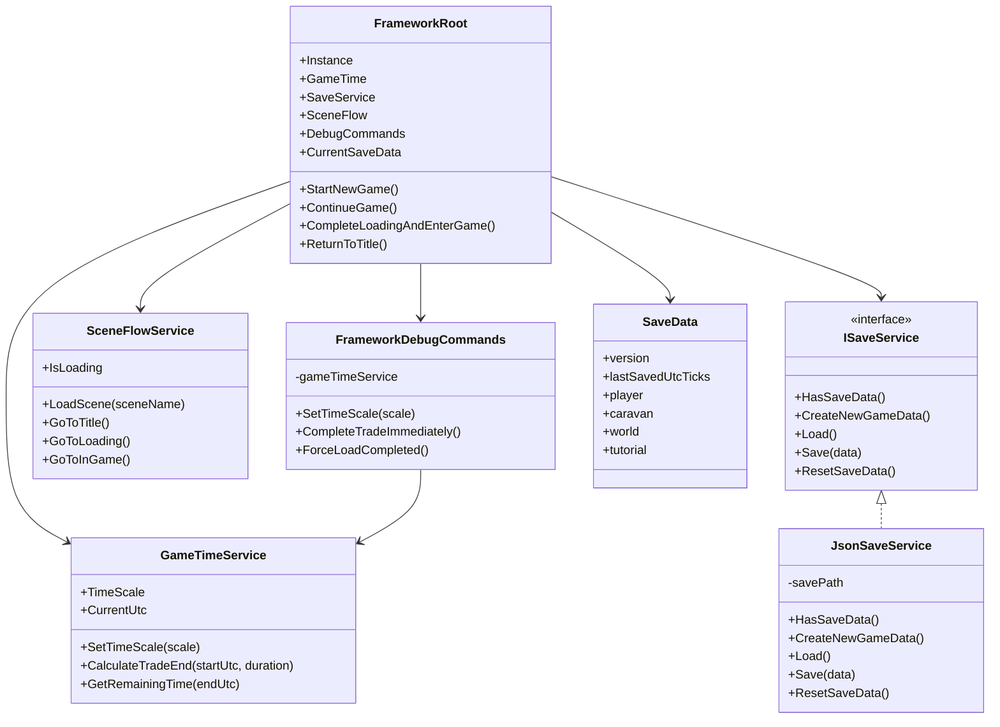
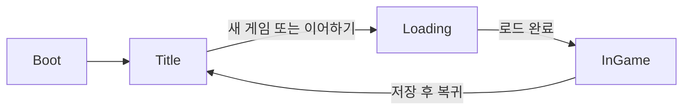

# Framework 담당 2026-07-07 구현 스크립트 로직 정리

> 대상 프로젝트: **누워서 돈벌기** 1차 빌드  
> 담당 영역: **Framework & Integration**  
> 정리 기준일: **2026-07-07**  
> 대상 코드: `FrameworkRoot`, 씬 흐름, 저장 서비스, 시간 서비스, 공용 이벤트, 디버그 명령 및 씬 컨트롤러

---

## 1. 문서 목적

이 문서는 2026년 7월 7일 Framework 담당 구현물의 구조와 실행 흐름을 정리한다.

현재 코드가 담당하는 핵심 범위는 다음과 같다.

- `Boot → Title → Loading → InGame → Title` 씬 흐름
- 씬이 바뀌어도 유지되는 공용 Framework 루트
- 새 게임과 이어하기 분기
- JSON 기반 저장 및 불러오기
- 저장 데이터 버전 검사
- 현실 UTC 기준 시간 계산
- 씬 전환 중복 요청 방지
- 시스템 간 결합도를 낮추기 위한 정적 이벤트
- 시간 배속, 무역 즉시 완료 등 통합 테스트용 디버그 명령
- Framework 전용 로그 형식 통일

현재 단계는 **M0 기반 구조**에 해당한다. 무역 상태 복구, 오프라인 완료 판정, 자동 저장, 시간 역행 감지와 같은 기능은 이벤트와 저장 필드의 기반만 일부 존재하며 실제 처리 로직은 아직 완성되지 않았다.

---

# 2. 전체 구조 요약

## 2.1 중심 구조

```text
Unity 시작
    ↓
FrameworkRoot 자동 생성
    ↓
공용 서비스 초기화
    ├─ GameTimeService
    ├─ JsonSaveService : ISaveService
    ├─ SceneFlowService
    └─ FrameworkDebugCommands
    ↓
BootSceneController
    ↓
TitleSceneController
    ├─ 새 게임
    ├─ 이어하기
    ├─ 저장 초기화
    └─ 게임 종료
    ↓
LoadingSceneController
    ├─ LoadCompleted 이벤트 발생
    └─ InGame 씬 이동
    ↓
InGameSceneController
    ├─ 타이틀 복귀 및 저장
    ├─ 시간 배속 변경
    └─ 무역 즉시 완료 요청
```

## 2.2 설계 방식

현재 Framework는 다음 세 층으로 구분된다.

| 층 | 주요 코드 | 책임 |
|---|---|---|
| 공용 루트 | `FrameworkRoot` | 서비스 생성, 수명 관리, 새 게임·이어하기·씬 흐름 조정 |
| 일반 C# 서비스 | `GameTimeService`, `JsonSaveService`, `SceneFlowService`, `FrameworkDebugCommands` | 시간, 저장, 씬 전환, 디버그 명령 수행 |
| 씬 연결 컴포넌트 | `BootSceneController`, `TitleSceneController`, `LoadingSceneController`, `InGameSceneController`, `FrameworkDebugBridge` | Unity 씬·버튼·Inspector 입력을 Framework API에 연결 |

씬 컨트롤러가 저장 파일이나 `SceneManager`를 직접 다루지 않고 `FrameworkRoot`를 통해 기능을 호출한다. 이 구조는 씬 UI와 Framework 내부 로직을 분리하고, 이후 구현 교체 시 변경 범위를 줄이기 위한 것이다.

---

# 3. 핵심 객체 관계



---

# 4. 게임 시작과 Framework 초기화 흐름

## 4.1 `FrameworkRoot` 자동 생성

`FrameworkRoot`에는 다음 특성이 붙어 있다.

```csharp
[RuntimeInitializeOnLoadMethod(RuntimeInitializeLoadType.BeforeSceneLoad)]
```

Unity가 첫 씬을 로드하기 전에 `EnsureRootExists()`를 호출한다.

### 처리 순서

```text
게임 실행
→ BeforeSceneLoad 시점에 EnsureRootExists() 호출
→ 기존 Instance가 없으면 "FrameworkRoot" GameObject 생성
→ FrameworkRoot 컴포넌트 추가
→ Awake() 호출
→ Singleton 중복 검사
→ DontDestroyOnLoad 적용
→ InitializeServices() 실행
```

따라서 각 씬에 `FrameworkRoot`를 직접 배치하지 않아도 런타임에 자동 생성된다.

## 4.2 중복 생성 방지

`Awake()`에서 이미 다른 `Instance`가 존재하면 새로 생성된 루트 오브젝트를 제거한다.

```text
Instance 없음
→ 현재 객체를 Instance로 등록
→ 씬 전환 시 유지

Instance 있음 + 현재 객체와 다름
→ 중복 경고 출력
→ 현재 중복 객체 파괴
```

이 방식으로 Boot, Title, Loading, InGame 씬을 이동해도 공용 서비스가 중복 생성되지 않는다.

## 4.3 서비스 초기화

`InitializeServices()`에서 다음 객체를 생성한다.

```text
GameTime = new GameTimeService()
SaveService = new JsonSaveService()
SceneFlow = new SceneFlowService()
DebugCommands = new FrameworkDebugCommands(GameTime)
```

이 객체들은 `MonoBehaviour`가 아닌 일반 C# 객체다. 따라서 Unity 씬 오브젝트 수명과 분리되며, `FrameworkRoot`가 참조를 유지하는 동안 계속 사용된다.

마지막으로 저장 파일 유무에 따라 현재 데이터를 준비한다.

```text
저장 파일 있음
→ SaveService.Load()
→ CurrentSaveData에 저장

저장 파일 없음
→ SaveService.CreateNewGameData()
→ 메모리에만 신규 데이터 생성
```

저장 파일이 없을 때 초기화 단계에서는 파일을 즉시 생성하지 않는다. 실제 파일은 `StartNewGame()` 또는 이후 `Save()` 호출 시 만들어진다.

---

# 5. 씬 흐름

## 5.1 씬 이름 중앙 관리 — `SceneNames`

씬 이름 문자열은 `SceneNames`에서 상수로 관리한다.

| 상수 | 값 | 용도 |
|---|---|---|
| `SceneNames.Boot` | `"Boot"` | 최초 진입 씬 이름 |
| `SceneNames.Title` | `"Title"` | 타이틀 씬 |
| `SceneNames.Loading` | `"Loading"` | 데이터 초기화 중간 씬 |
| `SceneNames.InGame` | `"InGame"` | 실제 게임 씬 |

문자열을 여러 코드에서 직접 입력하는 대신 상수를 사용하므로 오탈자와 이름 변경 비용을 줄인다.

단, 해당 씬들은 반드시 **Build Settings 또는 Build Profiles의 Scene List**에 실제 이름과 동일하게 등록되어야 한다.

## 5.2 기본 씬 전환 흐름



## 5.3 `BootSceneController`

Boot 씬 진입 후 `Start()`에서 `loadTitleOnStart`를 확인한다.

```text
loadTitleOnStart = true
→ FrameworkRoot.Instance.SceneFlow.GoToTitle()
→ Title 씬 비동기 로드

loadTitleOnStart = false
→ Boot 씬에 머무름
```

`loadTitleOnStart`는 Boot 씬에서 초기화 상태를 직접 확인하거나 통합 테스트를 진행할 때 자동 이동을 잠시 중단하는 용도로 사용할 수 있다.

## 5.4 `SceneFlowService`

실제 씬 전환은 `SceneFlowService`가 담당한다.

### `LoadScene(string sceneName)` 처리

```text
씬 이름이 null, 빈 문자열 또는 공백
→ 경고 로그
→ 전환 취소

이미 IsLoading == true
→ 중복 전환 경고
→ 새 요청 무시

정상 요청
→ IsLoading = true
→ SceneManager.LoadSceneAsync(sceneName)
→ 완료 콜백 등록
→ 로드 완료 시 IsLoading = false
→ FrameworkEvents.SceneChanged 발생
```

### 중복 입력 방지

`IsLoading`이 `true`인 동안 다른 씬 전환 요청은 무시된다. 따라서 새 게임 버튼을 빠르게 여러 번 누르거나, 타이틀 복귀 버튼이 중복 호출되어도 동시에 여러 씬 로드가 실행되는 것을 방지한다.

### 예외 처리

`LoadSceneAsync()` 호출 중 예외가 발생하거나 `AsyncOperation`이 생성되지 않으면 다음 처리를 한다.

- `IsLoading`을 다시 `false`로 복구
- 오류 로그 출력
- 현재 씬 유지

## 5.5 `TitleSceneController`

타이틀 UI 버튼에서 호출할 공개 메서드를 제공한다.

| 메서드/프로퍼티 | 동작 |
|---|---|
| `HasSaveData` | 실제 저장 파일 존재 여부 반환 |
| `StartNewGame()` | 신규 저장 데이터 생성 후 Loading 이동 |
| `ContinueGame()` | 저장 데이터 로드 후 Loading 이동 |
| `ResetSaveData()` | 저장 파일 삭제 |
| `ExitGame()` | 종료 로그 후 `Application.Quit()` 호출 |

`HasSaveData`를 이용해 이어하기 버튼의 활성화 여부를 결정할 수 있다.

```text
HasSaveData == true
→ 이어하기 버튼 활성화

HasSaveData == false
→ 이어하기 버튼 비활성화
```

Unity Editor에서는 `Application.Quit()`이 실제로 Play Mode를 종료하지 않는다. 빌드된 실행 파일에서만 게임 종료가 적용된다.

## 5.6 `LoadingSceneController`

`completeLoadingOnStart`가 `true`이면 Loading 씬의 `Start()`에서 즉시 `CompleteLoading()`을 호출한다.

```text
Loading 씬 시작
→ CompleteLoadingAndEnterGame()
→ CurrentSaveData 확인
→ LoadCompleted 이벤트 발생
→ InGame 씬 이동
```

현재 Loading 씬은 로딩 연출이나 진행률을 계산하지 않고, **데이터 로드 완료 신호를 발생시킨 뒤 InGame으로 이동하는 중간 단계**로 동작한다.

`completeLoadingOnStart`를 `false`로 설정하면 외부 초기화 작업이 끝난 시점에 UI 버튼이나 다른 시스템이 `CompleteLoading()`을 직접 호출할 수 있다.

## 5.7 `InGameSceneController`

InGame 씬 UI와 디버그 기능을 Framework에 연결한다.

| 메서드 | 동작 |
|---|---|
| `ReturnToTitle()` | 현재 저장 데이터를 저장하고 Title로 이동 |
| `SetTimeScale(float)` | Unity `Time.timeScale` 변경 |
| `CompleteTradeImmediately()` | 무역 즉시 완료 요청 이벤트 발생 |

이 클래스는 무역을 직접 완료하지 않는다. `CompleteTradeImmediately()`는 이벤트를 발생시킬 뿐이며, 실제 무역 시스템이 해당 이벤트를 구독하고 현재 무역 상태를 완료 처리해야 한다.

---

# 6. 새 게임과 이어하기 흐름

## 6.1 새 게임

```mermaid
sequenceDiagram
    actor Player
    participant Title as TitleSceneController
    participant Root as FrameworkRoot
    participant Save as JsonSaveService
    participant Scene as SceneFlowService
    participant Loading as LoadingSceneController
    participant Events as FrameworkEvents

    Player->>Title: StartNewGame()
    Title->>Root: StartNewGame()
    Root->>Save: CreateNewGameData()
    Save-->>Root: SaveData
    Root->>Save: Save(CurrentSaveData)
    Root->>Scene: GoToLoading()
    Scene-->>Loading: Loading 씬 로드
    Loading->>Root: CompleteLoadingAndEnterGame()
    Root->>Events: RaiseLoadCompleted(CurrentSaveData)
    Root->>Scene: GoToInGame()
```

### 세부 처리

1. `CreateNewGameData()`가 기본값을 가진 새 `SaveData`를 생성한다.
2. `version`을 현재 버전으로 지정한다.
3. `lastSavedUtcTicks`에 현재 UTC 시간을 기록한다.
4. 즉시 JSON 파일로 저장한다.
5. Loading 씬으로 이동한다.
6. 로딩 완료 이벤트를 발생시킨다.
7. InGame 씬으로 이동한다.

새 게임은 기존 저장 파일이 존재하더라도 새 기본 데이터로 덮어쓴다.

## 6.2 이어하기

```text
ContinueGame()
→ SaveService.Load()
→ JSON 파일 읽기
→ SaveData 역직렬화
→ 데이터 및 버전 검사
→ CurrentSaveData에 저장
→ Loading 씬 이동
→ LoadCompleted 이벤트 발생
→ InGame 씬 이동
```

저장 파일이 없거나 읽기 실패, JSON 파싱 실패, 버전 불일치가 발생하면 예외를 외부로 전달하지 않고 기본 새 게임 데이터를 반환한다.

## 6.3 인게임에서 타이틀 복귀

```text
InGameSceneController.ReturnToTitle()
→ FrameworkRoot.ReturnToTitle()
→ CurrentSaveData가 null이 아니면 Save()
→ Title 씬 이동
```

따라서 정상적인 타이틀 복귀는 현재 상태를 저장하는 주요 저장 시점으로 사용된다.

---

# 7. 저장 시스템

## 7.1 `ISaveService`

저장 기능의 계약을 정의하는 인터페이스다.

```csharp
bool HasSaveData();
SaveData CreateNewGameData();
SaveData Load();
void Save(SaveData data);
void ResetSaveData();
```

`FrameworkRoot`는 구체 클래스가 아니라 `ISaveService` 타입을 참조한다.

이 구조의 장점은 이후 저장 방식을 다음과 같이 교체할 수 있다는 것이다.

- JSON 로컬 저장
- 암호화 저장
- PlayerPrefs 저장
- Steam Cloud 또는 플랫폼 저장
- 서버 저장
- 테스트용 메모리 저장

교체 구현체가 `ISaveService`를 구현하면 `FrameworkRoot`의 공개 API는 유지할 수 있다.

## 7.2 `JsonSaveService`

현재 저장 구현체는 Unity `JsonUtility`와 `System.IO`를 사용한다.

### 저장 경로

```text
Application.persistentDataPath/save_data.json
```

`Application.persistentDataPath`는 플랫폼별로 Unity가 제공하는 영구 저장 경로다. 실행 파일 폴더나 `Assets` 폴더에 직접 저장하지 않는다.

### 저장 파일 존재 검사

```text
File.Exists(savePath)
```

파일이 실제로 존재하면 `true`, 없으면 `false`를 반환한다.

### 신규 데이터 생성

```text
new SaveData 생성
→ version = CurrentVersion
→ lastSavedUtcTicks = DateTime.UtcNow.Ticks
→ 기본 하위 데이터 객체 사용
```

이 메서드는 데이터를 생성만 하며 파일을 쓰지 않는다. 실제 파일 생성은 `Save()`에서 수행된다.

### 불러오기

```text
저장 파일 없음
→ 경고
→ 새 기본 데이터 반환

저장 파일 있음
→ 전체 JSON 문자열 읽기
→ JsonUtility.FromJson<SaveData>()
→ null 여부 검사
→ version 일치 여부 검사
→ 정상 데이터 반환
```

다음 상황에서는 기본 새 데이터를 반환한다.

- 파일 없음
- 파일 읽기 실패
- JSON 파싱 실패
- 역직렬화 결과가 `null`
- 저장 버전 불일치
- 기타 예외

예외를 호출자에게 다시 던지지 않으므로 게임 실행 자체는 계속될 수 있다.

### 저장

```text
data == null
→ 경고 후 취소

정상 데이터
→ 현재 버전 강제 적용
→ 현재 UTC 저장 시각 기록
→ 보기 좋은 JSON으로 직렬화
→ save_data.json에 쓰기
→ 성공 로그
```

`JsonUtility.ToJson(data, true)`의 두 번째 인자 `true`는 JSON을 들여쓰기하여 사람이 읽기 쉬운 형태로 저장한다.

### 저장 초기화

```text
파일 존재
→ File.Delete(savePath)
→ 초기화 로그

파일 없음
→ 아무 작업 없음
```

현재 `ResetSaveData()`는 디스크 파일만 삭제한다. `FrameworkRoot.CurrentSaveData`의 메모리 객체는 그대로 남아 있다.

---

# 8. 저장 데이터 구조 — `SaveData`

## 8.1 최상위 데이터

```text
SaveData
├─ version
├─ lastSavedUtcTicks
├─ player
├─ caravan
├─ world
└─ tutorial
```

모든 저장 클래스에 `[Serializable]`이 선언되어 있어 Unity `JsonUtility`로 직렬화할 수 있다.

## 8.2 버전 관리

```csharp
public const int CurrentVersion = 1;
public int version = CurrentVersion;
```

저장 시 항상 현재 버전으로 갱신되고, 불러올 때 저장된 버전과 현재 버전이 다르면 지원하지 않는 데이터로 판단한다.

현재는 마이그레이션을 지원하지 않는다.

```text
version == CurrentVersion
→ 정상 로드

version != CurrentVersion
→ 기존 데이터 사용 중단
→ 신규 기본 데이터 반환
```

## 8.3 `PlayerSaveData`

| 필드 | 기본값 | 의미 |
|---|---:|---|
| `tradingCurrency` | `1000` | 상품 구매, 식량, 용병 등 무역용 재화 |
| `developmentCurrency` | `0` | 거점 도시 발전용 재화 |

재화 이원화의 최소 저장 기반이다.

## 8.4 `CaravanSaveData`

| 필드 | 기본값 | 의미 |
|---|---|---|
| `activeTradeId` | 빈 문자열 | 현재 진행 중인 무역 식별자 |
| `tradeStartUtcTicks` | `0` | 무역 시작 UTC 시각 |
| `expectedTradeEndUtcTicks` | `0` | 무역 종료 예정 UTC 시각 |
| `hasPendingSettlement` | `false` | 완료 후 정산 대기 여부 |

현재는 단일 상단 기준 구조다. 여러 상단을 지원하려면 향후 `List<CaravanSaveData>` 또는 ID 기반 컬렉션 구조로 확장해야 한다.

## 8.5 `WorldSaveData`

| 필드 | 기본값 | 의미 |
|---|---|---|
| `currentSeasonId` | `"summer"` | 현재 계절 ID |
| `currentDisasterId` | 빈 문자열 | 현재 재난 ID, 빈 값은 재난 없음 |

계절과 재난을 이름 표시가 아닌 ID 문자열로 저장한다.

## 8.6 `TutorialSaveData`

| 필드 | 기본값 | 의미 |
|---|---|---|
| `isCompleted` | `false` | 튜토리얼 완료 여부 |
| `isSkipped` | `false` | 튜토리얼 스킵 여부 |
| `stepIndex` | `0` | 현재 진행 단계 |

튜토리얼 진행, 완료, 스킵 상태를 개별적으로 복원할 수 있다.

## 8.7 시간 저장 형식

시간은 `DateTime` 객체를 직접 저장하지 않고 `Ticks`를 `long`으로 저장한다.

```text
DateTime.UtcNow.Ticks
```

복원 시에는 다음 형태로 변환할 수 있다.

```csharp
var savedUtc = new DateTime(savedTicks, DateTimeKind.Utc);
```

UTC를 기준으로 저장하면 사용자의 지역 시간대나 서머타임 변화가 무역 완료 계산에 개입하는 문제를 줄일 수 있다.

---

# 9. 시간 시스템 — `GameTimeService`

## 9.1 제공 기능

| 멤버 | 역할 |
|---|---|
| `TimeScale` | 현재 Unity 시간 배속 값 |
| `CurrentUtc` | 현재 현실 UTC 시각 |
| `SetTimeScale(float)` | Unity `Time.timeScale` 변경 |
| `CalculateTradeEnd()` | 시작 시각과 기간으로 종료 시각 계산 |
| `GetRemainingTime()` | 종료 시각까지 남은 현실 시간 계산 |

## 9.2 시간 배속

```text
입력 scale
→ Mathf.Max(0, scale)
→ 음수 방지
→ TimeScale 프로퍼티 갱신
→ UnityEngine.Time.timeScale에 적용
```

예시:

| 입력 | 결과 |
|---:|---:|
| `10` | Unity의 scaled time이 10배 빠르게 진행 |
| `1` | 정상 속도 |
| `0` | scaled time 정지 |
| `-5` | `0`으로 보정 |

## 9.3 무역 종료 시각 계산

```csharp
return startUtc + duration;
```

예를 들어 UTC 12:00에 30분 무역을 시작하면 종료 예정 시각은 UTC 12:30이다.

## 9.4 남은 시간 계산

```text
endUtc - DateTime.UtcNow
→ 결과가 양수면 그대로 반환
→ 이미 종료되었으면 TimeSpan.Zero 반환
```

남은 시간이 음수가 되지 않으므로 UI에서는 최소 0초로 표시할 수 있다.

## 9.5 Unity 시간과 현실 시간의 차이

현재 코드에는 서로 다른 두 시간 체계가 존재한다.

| 시간 체계 | 사용 API | 영향 |
|---|---|---|
| Unity 게임 시간 | `Time.timeScale` | `Time.deltaTime`, Coroutine의 `WaitForSeconds` 등 |
| 현실 시간 | `DateTime.UtcNow` | 무역 종료 시각, 오프라인 진행 계산 |

따라서 `SetTimeScale(10)`을 호출해도 `DateTime.UtcNow` 자체는 10배 빠르게 흐르지 않는다.

현재 무역 시스템이 현실 UTC 종료 시각만 사용한다면 **시간 배속 디버그가 무역을 빠르게 완료시키지 않는다.** 시간 배속으로 무역 진행률을 빠르게 테스트하려면 무역 로직이 Unity scaled time을 사용하거나, 별도의 디버그용 시간 공급자 또는 종료 시각 조작 기능이 필요하다.

---

# 10. 공용 이벤트 — `FrameworkEvents`

## 10.1 목적

Framework와 Core, UI, Progression 등 다른 시스템이 서로의 구체 클래스를 직접 참조하지 않고 신호를 주고받기 위한 정적 이벤트 허브다.

```text
Framework가 이벤트 발생
→ 해당 이벤트를 구독한 시스템만 반응
→ Framework는 구독자의 구체 구현을 알 필요 없음
```

## 10.2 이벤트 목록

| 이벤트 | 매개변수 | 의도된 용도 | 현재 발생 코드 |
|---|---|---|---|
| `LoadCompleted` | `SaveData` | 공용 저장 데이터 로드 완료 전달 | `FrameworkRoot`, 디버그 명령 |
| `SceneChanged` | `string sceneName` | 씬 로드 완료 통지 | `SceneFlowService` |
| `TradeOfflineCompleted` | `string tradeId` | 오프라인 중 완료된 무역 통지 | 발생 메서드만 존재 |
| `TimeRollbackDetected` | 없음 | 시스템 시간 역행 감지 통지 | 발생 메서드만 존재 |
| `CompleteTradeRequested` | 없음 | 현재 무역 즉시 완료 디버그 요청 | `FrameworkDebugCommands` |

## 10.3 이벤트 발생 규칙

각 `Raise...()` 메서드는 다음 순서로 동작한다.

```text
Framework 로그 출력
→ 구독자가 존재하면 Invoke()
→ 구독자가 없으면 아무 동작 없이 종료
```

`?.Invoke()`를 사용하므로 구독자가 없어도 `NullReferenceException`이 발생하지 않는다.

## 10.4 예상 구독 예시

```csharp
private void OnEnable()
{
    FrameworkEvents.CompleteTradeRequested += HandleCompleteTradeRequested;
}

private void OnDisable()
{
    FrameworkEvents.CompleteTradeRequested -= HandleCompleteTradeRequested;
}
```

씬 오브젝트가 정적 이벤트를 구독할 때는 `OnDisable()` 또는 `OnDestroy()`에서 반드시 해제해야 한다. 해제하지 않으면 씬이 바뀐 뒤에도 파괴된 객체의 콜백 참조가 남을 수 있다.

---

# 11. 디버그 구조

## 11.1 `FrameworkDebugCommands`

실제 디버그 명령을 수행하거나 이벤트로 전달하는 일반 C# 클래스다.

| 명령 | 동작 |
|---|---|
| `SetTimeScale(float)` | `GameTimeService.SetTimeScale()` 호출 |
| `CompleteTradeImmediately()` | `CompleteTradeRequested` 이벤트 발생 |
| `ForceLoadCompleted()` | 현재 저장 데이터로 `LoadCompleted` 강제 발생 |

생성자에서 `GameTimeService`를 주입받는다.

```csharp
DebugCommands = new FrameworkDebugCommands(GameTime);
```

따라서 디버그 명령 내부에서 `new GameTimeService()`를 따로 만들지 않고 Framework가 사용 중인 동일한 시간 서비스를 조작한다.

## 11.2 `FrameworkDebugBridge`

Unity Inspector의 Context Menu에서 디버그 명령을 실행할 수 있게 연결하는 `MonoBehaviour`다.

### 제공 메뉴

```text
Framework/Set Debug Time Scale
Framework/Reset Time Scale
Framework/Complete Trade Immediately
Framework/Force Load Completed
```

### 사용 방식

1. 씬의 임의 GameObject에 `FrameworkDebugBridge`를 부착한다.
2. Inspector 우측 메뉴 또는 컴포넌트 Context Menu를 연다.
3. 원하는 Framework 명령을 실행한다.

`debugTimeScale`은 Inspector에서 설정 가능하며 기본값은 `10`이다.

## 11.3 디버그 명령의 책임 분리

```text
FrameworkDebugBridge
→ Unity Inspector 입력 담당

FrameworkDebugCommands
→ 실제 명령 실행 또는 이벤트 발생 담당

Core Gameplay 등 구독자
→ 무역 상태를 실제로 변경
```

`CompleteTradeImmediately()`는 무역 데이터를 직접 수정하지 않기 때문에 Framework가 Core Gameplay의 내부 구현에 의존하지 않는다.

---

# 12. 로그 구조 — `FrameworkLog`

Framework 관련 로그 앞에 항상 `[Framework]` 접두어를 추가한다.

| 메서드 | Unity API | 용도 |
|---|---|---|
| `Info()` | `Debug.Log` | 정상 상태와 주요 흐름 |
| `Warning()` | `Debug.LogWarning` | 복구 가능한 비정상 상황 |
| `Error()` | `Debug.LogError` | 저장·씬 로드 실패 등 오류 |

예시:

```text
[Framework] FrameworkRoot initialized.
[Framework] Loading scene: Title
[Framework] Save data loaded. Version: 1
[Framework] Scene changed: InGame
```

Console 검색창에서 `[Framework]`를 검색하면 관련 로그만 빠르게 확인할 수 있다.

---

# 13. 주요 실행 시퀀스

## 13.1 게임 최초 실행

```text
1. FrameworkRoot 자동 생성
2. 서비스 초기화
3. 저장 파일 없음 확인
4. 기본 SaveData를 메모리에 생성
5. Boot 씬 Start
6. Title 씬 로드
7. 타이틀에서 이어하기 불가 표시
8. 플레이어가 새 게임 선택
9. 기본 SaveData를 파일에 저장
10. Loading 씬 이동
11. LoadCompleted 발생
12. InGame 씬 이동
```

## 13.2 기존 저장 데이터로 실행

```text
1. FrameworkRoot 자동 생성
2. 저장 파일 발견
3. JSON 로드 및 버전 검사
4. CurrentSaveData에 저장
5. Boot → Title 이동
6. HasSaveData == true
7. 플레이어가 이어하기 선택
8. 저장 파일을 다시 Load
9. Loading 이동
10. LoadCompleted 발생
11. InGame 이동
```

## 13.3 저장 파일 손상 또는 버전 불일치

```text
1. Load() 호출
2. JSON 읽기 또는 역직렬화 실패
   또는 version 불일치
3. 오류/경고 로그 출력
4. 새 기본 SaveData 반환
5. 게임 실행은 계속됨
```

현재 이 경우 손상된 원본 파일을 별도로 백업하거나 이름을 변경하지 않는다. 이후 `Save()`가 호출되면 기본 데이터가 기존 파일을 덮어쓸 수 있다.

## 13.4 인게임 타이틀 복귀

```text
1. ReturnToTitle 버튼 호출
2. CurrentSaveData 저장
3. Title 씬 비동기 로드
4. 로드 완료 후 SceneChanged("Title") 발생
5. FrameworkRoot와 서비스는 유지
```

---

# 14. 파일별 책임 요약

| 파일 | 분류 | 핵심 책임 |
|---|---|---|
| `FrameworkRoot.cs` | 공용 루트 | Singleton, 서비스 생성, 게임 진입 흐름, 현재 저장 데이터 보유 |
| `GameTimeService.cs` | 시간 서비스 | UTC 시각, 종료 시각, 남은 시간, Unity 시간 배속 |
| `ISaveService.cs` | 저장 계약 | 저장 구현체가 제공해야 할 API 정의 |
| `JsonSaveService.cs` | 저장 구현 | JSON 파일 존재 검사, 생성, 로드, 저장, 삭제 |
| `SaveData.cs` | 저장 DTO | 플레이어·상단·월드·튜토리얼 상태 정의 |
| `SceneFlowService.cs` | 씬 서비스 | 비동기 씬 전환, 중복 요청 방지, 완료 이벤트 |
| `SceneNames.cs` | 상수 | 씬 이름 중앙 관리 |
| `FrameworkEvents.cs` | 이벤트 허브 | Framework와 다른 시스템 사이의 신호 전달 |
| `FrameworkDebugCommands.cs` | 디버그 서비스 | 시간 배속, 무역 완료 요청, 로드 완료 강제 발생 |
| `FrameworkDebugBridge.cs` | Unity 연결 | Inspector Context Menu와 디버그 서비스 연결 |
| `FrameworkLog.cs` | 로그 유틸리티 | Framework 로그 접두어 및 수준 통일 |
| `BootSceneController.cs` | 씬 컨트롤러 | Boot에서 Title 자동 이동 |
| `TitleSceneController.cs` | 씬 컨트롤러 | 새 게임, 이어하기, 저장 초기화, 종료 |
| `LoadingSceneController.cs` | 씬 컨트롤러 | 로드 완료 처리 후 InGame 이동 |
| `InGameSceneController.cs` | 씬 컨트롤러 | 타이틀 복귀, 시간 배속, 무역 완료 디버그 요청 |

---

# 15. 현재 코드에서 구현 완료된 M0 항목

## 구현 완료

- [x] `FrameworkRoot` 런타임 자동 생성
- [x] `DontDestroyOnLoad` 기반 공용 수명 유지
- [x] 중복 `FrameworkRoot` 제거
- [x] Boot → Title 이동
- [x] Title → Loading 이동
- [x] Loading → InGame 이동
- [x] InGame → Title 이동
- [x] 새 게임 API
- [x] 이어하기 API
- [x] 저장 파일 유무 검사
- [x] JSON 저장 및 불러오기 기초
- [x] 저장 데이터 버전 필드와 검사
- [x] 공용 Framework 로그
- [x] 씬 전환 중복 요청 방지
- [x] UTC 시간 및 남은 시간 계산
- [x] Unity 시간 배속 변경
- [x] 무역 즉시 완료 요청 이벤트
- [x] 로드 완료 이벤트
- [x] 씬 변경 이벤트
- [x] 디버그 Context Menu

## 기반만 존재하거나 후속 구현 필요

- [ ] Loading 진행률 표시
- [ ] 여러 초기화 작업의 완료 대기
- [ ] 자동 저장
- [ ] 애플리케이션 종료 시 저장
- [ ] 일시정지 또는 백그라운드 전환 시 저장
- [ ] 오프라인 경과 시간 계산 및 무역 상태 갱신
- [ ] `TradeOfflineCompleted` 실제 발생 조건
- [ ] 시간 역행 판정 및 `TimeRollbackDetected` 발생
- [ ] 최대 오프라인 인정 시간
- [ ] 완료 보상 중복 수령 방지
- [ ] 저장 성공·실패 결과를 UI에 전달
- [ ] 저장 데이터 마이그레이션
- [ ] 무역 ID별 로그 추적
- [ ] 계절·재난 강제 변경 디버그
- [ ] 무역로 이벤트 강제 발생 디버그

---

# 16. 통합 전에 확인해야 할 중요 사항

## 16.1 `LoadCompleted` 이벤트 발생 시점

현재 순서는 다음과 같다.

```text
LoadingSceneController.CompleteLoading()
→ FrameworkEvents.RaiseLoadCompleted(CurrentSaveData)
→ SceneFlow.GoToInGame()
```

즉, `LoadCompleted`는 **InGame 씬을 로드하기 전에 발생한다.**

InGame 씬의 컴포넌트가 `OnEnable()`에서 이벤트를 구독하도록 구현되면, 해당 컴포넌트가 생성되기 전에 이벤트가 이미 지나가므로 데이터를 받지 못할 수 있다.

### 현재 구조에서 안전한 경우

- `DontDestroyOnLoad` 객체가 미리 이벤트를 구독함
- InGame 진입 후 `FrameworkRoot.Instance.CurrentSaveData`를 직접 읽음
- InGame 씬 로드 완료 후 별도 초기화 이벤트를 발생시킴

### 권장 방향

다음 중 하나로 계약을 명확히 해야 한다.

1. `LoadCompleted`는 영속 시스템 전용 이벤트로 사용한다.
2. InGame 씬 로드 완료 후 `LoadCompleted`를 발생시킨다.
3. `DataLoaded`와 `InGameReady` 이벤트를 분리한다.
4. InGame 초기화 컴포넌트는 이벤트에 의존하지 않고 `CurrentSaveData`를 조회한다.

## 16.2 시간 배속과 무역 시간

`Time.timeScale`과 `DateTime.UtcNow`는 서로 독립적이다.

```text
SetTimeScale(10)
→ Unity Update/Coroutine 등은 빨라질 수 있음
→ 현실 UTC 기반 종료 시각은 빨라지지 않음
```

따라서 Core Gameplay와 Framework 사이에서 무역 진행 시간을 다음 중 무엇으로 계산할지 합의해야 한다.

- 온라인 상태: Unity scaled time
- 온라인·오프라인 공통: UTC 종료 시각
- UTC를 기본으로 하되 디버그용 가상 Clock 사용

방치형 게임의 실제 저장·오프라인 기준은 UTC가 적절하지만, 테스트 편의를 위해 별도 가상 시간 또는 종료 시각 단축 명령을 두는 편이 명확하다.

## 16.3 저장 초기화 후 메모리 상태

`ResetSaveData()`는 파일만 삭제한다.

```text
디스크 save_data.json 삭제
≠ FrameworkRoot.CurrentSaveData 초기화
```

따라서 저장 초기화 직후 `ForceLoadCompleted()`를 실행하거나 메모리 데이터를 참조하면 삭제 전 데이터가 남아 있을 수 있다.

저장 초기화의 기대 동작을 다음 중 하나로 결정해야 한다.

- 파일만 삭제하고 다음 새 게임 선택을 기다림
- 파일 삭제 후 `CurrentSaveData = null`
- 파일 삭제 후 즉시 새 기본 데이터 생성

## 16.4 정적 이벤트 구독 해제

`FrameworkEvents`는 정적 클래스이므로 이벤트 구독도 정적으로 유지된다.

씬 오브젝트는 반드시 다음 규칙을 지켜야 한다.

```text
OnEnable에서 구독
OnDisable에서 해제
```

구독 해제가 누락되면 다음 문제가 생길 수 있다.

- 파괴된 객체의 콜백 잔존
- 씬 재진입 후 중복 구독
- 같은 이벤트가 여러 번 처리됨
- 메모리 참조 유지

## 16.5 저장 안정성

현재 저장은 다음 방식이다.

```text
File.WriteAllText(savePath, json)
```

간단한 M0 구현으로는 충분하지만 저장 중 강제 종료되면 파일이 일부만 기록될 가능성이 있다.

후속 단계에서는 다음 구조를 검토할 수 있다.

```text
임시 파일에 저장
→ 기존 저장 파일 백업
→ 임시 파일을 본 파일로 교체
```

최소한 정상 저장과 로드 실패를 UI 또는 테스트 로그에서 구분할 수 있도록 결과 전달 구조가 필요하다.

## 16.6 저장 버전 불일치

현재 버전이 다르면 기존 저장을 그대로 폐기하고 새 데이터를 만든다.

M0와 1차 빌드 기간에는 단순한 방식이지만 필드가 추가될 때 기존 테스트 저장 데이터가 초기화될 수 있다.

팀 통합 중 `SaveData.CurrentVersion`을 변경할 경우 다음을 팀에 공지해야 한다.

- 기존 저장 파일 삭제 필요 여부
- 필드 기본값
- 마이그레이션 지원 여부
- 테스트 저장 파일 호환 여부

## 16.7 Loading 씬의 현재 역할

`SceneManager.LoadSceneAsync()`를 사용하고 있지만 Loading 씬 자체에서 InGame 로드 진행률을 표시하지 않는다.

현재 구조는 다음에 가깝다.

```text
Title에서 Loading 씬을 비동기 로드
→ Loading 시작 직후 InGame 씬 비동기 로드
```

진행률 UI를 구현하려면 `SceneFlowService`가 `AsyncOperation.progress` 또는 진행 상태를 외부에 제공하거나, Loading 전용 로더가 InGame 로드를 직접 관리해야 한다.

---

# 17. 담당 시스템 간 연결 계약

## 17.1 Core Gameplay와의 연결

Framework가 제공해야 하는 값과 이벤트:

- 현재 UTC 시각
- 무역 종료 예정 시각 계산
- 현재 `SaveData.caravan`
- 무역 즉시 완료 요청
- 오프라인 완료 이벤트
- 저장 시점 호출

Core Gameplay가 Framework에 제공해야 하는 정보:

- 현재 무역 ID
- 무역 시작 시각
- 종료 예정 시각
- 정산 대기 여부
- 보상 수령 완료 여부
- 저장 가능한 상단 런타임 상태

## 17.2 UI & Data와의 연결

Framework가 제공해야 하는 값과 상태:

- `HasSaveData`
- 현재 저장 데이터
- 씬 전환 중 여부 `IsLoading`
- 씬 변경 이벤트
- 저장 결과
- 이어하기 가능 여부

UI가 지켜야 할 규칙:

- JSON 파일에 직접 접근하지 않음
- `SceneManager`를 직접 호출하지 않음
- Framework 공개 API를 통해 씬·저장 요청
- 씬 전환 중 버튼 중복 입력 방지 표시

## 17.3 Progression & System과의 연결

Framework가 제공해야 하는 시간 정보:

- 현재 UTC
- 마지막 저장 UTC
- 계절 변경 계산에 사용할 기준 시간
- 대출 상환 또는 이벤트 종료 시각

Progression에서 저장해야 할 데이터는 이후 `SaveData` 하위 DTO로 확장해야 한다.

## 17.4 Content & Tools와의 연결

Content & Tools 담당자는 다음 디버그 진입점을 사용할 수 있다.

- 시간 배속
- 무역 즉시 완료 요청
- 로드 완료 강제 발생
- 저장 초기화

향후 추가 대상:

- 계절 강제 지정
- 재난 강제 지정
- 무역로 이벤트 강제 발생
- 테스트 프리셋 로드
- 데이터 초기화

---

# 18. Unity 씬 연결 체크리스트

## Boot 씬

- [ ] `BootSceneController`가 존재한다.
- [ ] `loadTitleOnStart`가 의도한 값으로 설정되어 있다.
- [ ] Build Scene List의 첫 씬이 Boot다.
- [ ] 씬에 별도의 수동 `FrameworkRoot`가 없어도 동작하는지 확인한다.

## Title 씬

- [ ] 새 게임 버튼 → `TitleSceneController.StartNewGame`
- [ ] 이어하기 버튼 → `TitleSceneController.ContinueGame`
- [ ] 초기화 버튼 → `TitleSceneController.ResetSaveData`
- [ ] 종료 버튼 → `TitleSceneController.ExitGame`
- [ ] 이어하기 버튼 활성 상태가 `HasSaveData`와 연결된다.
- [ ] 씬 이동 중 버튼을 반복 클릭해도 씬 로드가 한 번만 실행된다.

## Loading 씬

- [ ] `LoadingSceneController`가 존재한다.
- [ ] 자동 완료를 사용할 경우 `completeLoadingOnStart = true`
- [ ] 수동 초기화가 필요한 경우 `false`로 설정 후 완료 시 직접 호출
- [ ] Loading 진입 후 InGame으로 정상 전환된다.

## InGame 씬

- [ ] 타이틀 복귀 버튼 → `InGameSceneController.ReturnToTitle`
- [ ] 디버그 UI가 있다면 시간 배속과 무역 완료 메서드 연결
- [ ] `LoadCompleted` 구독 시 이벤트 발생 순서를 확인한다.
- [ ] 타이틀 복귀 후 저장 파일의 수정 시각과 내용이 갱신된다.

## 디버그 오브젝트

- [ ] 필요한 테스트 씬에 `FrameworkDebugBridge`를 배치한다.
- [ ] Context Menu에서 시간 배속 설정·초기화가 동작한다.
- [ ] 무역 시스템 구독 후 즉시 완료 이벤트가 한 번만 처리된다.

---

# 19. M0 테스트 시나리오

## 테스트 1 — FrameworkRoot 중복 생성 방지

```text
Given  게임을 Boot 씬에서 실행한다.
When   Title → Loading → InGame → Title을 이동한다.
Then   Hierarchy 또는 로그에서 FrameworkRoot가 하나만 유지된다.
```

확인 로그:

```text
[Framework] FrameworkRoot initialized.
```

중복 객체를 씬에 일부러 배치한 경우:

```text
[Framework] Duplicate FrameworkRoot destroyed.
```

## 테스트 2 — 신규 게임

```text
Given  save_data.json이 없다.
When   새 게임 버튼을 누른다.
Then   기본 재화 1000을 가진 SaveData가 저장된다.
And    Loading을 거쳐 InGame으로 이동한다.
```

## 테스트 3 — 이어하기

```text
Given  정상 save_data.json이 존재한다.
When   게임을 재실행하고 이어하기를 누른다.
Then   저장된 데이터가 CurrentSaveData로 로드된다.
And    InGame으로 이동한다.
```

## 테스트 4 — 버전 불일치

```text
Given  저장 JSON의 version을 현재 버전과 다르게 수정한다.
When   이어하기를 실행한다.
Then   경고 로그가 출력된다.
And    신규 기본 데이터가 반환된다.
And    게임이 크래시하지 않는다.
```

## 테스트 5 — 손상된 JSON

```text
Given  save_data.json 내용을 유효하지 않은 문자열로 변경한다.
When   Load()를 실행한다.
Then   오류 로그가 출력된다.
And    신규 기본 데이터가 반환된다.
```

## 테스트 6 — 씬 전환 중복 입력

```text
Given  Title 씬이다.
When   새 게임 버튼을 매우 빠르게 여러 번 누른다.
Then   첫 번째 로드만 실행된다.
And    이후 요청은 IsLoading으로 차단된다.
```

## 테스트 7 — 타이틀 복귀 저장

```text
Given  InGame에서 CurrentSaveData의 재화를 변경한다.
When   ReturnToTitle()을 호출한다.
Then   변경된 데이터가 JSON에 저장된다.
And    Title 씬으로 이동한다.
```

## 테스트 8 — 시간 계산

```text
Given  시작 UTC와 10분의 duration이 있다.
When   CalculateTradeEnd()를 호출한다.
Then   시작 시각보다 정확히 10분 뒤가 반환된다.
```

```text
Given  종료 시각이 이미 지났다.
When   GetRemainingTime()을 호출한다.
Then   음수가 아니라 TimeSpan.Zero가 반환된다.
```

## 테스트 9 — 디버그 이벤트

```text
Given  CompleteTradeRequested를 구독한 테스트 리스너가 있다.
When   CompleteTradeImmediately()를 실행한다.
Then   리스너가 정확히 한 번 호출된다.
```

---

# 20. 권장 로그 확인 순서

정상 신규 게임 흐름에서는 대체로 다음 순서의 로그를 기대할 수 있다.

```text
[Framework] New game save data created.
[Framework] FrameworkRoot initialized.
[Framework] Loading scene: Title
[Framework] Scene changed: Title
[Framework] New game save data created.
[Framework] Save data written: {persistentDataPath}/save_data.json
[Framework] Loading scene: Loading
[Framework] Scene changed: Loading
[Framework] LoadCompleted event raised.
[Framework] Loading scene: InGame
[Framework] Scene changed: InGame
```

첫 번째 `New game save data created.`는 Framework 초기화 시 저장 파일이 없어서 메모리 데이터를 만든 로그이고, 두 번째 로그는 사용자가 실제로 새 게임을 선택했을 때 생성된 데이터다.

---

# 21. 현재 구조의 장점

1. **공용 생명주기가 명확하다.**  
   `FrameworkRoot`가 씬과 무관하게 서비스를 유지한다.

2. **씬 컨트롤러가 얇다.**  
   UI 입력을 Framework에 전달할 뿐 저장·씬 로드 세부 구현을 직접 가지지 않는다.

3. **저장 구현 교체 가능성이 있다.**  
   `ISaveService`를 통해 구체 저장 방식과 호출자를 분리했다.

4. **중복 씬 전환을 방어한다.**  
   `SceneFlowService.IsLoading`으로 빠른 연속 입력을 차단한다.

5. **오류 시 게임 실행을 유지한다.**  
   저장 데이터가 손상되어도 기본 데이터로 복구한다.

6. **이벤트 기반 통합 지점이 있다.**  
   Framework가 Core Gameplay의 구체 클래스를 직접 참조하지 않고 요청을 전달할 수 있다.

7. **방치형 시간 계산의 기본 방향이 적절하다.**  
   저장과 무역 종료 시간을 로컬 표시 시간이 아닌 UTC Ticks로 보관한다.

8. **디버그 진입점이 분리되어 있다.**  
   실제 게임 기능과 테스트 명령을 구분할 수 있다.

---

# 22. 현재 구조의 제한과 후속 개선 우선순위

## 우선순위 1 — 통합 차단 가능성이 있는 항목

1. `LoadCompleted` 발생 시점과 InGame 구독 계약 확정
2. Core Gameplay의 무역 상태와 `CaravanSaveData` 필드 계약 확정
3. 무역 완료 요청 이벤트 구독 및 중복 처리 방지
4. 저장 초기화 후 메모리 상태 처리 확정
5. UTC 무역 시간과 Time Scale 디버그 방식 확정

## 우선순위 2 — M1~M3 필수 항목

1. 무역 시작 시각 및 종료 예정 시각 기록 API
2. 주요 상태 변경 시 자동 저장
3. 오프라인 복귀 시 완료 여부 판정
4. `hasPendingSettlement` 전환
5. 정산 수령 여부 필드 추가
6. 동일 무역 ID 중복 보상 방지
7. 시간 역행 검사
8. 최대 오프라인 인정 시간
9. 저장 성공·실패 결과 이벤트

## 우선순위 3 — 안정성과 유지보수

1. 임시 파일 기반 원자적 저장
2. 백업 저장 파일
3. 저장 데이터 마이그레이션
4. 이벤트 구독 관리 규칙 문서화
5. 서비스 초기화 실패 처리
6. 디버그 명령의 개발 빌드 제한
7. 씬 로딩 진행률 공개

---

# 23. 결론

현재 스크립트들은 Framework M0에서 요구하는 **공용 루트, 씬 흐름, 저장 서비스 계약, JSON 저장 기반, UTC 시간 계산, 공용 이벤트와 디버그 진입점**을 최소 형태로 구성한다.

전체 실행의 중심은 `FrameworkRoot`이며, 다음 책임을 조정한다.

```text
FrameworkRoot
= 공용 서비스 수명 관리
+ CurrentSaveData 보유
+ 새 게임/이어하기 분기
+ Loading 완료 처리
+ InGame 진입
+ 타이틀 복귀 전 저장
```

다음 통합 단계에서 가장 먼저 확정해야 할 것은 다음 세 가지다.

1. **InGame 시스템이 저장 데이터를 받는 정확한 시점**
2. **Core Gameplay의 무역 상태를 SaveData에 반영하는 계약**
3. **현실 UTC 기반 무역 시간과 테스트용 시간 배속의 관계**

이 세 지점이 확정되면 현재 M0 구조를 크게 변경하지 않고 M1의 무역 시작·완료 연결과 M3의 오프라인 저장 복구 구조로 확장할 수 있다.
