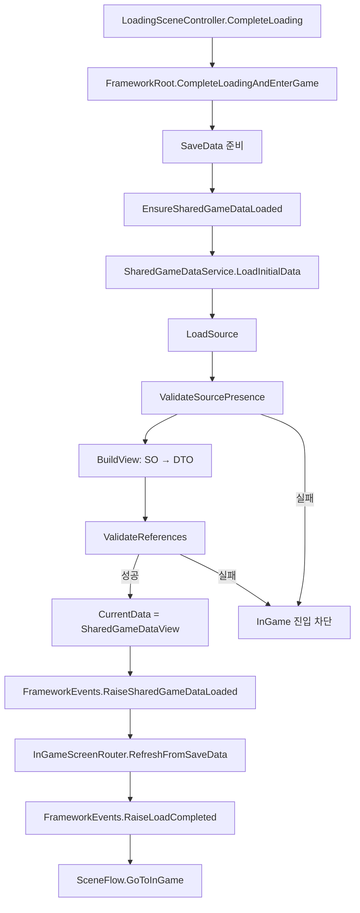

# Framework 공용 게임 데이터 로딩 로직 정리

> **작업 범위:** Framework M0 잔여 — 공용 더미 데이터 로드 완료 이벤트 및 데이터 초기화 흐름 명확화  
> **Feature Root:** `Assets/_Project/11.CoreServices/`  
> **Branch:** `feature/framework/shared-game-data-loading`

---

## 1. 목적

Framework가 InGame 진입 전에 **공용 기준 데이터(Static/Seed Data)** 가 준비·검증되었음을 보장한다.

기존에는 `LoadCompleted` 이벤트만으로 “게임 진입 가능” 상태를 판단했기 때문에, SaveData만 준비되고 Town/Market/TradeItem/Wagon/DraftAnimal/Route 기준 데이터는 아직 없을 수 있었다.

이번 작업으로 다음을 분리했다.

| 구분 | 역할 | 저장 여부 |
|------|------|-----------|
| **Shared Game Data** | 변하지 않는 기준/정의 데이터 | 저장하지 않음 (ScriptableObject에서 읽기) |
| **SaveData** | 플레이어 진행 상태 (선택 ID, 재화, 진행 trade 등) | JSON 등으로 저장/로드 |

---

## 2. 전체 흐름



### 진입점

`FrameworkRoot.CompleteLoadingAndEnterGame()` 에서 다음 순서로 실행된다.

1. `CurrentSaveData`가 없으면 `SaveService.Load()`로 복구
2. `EnsureSharedGameDataLoaded()` — **공용 데이터 로드·검증**
3. `InGameScreenRouter.RefreshFromSaveData()`
4. `FrameworkEvents.RaiseLoadCompleted(CurrentSaveData)`
5. `SceneFlow.GoToInGame()`

공용 데이터 검증 실패 시 3~5단계는 실행되지 않는다.

---

## 3. 핵심 컴포넌트

### 3.1 `ISharedGameDataProvider`

공용 기준 데이터를 외부 시스템에 노출하는 **공개 계약**이다.

- Sandbox ScriptableObject 타입을 직접 노출하지 않음
- ID 기반 lookup 제공
- 반환 객체는 Framework가 만든 **읽기 전용 스냅샷**

주요 API:

```csharp
bool IsLoaded { get; }
string Summary { get; }
int TownCount, MarketCount, TradeItemCount, WagonCount, DraftAnimalCount, RouteCount { get; }
IReadOnlyList<string> TownIds, MarketIds, ... { get; }

bool TryGetTown(string id, out SharedTownDefinition town);
bool TryGetMarket(string id, out SharedMarketDefinition market);
// ... TradeItem, Wagon, DraftAnimal, Route
```

### 3.2 `SharedGameDataView`

`ISharedGameDataProvider` 구현체. 내부적으로 `Dictionary<string, Shared*Definition>`을 보관한다.

Sandbox SO → Framework DTO 변환 결과를 담는 **런타임 스냅샷**이다.

### 3.3 `SandboxSharedGameDataCatalog`

ScriptableObject catalog. Sandbox seed asset 참조 목록을 보관한다.

```csharp
public const string ResourceName = "SandboxSharedGameDataCatalog";
```

배열 필드:

- `towns` → `TownData[]`
- `markets` → `MarketData[]`
- `tradeItems` → `TradeItemData[]`
- `wagons` → `WagonData[]`
- `draftAnimals` → `DraftAnimalData[]`
- `routes` → `RouteData[]`

**역할:** Sandbox 데이터와 Framework 로더 사이의 **임시 연결점** (M0 seed data용)

### 3.4 `SharedGameDataService`

로드·변환·검증을 담당하는 Framework 서비스.

상태:

- `CurrentData` — 마지막 검증 성공 view
- `LastErrorSummary` — 차단 오류 요약
- `LastWarningSummary` — 경고 요약

---

## 4. 데이터 소스 로드 (`LoadSource`)

우선순위:

```text
1. 생성자로 주입된 explicitCatalog (테스트용)
2. Resources.Load<SandboxSharedGameDataCatalog>("SandboxSharedGameDataCatalog")
3. Unity Editor 전용 Sandbox 경로 fallback (Player build 불가)
```

### Resources 로드 조건

- Asset이 **`Resources` 폴더 하위**에 있어야 함
- 파일명이 `SandboxSharedGameDataCatalog` (확장자 제외)
- 예: `Assets/_Project/11.CoreServices/Resources/SandboxSharedGameDataCatalog.asset`

### Editor fallback (catalog 없을 때)

하드코oded Sandbox 경로에서 직접 asset을 읽는다.

| 종류 | 경로 |
|------|------|
| Town | `Town_BaseCamp`, `TownData_Dummy` |
| Market | `Market_DummyTown` |
| TradeItem | `TradeItem_Dummy` |
| Wagon | `Wagon_DummyWagonWithAnimals`, `Wagon_DummyMount` |
| DraftAnimal | `DraftAnimal_Dummy` |
| Route | `Route_Dummy` |

`AssetDatabase.LoadAssetAtPath`를 reflection으로 호출 (Editor only).

---

## 5. `LoadInitialData()` 처리 단계

```csharp
public bool LoadInitialData()
{
    // 1. 상태 초기화
    // 2. LoadSource() — catalog 또는 fallback에서 source 수집
    // 3. ValidateSourcePresence() — 배열 존재/null 여부
    // 4. BuildView() — SO → Shared*Definition 변환 + ID 중복 검사
    // 5. ValidateReferences() — 참조 무결성 검사
    // 6. 성공 시 CurrentData 설정, 로그 출력, true 반환
}
```

실패 시 `CurrentData = null`, `false` 반환.

---

## 6. Sandbox → Framework DTO 변환

Sandbox 원본 타입은 외부 API에 노출하지 않고, Framework DTO로 변환한다.

| Sandbox SO | Framework DTO | ID 필드 |
|------------|---------------|---------|
| `TownData` | `SharedTownDefinition` | `TownId` |
| `MarketData` | `SharedMarketDefinition` | `MarketId` |
| `TradeItemData` | `SharedTradeItemDefinition` | `itemId` |
| `WagonData` | `SharedWagonDefinition` | `WagonId` |
| `DraftAnimalData` | `SharedDraftAnimalDefinition` | `DraftAnimalId` |
| `RouteData` | `SharedRouteDefinition` | `RouteId` |

### Market 참조 추출 방식

Market SO 내부의 ScriptableObject 참조 배열에서 **ID 문자열만 추출**해 DTO에 저장한다.

```csharp
TradeItemIds      ← item.TradeItems
DraftAnimalIds    ← item.DraftAnimalItems
WagonIds          ← item.WagonItems
LocalSpecialtyItemIds ← item.LocalSpecialtyItems
```

### DraftAnimal 필드 매핑 (GDD 반영)

| Sandbox 필드 | Framework DTO | 처리 |
|--------------|---------------|------|
| `IncreaseOverLoad` | `AdditionalEfficientLoad` | 사용 |
| `IncreaseMaxLoad` | *(저장 안 함)* | 값 > 0이면 **경고만** |

> GDD: 견인 동물의 추가 효율 적재량은 **최대 적재량을 증가시키지 않는다.**

---

## 7. 검증 규칙

### 7.1 Source 존재 검증 (`ValidateSourcePresence`)

각 카테고리(Town, Market, TradeItem, Wagon, DraftAnimal, Route) 배열이:

- null 또는 empty가 아니어야 함
- 전부 null entry가 아니어야 함

### 7.2 ID 검증 (`CanAddId`)

BuildView 단계에서 각 entry마다:

- ID가 비어 있으면 **Error**
- 동일 ID가 이미 dictionary에 있으면 **Error** (duplicate)

> Catalog에 **같은 asset을 두 번 넣어도** duplicate ID error가 발생한다.

### 7.3 참조 무결성 검증 (`ValidateReferences`)

#### Town
- `MarketId` → 로드된 Market에 존재해야 함
- `AvailableRouteIds[]` → 로드된 Route에 존재해야 함

#### Market
- `TradeItemIds[]` → 로드된 TradeItem에 존재
- `LocalSpecialtyItemIds[]` → 로드된 TradeItem에 존재
- `WagonIds[]` → 로드된 Wagon에 존재
- `DraftAnimalIds[]` → 로드된 DraftAnimal에 존재

#### Route
- `FromTownId`, `ToTownId` → 로드된 Town에 존재

### 7.4 Error vs Warning

| 구분 | 동작 | InGame 진입 |
|------|------|-------------|
| **Error** | `FrameworkLog.Error` | **차단** |
| **Warning** | `FrameworkLog.Warning` | **허용** |

---

## 8. 이벤트

### `SharedGameDataLoaded`

```csharp
FrameworkEvents.SharedGameDataLoaded += OnSharedGameDataLoaded;
```

- **발행 시점:** 공용 데이터 검증 성공 직후
- **인자:** `ISharedGameDataProvider`
- **순서:** `LoadCompleted` **보다 먼저** 발생

### `LoadCompleted`

```csharp
FrameworkEvents.LoadCompleted += OnLoadCompleted;
```

- **발행 시점:** SaveData + SharedGameData 모두 준비된 후, InGame 전환 직전
- **인자:** `SaveData`

### 이벤트 순서 (성공 시)

```text
SharedGameDataLoaded(ISharedGameDataProvider)
  → LoadCompleted(SaveData)
    → SceneFlow.GoToInGame()
```

---

## 9. 외부 시스템 사용 방법

### 방법 1: 이벤트 구독

```csharp
private void OnEnable()
{
    FrameworkEvents.SharedGameDataLoaded += OnSharedGameDataLoaded;
}

private void OnDisable()
{
    FrameworkEvents.SharedGameDataLoaded -= OnSharedGameDataLoaded;
}

private void OnSharedGameDataLoaded(ISharedGameDataProvider provider)
{
    provider.TryGetWagon("wagon_id", out var wagon);
}
```

### 방법 2: FrameworkRoot 직접 조회

```csharp
var provider = FrameworkRoot.Instance.SharedGameData;
if (provider != null && provider.IsLoaded)
{
    provider.TryGetTown("basecamp", out var town);
}
```

### SaveData와의 관계

```text
SaveData: selectedWagonId = "dummywagonwithanimals"
          ↓ ID lookup
SharedGameData: TryGetWagon("dummywagonwithanimals", out wagon)
          ↓
Runtime: wagon.MaxLoad, wagon.BaseEfficientLoad 등 사용
```

SaveData에는 **ID만 저장**하고, 표시·계산에 필요한 기준값은 SharedGameData에서 조회한다.

---

## 10. Catalog Asset 구성 규칙

Catalog는 **로드 대상 목록**이다. Sandbox SO 자체를 수정하지 않고, Framework가 읽을 asset 참조만 등록한다.

### 올바른 구성 원칙

1. **같은 asset을 배열에 중복 등록하지 않는다** (duplicate ID error)
2. Market/Town/Route가 참조하는 ID의 asset은 **해당 catalog 배열에 포함**해야 한다
3. 각 카테고리에 최소 1개 이상의 valid entry가 있어야 한다

### M0 seed data 권장 구성

| 배열 | 포함 asset |
|------|-----------|
| Towns | `Town_BaseCamp`, `TownData_Dummy` |
| Markets | `Market_DummyTown` |
| TradeItems | `TradeItem_Dummy` |
| Wagons | `Wagon_DummyWagonWithAnimals`, `Wagon_DummyMount` |
| DraftAnimals | `DraftAnimal_Dummy` |
| Routes | `Route_Dummy` |

### 흔한 실수 예시 (실제 테스트에서 발생)

| 증상 | 원인 |
|------|------|
| `duplicate ID: dummytown` | `TownData_Dummy`를 towns 배열에 2번 등록 |
| `duplicate ID: dummyitem` | `TradeItem_Dummy`를 tradeItems 배열에 2번 등록 |
| `wagon reference missing: wagondummymount` | Market이 참조하는 `Wagon_DummyMount`가 wagons 배열에 없음 |

---

## 11. FrameworkRoot 연동

```csharp
// InitializeServices()
SharedGameDataService = new SharedGameDataService();

// CompleteLoadingAndEnterGame()
if (!EnsureSharedGameDataLoaded()) return;

// EnsureSharedGameDataLoaded()
SharedGameDataService.LoadInitialData()
  → SharedGameData = SharedGameDataService.CurrentData
  → FrameworkEvents.RaiseSharedGameDataLoaded(SharedGameData)
```

공개 프로퍼티:

- `FrameworkRoot.Instance.SharedGameDataService`
- `FrameworkRoot.Instance.SharedGameData` (`ISharedGameDataProvider`)

---

## 12. 디버그 / 테스트 지원

### Debug Commands

- `FrameworkDebugCommands.LogSharedGameDataSummary()` — 현재 로드된 공용 데이터 요약 출력

### ContextMenu

- `FrameworkDebugBridge` → `Framework/Log Shared Game Data Summary`

### 테스트 씬

- `Assets/_Project/11.CoreServices/Scenes/SharedDataTest.unity`
- `LoadingSceneController` + `SharedDataTestListener`
- `SharedDataTestListener`가 `SharedGameDataLoaded`, `LoadCompleted` 이벤트를 Console에 출력

### 성공 시 기대 로그

```text
[Framework] Shared game data loaded. Towns: 2, Markets: 1, TradeItems: 1, Wagons: 2, DraftAnimals: 1, Routes: 1
[Framework] SharedGameDataLoaded event raised. Summary: ...
[Framework] LoadCompleted event raised.
```

---

## 13. 주요 파일

| 파일 | 역할 |
|------|------|
| `Scripts/Data/ISharedGameDataProvider.cs` | 공개 계약 |
| `Scripts/Data/SharedGameDataView.cs` | DTO + Provider 구현 |
| `Scripts/Data/SandboxSharedGameDataCatalog.cs` | Catalog SO 타입 |
| `Scripts/Data/SharedGameDataService.cs` | 로드·변환·검증 |
| `Scripts/Bootstrap/FrameworkRoot.cs` | Startup 연동 |
| `Scripts/Events/FrameworkEvents.cs` | `SharedGameDataLoaded` 이벤트 |
| `Resources/SandboxSharedGameDataCatalog.asset` | Runtime catalog (Player build 필수) |
| `Scripts/Debug/SharedDataTestListener.cs` | 테스트 리스너 |

---

## 14. SaveData vs Shared Game Data — 역할 요약

```text
[Shared Game Data]                    [SaveData]
  Town "basecamp" 정의                  currentTownId = "basecamp"
  Wagon "dummywagon" 스펙               selectedWagonId = "dummywagon"
  TradeItem "wheat" 가격/무게           inventory: [{ itemId: "wheat", qty: 3 }]
         ↑                                      ↓
         └──── SaveData의 ID를 해석하는 기준 ────┘
```

- **Shared Game Data:** “이 ID가 무엇인가” (정의)
- **SaveData:** “플레이어가 무엇을 선택/보유했는가” (상태)
- Framework는 InGame 진입 전 **둘 다** 준비되었음을 보장한다.

---

## 15. 현재 검증 결과 (2026-07-10 기준)

| 항목 | 상태 |
|------|------|
| Resources.Load 동작 | 정상 |
| Catalog → DTO 변환 | 정상 |
| ID/참조 검증 | 정상 (의도대로 error 발생) |
| InGame 차단 (invalid catalog) | 정상 |
| Catalog asset 구성 | 수정 필요 (duplicate + missing wagon) |
| Commit / PR | 미완료 |

---

## 16. 후속 작업 (참고)

- Catalog asset을 권장 구성으로 정리
- UI & Data / Content 담당자와 공용 데이터 계약 정렬
- M0 이후 `02.Data` feature의 공식 데이터로 catalog 교체 방안 논의
- `Resources` vs Addressables 등 production 로딩 전략 팀 결정
- Commit 및 PR (`dev` base)