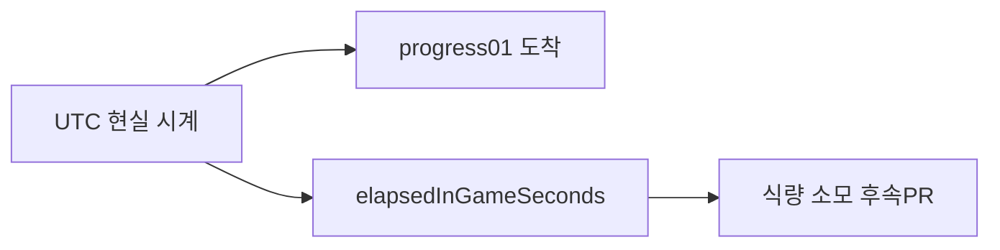

# In-Game Time Multiplier 로직 정리

Framework & Integration — `11.CoreServices`  
작성 목적: 이번 작업에서 구현한 인게임 시간 배율 기능의 정책·구조·데이터 흐름을 팀 공유용으로 정리한다.

---

## 1. 목적

이번 작업은 **현실 시간(UTC)** 과 **인게임 시간**을 분리하고, gameplay에 필요한 **인게임 경과 시간 API**를 Framework에 추가하는 것이 목적이다.

- `TimeScale`(Unity 연출/debug)과 **완전 분리**
- 무역 **도착**은 현실 UTC 기준 유지
- **식량·월드 시뮬** 등은 인게임 시간 축 사용 (Core 연동은 후속 PR)
- 온라인·오프라인·pause에서 **동일한 변환 규칙** 제공

---

## 2. 확정 정책

| 항목 | 정책 |
|---|---|
| 배율 정의 | `inGameTimeMultiplier` = 현실 1초당 인게임 N초 |
| 현실 시간 기준 | UTC wall-clock (`DateTime.UtcNow`) |
| 내부 계산 단위 | 인게임 **초**(in-game seconds) |
| Inspector 단위 | 분/시간/하루 — 표시·식량 raw rate 해석용 |
| `TimeScale` | Unity `Time.timeScale` 전용, gameplay 배율과 무관 |
| Pause | 인게임 경과·무역 진행률 갱신 모두 정지 |
| 배율 변경 | Editor / Development Build에서만 런타임 변경 가능 |
| Release | `InGameTimePolicyConfig` 기본값만 사용 |
| 무역 중 배율 | 출발 시 저장된 `inGameTimeMultiplierAtStart`만 사용 |
| `totalSeconds` | 현실 기준 총 소요 시간(초) — Core `CaravanData` 의미 유지 |

---

## 3. 이중 시간 모델

무역에는 **두 개의 시간 축**이 동시에 존재한다.

### 3-1. 현실 시간 축 — 도착·이동

```text
progress01 = (CurrentUtc - tradeStartUtc) / totalRealSeconds
```

- `totalSeconds`는 거리·속도·적재로 계산한 **현실 이동 소요 시간**
- `expectedTradeEndUtcTick = tradeStartUtc + expectedDuration`
- **인게임 배율과 무관**하게 도착 시각이 결정된다

### 3-2. 인게임 시간 축 — 식량·월드 시뮬(예정)

```text
elapsedInGameSeconds = (CurrentUtc - tradeStartUtc).TotalSeconds × inGameTimeMultiplierAtStart
```

- 식량 소모, 계절·재난, 마을 갱신 등 **게임 세계 시계**에 사용
- 무역 출발 시점의 배율을 스냅샷으로 고정해 사용한다



---

## 4. 핵심 변환 공식

변환 로직은 `InGameTimeConversionPolicy` 한 곳에 모았다. 공식 변경 시 이 클래스만 수정한다.

### 온라인 / 공통

```text
경과 인게임 시간(초) = 현실 경과 시간(초) × 배율
```

### 오프라인 (M3 대비, API만 준비)

```text
offlineInGameSeconds = (loadUtc - tradeStartUtc).TotalSeconds × multiplierAtStart
```

### 식량 raw rate 정규화 (후속 Core PR 입력용)

```text
consumptionPerInGameSecond = rawRate / SecondsPerUnit(foodConsumptionUnit)
```

| `InGameTimeUnit` | `SecondsPerUnit` |
|---|---|
| Second | 1 |
| Minute | 60 |
| Hour | 3,600 |
| Day | 86,400 |

---

## 5. 주요 컴포넌트

| 타입 | 경로 | 역할 |
|---|---|---|
| `InGameTimeUnit` | `Scripts/Time/InGameTimeUnit.cs` | Second/Minute/Hour/Day enum + 변환 helper |
| `InGameTimePolicyConfig` | `Scripts/Time/InGameTimePolicyConfig.cs` | Inspector 기본 배율·표시 단위·식량 단위 |
| `InGameTimeConversionPolicy` | `Scripts/Time/InGameTimeConversionPolicy.cs` | 현실→인게임 변환 공식 |
| `IInGameTimeProvider` | `Scripts/Time/IInGameTimeProvider.cs` | 팀 공용 API 계약 |
| `GameTimeService` | `Scripts/Time/GameTimeService.cs` | UTC, TimeScale, multiplier, pause, 변환 API |
| `TradeProgressRecorder` | `Scripts/TradeProgress/TradeProgressRecorder.cs` | 출발 시 배율·시간 tick 기록 |
| `TradeProgressCoordinator` | `Scripts/TradeProgress/TradeProgressCoordinator.cs` | progress 갱신, elapsed 계산, pause 반영 |

### 설정 자산

- `InGameTimePolicyConfig` ScriptableObject
- 권장 경로: `Assets/_Project/11.CoreServices/Resources/InGameTimePolicyConfig.asset`
- asset이 없으면 runtime 기본값 사용 (배율 1, 표시/식량 단위 Hour)

---

## 6. 초기화 흐름

`FrameworkRoot.InitializeServices()`에서 다음 순서로 준비된다.

```text
1. Resources.Load<InGameTimePolicyConfig>()
2. 없으면 ScriptableObject.CreateInstance로 fallback
3. new GameTimeService(policyConfig)
4. TradeProgressRecorder(GameTime, GameTime)
5. TradeProgressCoordinator(..., GameTime, ..., GameTime)
```

접근 진입점은 기존과 동일하다.

```text
FrameworkRoot.Instance.GameTime
```

`GameTimeService`가 `IGameTimeProvider`(UTC)와 `IInGameTimeProvider`(인게임 시간)를 함께 구현한다.

---

## 7. 무역 출발 시 로직

`TradeProgressRecorder.RecordStartedTrade()` 성공 시:

```text
1. tradeStartUtcTick = CurrentUtc.Ticks
2. expectedTradeEndUtcTick = startUtc + expectedDuration
3. inGameTimeMultiplierAtStart = 현재 InGameTimeMultiplier
4. caravan.elapsedInGameSeconds = 0
5. state = Traveling
```

- `expectedDuration`은 Core `CaravanCalculator.GetTravelSeconds()` 기반 **현실 초**
- 출발 시점 배율이 이후 무역 전체의 인게임 시간 변환 기준이 된다

---

## 8. 진행 갱신 시 로직

`TradeProgressCoordinator.CheckProgressAndCompletion()` 흐름:

```text
1. saveData.tradeProgress.state == Traveling 인지 확인
2. IsGameTimePaused == true 이면 즉시 return (progress·elapsed 모두 갱신 안 함)
3. progress01 = CalculateProgress()   ← 현실 UTC 기준
4. JourneyRunner.SetProgress(caravan, progress01)
5. CaravanSaveDataMapper.CopyToSave(caravan, saveData.caravan)
6. elapsedInGameSeconds = GetElapsedInGameSecondsForActiveTrade(progress, CurrentUtc)
7. saveData.caravan.elapsedInGameSeconds에 기록
8. 도착 전이면 Save, 도착/실패 시 settlement 생성
```

### `CalculateProgress` (현실 기준, 변경 없음)

```text
progress01 = (CurrentUtc - tradeStartUtc).TotalSeconds / (expectedEndUtc - tradeStartUtc).TotalSeconds
```

### `UpdateElapsedInGameSeconds` (인게임 기준, 신규)

```text
multiplier = tradeProgress.inGameTimeMultiplierAtStart  (0 이하면 1로 보정)
elapsedInGameSeconds = (CurrentUtc - tradeStartUtc).TotalSeconds × multiplier
```

---

## 9. Pause 동작

| 상태 | `progress01` | `elapsedInGameSeconds` | 저장 |
|---|---|---|---|
| 일반 진행 | 갱신 | 갱신 | 갱신 |
| `IsGameTimePaused` | 갱신 안 함 | 갱신 안 함 | 갱신 안 함 |

- `GameTimeService.PauseGameTime()` / `ResumeGameTime()`으로 제어
- pause 구간의 현실·인게임 시간은 **누적되지 않는다**
- Resume 이후 다음 tick부터 `CurrentUtc` 기준으로 이어서 계산

---

## 10. TimeScale vs InGameTimeMultiplier

| | `TimeScale` | `inGameTimeMultiplier` |
|---|---|---|
| 대상 | `UnityEngine.Time.timeScale` | gameplay 인게임 시계 |
| 용도 | 연출·debug 속도 | 식량·월드 시뮬(예정) |
| API | `SetTimeScale()` | `TrySetInGameTimeMultiplier()` |
| 무역 progress | 영향 없음 | elapsed에만 영향 (progress01 무관) |
| Release 변경 | debug 용도 | 변경 불가 (config 고정) |

`SetTimeScale(10)`을 호출해도 `InGameTimeMultiplier`는 변하지 않는다.

---

## 11. 저장 데이터 (SaveData v3)

### `TradeProgressSaveData`

| 필드 | 타입 | 의미 |
|---|---|---|
| `tradeStartUtcTick` | long | 무역 시작 UTC tick |
| `expectedTradeEndUtcTick` | long | 예상 도착 UTC tick |
| `inGameTimeMultiplierAtStart` | float | 출발 시 고정 배율 (기본 1.0) |

### `CaravanSaveData`

| 필드 | 타입 | 의미 |
|---|---|---|
| `totalSeconds` | float | 현실 기준 총 소요 시간(초) |
| `progress01` | float | 현실 기준 도착 진행률 |
| `elapsedInGameSeconds` | float | 누적 인게임 경과 시간(초) |

### 정규화 (`JsonSaveService.NormalizeData`)

- `inGameTimeMultiplierAtStart <= 0` → `1.0`으로 보정
- 구버전 저장(version 2)은 schema 불일치 시 새 데이터로 처리 (기존 정책)

---

## 12. 공용 API (`IInGameTimeProvider`)

```csharp
float InGameTimeMultiplier { get; }
bool IsGameTimePaused { get; }
InGameTimeUnit ElapsedTimeDisplayUnit { get; }
InGameTimeUnit FoodConsumptionUnit { get; }

double GetElapsedInGameSeconds(DateTime startUtc, DateTime endUtc, float multiplier);
double GetElapsedInGameSecondsForActiveTrade(TradeProgressSaveData progress, DateTime endUtc);
string FormatInGameDuration(double inGameSeconds, InGameTimeUnit unit);
float ToConsumptionPerInGameSecond(float rawRate);
```

### Debug 진입점

| 경로 | API |
|---|---|
| `FrameworkDebugCommands` | `SetInGameTimeMultiplier`, `ResetInGameTimeMultiplier`, `PauseGameTime`, `ResumeGameTime` |
| `FrameworkDebugBridge` | Inspector ContextMenu |
| `InGameSceneController` | scene debug 위임 |
| `InGameTimeTextDisplay` | TimeScale / Multiplier / Elapsed / Paused 표시 |

---

## 13. 이번 PR 범위와 후속 작업

### 이번 PR에서 완료

- 인게임 시간 배율 정책·변환 API
- 출발 시 배율 스냅샷 저장
- `elapsedInGameSeconds` 계산·SaveData 기록
- pause 시 진행·elapsed 정지
- debug / UI 표시

### 후속 PR (Core Gameplay)

- `CaravanData.elapsedInGameSeconds` runtime 필드 추가
- `CaravanCalculator.GetRemainingFood`를 인게임 경과 기준으로 변경
- `JourneyRunner.SetProgress` 호출 전 elapsed 주입
- `foodPerKm` raw rate → `ToConsumptionPerInGameSecond` 연동

현재 `JourneyRunner.SetProgress` 시점의 식량 판정은 여전히 `progress01 × totalSeconds`(현실 초) 기준이므로, **식량이 인게임 배율을 반영하려면 Core 후속 PR이 필요**하다.

### M3 이후

- 오프라인 로드 시 `GetOfflineElapsedInGameSeconds`로 elapsed 복구
- 계절·재난·상품 갱신에 인게임 누적 시계 연결

---

## 14. 밸런스 설계 관점 요약

| 밸런스 영역 | 시간 축 |
|---|---|
| 루트 거리, 이동 속도, 도착 대기 | **현실 시간** |
| 식량 소모, 계절, 재난, 마을 갱신 | **인게임 시간 (× 배율)** |
| 이동 중 거리 이벤트 (M2) | **progress01 / 거리** 우선 검토 |

즉, **“언제 도착하나”는 현실 시간**, **“세계 안에서 얼마나 지났나”는 인게임 시간**으로 설계한다.

---

## 15. 관련 파일

| 구분 | 경로 |
|---|---|
| 정책 config | `Assets/_Project/11.CoreServices/Scripts/Time/InGameTimePolicyConfig.cs` |
| 변환 정책 | `Assets/_Project/11.CoreServices/Scripts/Time/InGameTimeConversionPolicy.cs` |
| 서비스 | `Assets/_Project/11.CoreServices/Scripts/Time/GameTimeService.cs` |
| API 계약 | `Assets/_Project/11.CoreServices/Scripts/Time/IInGameTimeProvider.cs` |
| 저장 schema | `Assets/_Project/11.CoreServices/Scripts/Save/SaveData.cs` |
| 진행 연동 | `Assets/_Project/11.CoreServices/Scripts/TradeProgress/TradeProgressCoordinator.cs` |
| 출발 기록 | `Assets/_Project/11.CoreServices/Scripts/TradeProgress/TradeProgressRecorder.cs` |
| UI 표시 | `Assets/Scripts/InGameTimeTextDisplay.cs` |

---

이 문서를 `Docs/`에 저장하거나 PR 본문에 붙여 팀에 공유하면 됩니다. 파일로 추가가 필요하면 Agent 모드에서 요청해 주세요.