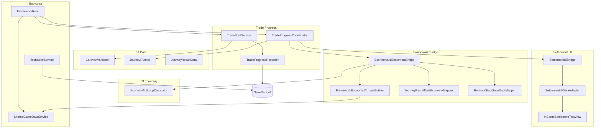
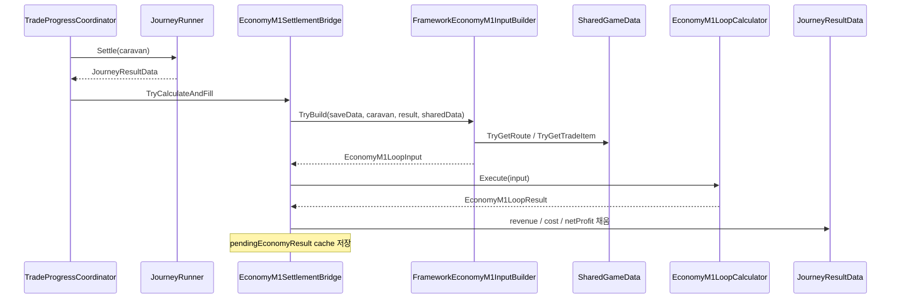

# 11.CoreServices 갱신 작업 — 로직 정리

**브랜치:** `feature/framework/core-services-sync`  
**범위:** `Assets/_Project/11.CoreServices/`  
**목적:** Core M2 · Sandbox SO · Economy M1 계약에 맞춰 Framework 저장·무역 loop·정산 bridge 동기화

---

## 1. 작업 개요

이번 작업은 **무역 한 사이클**이 아래 흐름으로 안전하게 반복되도록 Framework 계층을 갱신하는 것입니다.

```text
Prepare
→ Traveling
→ Settling (Core JourneyState) / SettlementPending (SaveData)
→ Claim
→ Completed or Failed
→ Prepare
```

핵심 목표는 다음 세 가지입니다.

1. **Core M2 caravan 필드**를 SaveData에 저장·복원
2. **Economy M1 정산**을 settle preview / claim apply로 Framework에 연결
3. **정산 캐시·중복 claim·무역 ID 불일치**를 Framework에서 차단

---

## 2. 시스템 구성



---

## 3. SaveData v4 스키마

### 3-1. 버전 정책

| 항목 | 값 |
|------|-----|
| `SaveData.CurrentVersion` | `4` |
| migration | 없음 — v3 이하 로드 시 **새 게임 데이터로 복구** |
| 정규화 | `JsonSaveService.NormalizeData` + `CaravanSaveDataMapper.Normalize` |

### 3-2. 주요 필드 변경

**PlayerSaveData**

| 필드 | 변경 |
|------|------|
| `tradingCurrency` | `int` → `long` |
| `developmentCurrency` | `int` → `long` |
| `playerGrowthLevel` | 신규 |
| `caravanGrowthLevel` | 신규 |

**CaravanSaveData (Core M2 대응)**

| 대표 필드 | 용도 |
|-----------|------|
| `currentDurability` | 출발 가능 여부(BrokenWagon) |
| `elapsedInGameSeconds` | 인게임 경과 시간 |
| `starveGraceSeconds` | 식량 고갈 후 도착 제한 |
| `lossLimitRate` | Economy claim 후 runtime stat 반영 |
| `runDurabilityLost`, `runBattlesFought` 등 | M2 run 추적 필드 |

**WorldSaveData**

- `unlockedTownIds`, `unlockedRouteIds`, `completedRouteIds` 추가

### 3-3. Runtime ↔ Save 변환

```text
CaravanData (Core runtime)
    ⇄ CaravanSaveDataMapper.ToRuntime / CopyToSave
CaravanSaveData (JSON DTO)
```

- reload 후 M2 상태가 복원되어 출발·진행·정산이 깨지지 않도록 **1:1 매핑**이 핵심입니다.

---

## 4. 무역 Loop 로직

### 4-1. 무역 출발 (`TradeStartService.TryStartTrade`)

```text
1. CaravanValidator.Validate(caravan)
   → canDepart == false 이면 중단

2. TradeProgressRecorder로 activeTradeId, routeId,
   tradeStartUtcTick, expectedTradeEndUtcTick 기록
   → 기록 실패 시 Core Traveling 전환 없음

3. 기록 성공 시 이전 정산 캐시 제거 (ClearSettlementCache)

4. JourneyRunner 출발 처리 + CaravanSaveDataMapper.CopyToSave

5. SaveData.tradeProgress.state = Traveling
6. InGameScreenState.Traveling 요청
7. Save
```

**원칙:** Framework 기록이 실패하면 Core만 Traveling이 되는 상태를 방지합니다.

---

### 4-2. 진행률 갱신 (`TradeProgressCoordinator.CheckProgressAndCompletion`)

```text
전제: saveData.tradeProgress.state == Traveling

1. pause 중이면 갱신 스킵
2. progress = (현재 UTC - 시작 UTC) / (예상 종료 UTC - 시작 UTC)
3. JourneyRunner.SetProgress(caravan, progress)
4. elapsedInGameSeconds 갱신
5. 아직 도착/치명 실패 없으면 진행률만 저장 후 return false
6. 도착 또는 실패 조건이면 SettleActiveTrade 호출
```

**SettlementPending 이후 `CheckProgress` 재호출 시**

- `CanUpdateTravelingTrade`가 false → **새 정산 생성 안 함**
- `LastSettlementResult`는 **유지** (M1 무결성 요구사항)

---

### 4-3. 정산 생성 (`SettleActiveTrade`)

```text
전제:
- state == Traveling
- activeTradeId 비어 있지 않음

1. JourneyRunner.Settle(caravan) → JourneyResultData
2. tradeProgressRecorder.MarkSettlementPending
3. LastSettlementTradeId / LastSettlementResult 캐시
4. EconomyM1SettlementBridge.TryCalculateAndFill (preview)
5. CaravanSaveDataMapper.CopyToSave
6. Save
7. FrameworkEvents.RaiseTradeSettlementReady
8. InGameScreenState.Settlement 요청
```

---

### 4-4. 정산 수령 (`ClaimSettlementAndReset`)

```text
검증:
- LastSettlementResult != null
- state == SettlementPending
- LastSettlementTradeId == activeTradeId

1. JourneyRunner.ClaimSettlement(caravan)
2. EconomyM1SettlementBridge.TryApplyPendingEconomy
   → player 화폐, growth level, caravan.lossLimitRate 반영
3. 등급에 따라 MarkCompleted 또는 MarkFailed
4. JourneyRunner.ResetToPrepare(caravan)
5. CaravanSaveDataMapper.CopyToSave + Save
6. InGameScreenState.Preparation
7. ClearSettlementCache (Coordinator + Economy pending)
```

**중복 claim:** 캐시 제거 후 두 번째 claim은 `cached settlement result is missing`으로 차단됩니다.

---

### 4-5. 상태 대응표

| SaveData `TradeProgressState` | Core `JourneyState` | 화면 |
|-------------------------------|---------------------|------|
| Preparing / None | Prepare | Preparation |
| Traveling | Traveling | Traveling |
| SettlementPending | Settling | Settlement |
| Completed / Failed | Completed → Prepare | Preparation |

---

## 5. Economy M1 Claim Bridge

### 5-1. 설계 원칙 (M1)

| 시점 | 동작 | SaveData 화폐 |
|------|------|---------------|
| **Settle** | Economy 계산 + `JourneyResultData` 금액 채움 (preview) | **변경 없음** |
| **Claim** | pending cache 적용 | **변경** |

- `PurchaseGrowth = false` (M1 고정)
- **첫 번째 유효 cargo 1품목**만 Economy 입력에 사용
- Economy 실패 시 Core 정산 등급은 유지, 금액 필드는 0일 수 있음

---

### 5-2. Settle 흐름 (preview)



**입력 조립 규칙 (`FrameworkEconomyM1InputBuilder`)**

| 입력 | 출처 |
|------|------|
| `tradeId`, `routeId` | `saveData.tradeProgress` |
| route 비용 | `SharedRouteDefinition.BaseFoodCost/MercenaryCost` |
| item 가격·modifier | `SharedTradeItemDefinition` |
| `Quantity` | cargo quantity − `cargoLost` |
| `CartRepairCost` | `durabilityLost × 1` (임시 상수) |
| `SeasonId`, `DisasterId` | `WorldSaveData` |
| growth level | `PlayerSaveData` |

---

### 5-3. Claim 흐름 (apply)

```text
TryApplyPendingEconomy(saveData, runtimeCaravan, activeTradeId)

검증:
- pendingEconomyResult 존재
- pendingTradeId == activeTradeId

적용 (RuntimeStatsSaveDataMapper.ApplyEconomyResult):
- player.tradingCurrency / developmentCurrency
- player.playerGrowthLevel (growth purchase 성공 시)
- runtimeCaravan.lossLimitRate

→ pending cache 삭제
```

**검증 예시 (dummyroute / dummyitem)**

- settle 후: `tradingCurrency` = 1000 (미변경)
- claim 후: `tradingCurrency` = 970, `lossLimitRate` = 0.5

---

## 6. SharedGameData 연동

### 6-1. 로드 시점

```text
CompleteLoadingAndEnterGame()
  → EnsureSharedGameDataLoaded()
  → SharedGameDataService.LoadInitialData()
  → FrameworkRoot.SharedGameData 설정
  → FrameworkEvents.SharedGameDataLoaded
```

- 테스트 Scene만 직접 Play하면 SharedData가 없을 수 있음
- Economy preview는 이 경우 skip warning 후 Core 정산만 유지

### 6-2. Phase 2 보강

**SharedRouteDefinition**

- `BaseFoodCost`, `BaseMercenaryCost` (`long`)

**SharedTradeItemDefinition**

- `PriceModifierInput` 스냅샷 (Sandbox modifier → Economy 변환)

---

## 7. Settlement UI 연동

```text
TradeSettlementReady 이벤트
  → SettlementUiBridge (pending cache)
  → SettlementUiDataAdapter
  → SettlementViewData (long revenue/cost/netProfit + M2 필드)
  → ISettlementView (InGameSettlementTestView)

Claim 버튼
  → SettlementUiDataAdapter.OnClickClaimSettlement
  → SettlementUiBridge.ClaimSettlementAndReset
  → TradeProgressCoordinator.ClaimSettlementAndReset
```

**M1 UI 표시**

- `netProfitText` 등 long 금액 표시
- M2 상세 필드는 adapter에 존재, 테스트 view는 `netProfit` 중심

---

## 8. FrameworkRoot 조립

`FrameworkRoot.InitializeServices()`에서:

```text
GameTimeService
JsonSaveService
SharedGameDataService
TradeProgressRecorder
InGameScreenStateRouter
TradeProgressCoordinator(
  ...
  getSharedGameData: () => SharedGameData   ← Economy bridge DI
)
TradeStartService(..., ClearSettlementRuntimeCache)
SettlementUiBridge (MonoBehaviour)
```

`ClearSettlementRuntimeCache`는 **새 무역 출발 성공 시** coordinator·bridge 정산 캐시를 함께 비웁니다.

---

## 9. 주요 파일 맵

| 역할 | 경로 |
|------|------|
| 저장 스키마 | `Scripts/Save/SaveData.cs` |
| M2 mapper | `Scripts/Save/CaravanSaveDataMapper.cs` |
| JSON 저장 | `Scripts/Save/JsonSaveService.cs` |
| Economy 입력 | `Scripts/TradeProgress/FrameworkEconomyM1InputBuilder.cs` |
| Economy bridge | `Scripts/TradeProgress/EconomyM1SettlementBridge.cs` |
| 결과 매핑 | `Scripts/TradeProgress/JourneyResultDataEconomyMapper.cs` |
| claim stat 반영 | `Scripts/Save/RuntimeStatsSaveDataMapper.cs` |
| 정산 조율 | `Scripts/TradeProgress/TradeProgressCoordinator.cs` |
| 출발 | `Scripts/TradeProgress/TradeStartService.cs` |
| DI root | `Scripts/Bootstrap/FrameworkRoot.cs` |
| SharedData | `Scripts/Data/SharedGameDataService.cs`, `SharedGameDataView.cs` |
| Settlement UI | `Scripts/UI/Settlement/*` |
| Debug | `Scripts/Debug/TradeStartDebugHarness.cs` |

---

## 10. M1 범위와 후속

### 포함 (이번 작업)

- SaveData v4 + M2 전 필드 매핑
- Economy settle preview / claim apply
- 무역 loop 무결성 (3회 smoke, 중복 정산·claim 방지)
- SharedData route 비용·item modifier
- Settlement UI long 금액 표시

### 미포함 (후속)

| 항목 | 비고 |
|------|------|
| `RuntimeStatsSaveData` SaveData 루트 영속화 | claim 시 `lossLimitRate`만 반영 |
| 다품목 Economy 정산 | 첫 cargo만 사용 |
| `PurchaseGrowth` / 성장 구매 UI | M1에서 false 고정 |
| `PendingSettlementSaveData` 재실행 복구 | M3 범위 |
| harness 기본 ID = catalog ID | 테스트 시 `dummyroute`/`dummyitem` 수동 설정 |

### 외부 PR 요청 (코드 수정 없이 문서화)

- **Economy (LJH):** `LjhEconomyM1InputAdapter` Framework SaveData 공식 지원
- **UI&Data (LJH):** debug/catalog ID 표준화, `imsi*` → 최종 GameData 합의
- **Core (YHY):** 다품목·modifier 정책 확정

---

## 11. 디버그 검증 경로

**Loop smoke (필수)**

```text
TradeStartDebugHarness
  → Run M1 Loop Integrity Smoke (3회)
```

**Economy E2E (권장)**

```text
Boot → New Game → InGame
harness: routeId=dummyroute, cargo item.id=dummyitem
  → Start → Force Complete → Claim
  → tradingCurrency 변화, lossLimitRate 확인
```

---

이 문서를 `Docs/`에 저장하려면 Agent mode에서 경로를 지정해 주시면 파일로 추가할 수 있습니다.