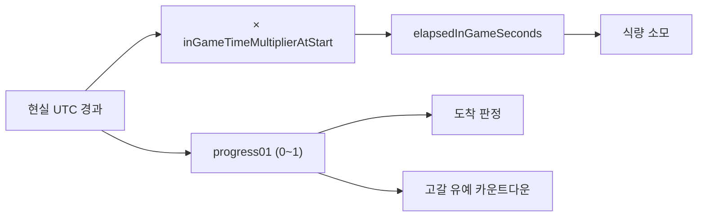
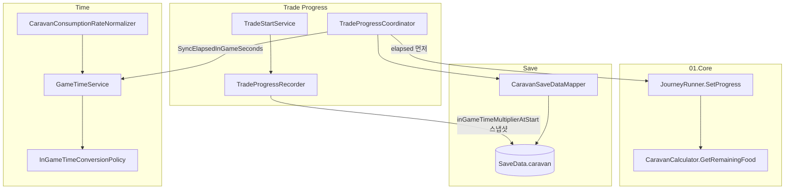

# 인게임 식량 소모 Framework 연동 — 로직 정리

**브랜치:** `fix/framework/caravan-ingame-food-sync`  
**커밋:** `898b39e`  
**범위:** `Assets/_Project/11.CoreServices/` (Framework) + Core 연동 계약  
**목적:** Core의 인게임 시간 기준 식량 소모를 Framework 무역 진행 루프에서 실제로 동작하도록 연결

---

## 1. 작업 개요

Core는 식량 소모를 **거리 기준에서 인게임 경과 시간 기준**으로 전환했다.  
Framework는 인게임 시간 배율(`inGameTimeMultiplier`)과 UTC tick 기반 무역 진행을 이미 제공하고 있었으나, **active runtime caravan에 `elapsedInGameSeconds`가 반영되지 않아** 식량이 소모되지 않는 연동 버그가 있었다.

이번 작업은 다음을 해결한다.

1. **`elapsedInGameSeconds` 동기화** — `SetProgress` 전에 runtime caravan + SaveData 동시 갱신
2. **소모율 정규화** — SO/raw rate → 인게임 초당 소모율 (`ToConsumptionPerInGameSecond`)
3. **회귀 검증** — Editor E2E + Play mode smoke 추가

---

## 2. 이중 시간 모델

무역 진행은 **두 개의 독립된 시간 축**을 사용한다.

| 축 | 단위 | 사용처 | Framework 담당 |
|----|------|--------|----------------|
| **현실 UTC** | wall-clock 초 | `progress01` (도착 판정) | `CalculateProgress` |
| **인게임 경과** | 인게임 초 | 식량 소모, (향후) 월드 시뮬 tick | `SyncElapsedInGameSeconds` |
| **현실 유예** | wall-clock 초 | `starveGraceSeconds` 고갈 후 제한시간 | 값 저장만 (Core 판정) |



**팀 결정 (2026-07-11):** `starveGraceSeconds`는 **현실 초** 축을 유지한다.  
식량 **소모량**만 인게임 배율의 영향을 받는다.

---

## 3. 수정 전 문제

### 3-1. elapsed가 active caravan에 반영되지 않음

`TradeProgressCoordinator.CheckProgressAndCompletion` 기존 순서:

```text
1. JourneyRunner.SetProgress(caravan, progress)   ← elapsed=0 으로 식량 계산
2. CaravanSaveDataMapper.CopyToSave(...)
3. UpdateElapsedInGameSeconds(saveData)         ← SaveData만 갱신
```

- `CheckFoodDepletion` → `GetRemainingFood`는 **runtime caravan**의 `elapsedInGameSeconds`를 사용
- SaveData에는 올바른 값이 저장되지만, **같은 세션 내 active caravan은 0에 고정**
- 결과: 식량 미소모, `foodConsumed` 정산값 0, 고갈 실패 미발생

### 3-2. 소모율 정규화 미연동

- `GameTimeService.ToConsumptionPerInGameSecond` API는 존재했으나 **호출처 없음**
- debug/E2E harness가 `foodPerKm = 0.1f` 하드코딩 (정책 단위와 불일치 가능)

---

## 4. 수정 후 흐름

### 4-1. 진행률 갱신 (`CheckProgressAndCompletion`)

```text
전제: tradeProgress.state == Traveling, pause 아님

1. EnsureActiveCaravan()
2. SyncElapsedInGameSeconds(saveData, caravan)     ← ★ SetProgress 전
3. progress = CalculateProgress(tradeProgress)     ← 현실 UTC 비율
4. JourneyRunner.SetProgress(caravan, progress)   ← 식량·마모·고갈 판정
5. CaravanSaveDataMapper.CopyToSave(...)
6. 도착/치명 실패 없으면 진행률만 저장
7. 조건 충족 시 SettleActiveTrade
```

`ForceCompleteActiveTrade`도 동일하게 **SetProgress 전** `SyncElapsedInGameSeconds` 호출.

### 4-2. `SyncElapsedInGameSeconds` 로직

```text
elapsed = GetElapsedInGameSecondsForActiveTrade(tradeProgress, CurrentUtc)

caravan.elapsedInGameSeconds = elapsed
saveData.caravan.elapsedInGameSeconds = elapsed
```

**인게임 경과 공식:**

```text
elapsedInGameSeconds = (CurrentUtc - tradeStartUtc).TotalSeconds × inGameTimeMultiplierAtStart
```

- `inGameTimeMultiplierAtStart`는 출발 시 `TradeProgressRecorder.RecordStartedTrade`에서 스냅샷
- 무역 중 runtime 배율 변경은 **진행 중 무역에 영향 없음** (다음 출발부터 적용)

### 4-3. pause 동작

`IsGameTimePaused == true`이면 `CheckProgressAndCompletion` 전체를 스킵한다.  
현실 `progress01`과 인게임 `elapsedInGameSeconds` 모두 갱신되지 않는다.

---

## 5. Core 식량 계산 (연동 대상)

Framework가 `elapsedInGameSeconds`를 채운 뒤 Core가 계산한다.

### 5-1. 초당 소모율

```text
GetConsumptionPerSec(caravan) = Σ animal.foodPerKm
```

- `foodPerKm` 필드명은 legacy. **의미는 인게임 1초당 소모율**
- Framework `CaravanConsumptionRateNormalizer`가 출발 직전에 정규화

### 5-2. 남은 식량

```text
remaining = foodAmount - (GetConsumptionPerSec × elapsedInGameSeconds) - runFoodLost
```

### 5-3. 고갈 판정 (`JourneyRunner.CheckFoodDepletion`)

```text
remaining <= 0  →  runFoodDepleted = true, runFoodDepletedProgress = progress01 기록

유예 초과 = (progress01 - runFoodDepletedProgress) × totalSeconds >= starveGraceSeconds
  →  MarkFatal(FoodDepleted)   ※ totalSeconds·유예는 현실 초 축
```

---

## 6. 소모율 정규화 (`CaravanConsumptionRateNormalizer`)

### 6-1. 역할

SharedGameData·SO·debug 설정의 **raw 소모율**을 Core가 사용하는 **인게임 초당 소모율**로 변환한다.

```text
foodPerKm (runtime) = ToConsumptionPerInGameSecond(rawRate)
                    = rawRate / SecondsPerUnit(FoodConsumptionUnit)
```

| `FoodConsumptionUnit` | `SecondsPerUnit` |
|-----------------------|------------------|
| Second | 1 |
| Minute | 60 |
| Hour | 3,600 |
| Day | 86,400 |

정책 asset: `Resources/InGameTimePolicyConfig.asset` — `foodConsumptionUnit: Day (3)`

### 6-2. 호출 시점

| 시점 | 호출 |
|------|------|
| debug harness `FillSampleCaravan` / 출발 직전 | ✅ |
| E2E `CreateSampleCaravan` | ✅ |
| `CaravanSaveDataMapper.ToRuntime` (저장 복원) | ❌ (이중 정규화 방지) |
| 매 tick `CheckProgressAndCompletion` | ❌ |

### 6-3. debug/E2E 샘플 상수

```text
SampleRawFoodConsumptionPerDay = 8640
→ Day 정책에서 인게임 초당 0.1 (동물 1마리 기준)
→ 동물 2마리 합산: 0.2 / 인게임 초
```

---

## 7. 시스템 구성



---

## 8. 주요 파일

| 파일 | 역할 |
|------|------|
| `TradeProgressCoordinator.cs` | `SyncElapsedInGameSeconds`, 진행 갱신 조율 |
| `CaravanConsumptionRateNormalizer.cs` | raw → 인게임 초당 소모율 |
| `GameTimeService.cs` | 배율·elapsed 변환·정규화 API |
| `TradeProgressRecorder.cs` | 출발 시 배율 스냅샷·elapsed 0 초기화 |
| `TradeStartDebugHarness.cs` | Play mode smoke |
| `FrameworkM1LoopE2EEditorTests.cs` | Editor/batchmode E2E |
| `Framework_InGame_Time_Multiplier_API_Guide.md` | 공개 API·연동 상태 가이드 |

---

## 9. 검증

### 9-1. Editor E2E (`RunInGameFoodConsumptionE2E`)

`ND → Framework → Run M1 Loop + Economy E2E Checks`에 포함.

| 케이스 | 배율 | 조건 | 기대 |
|--------|------|------|------|
| High multiplier | 60 | 식량 10, 현실 10초 backdate | 식량 감소, `runFoodDepleted` |
| Baseline | 1 | 동일 backdate | 식량 잔존, 고갈 없음 |

공통 검증:

- `caravan.elapsedInGameSeconds == saveData.caravan.elapsedInGameSeconds`
- `GetRemainingFood` 감소 (high case)

### 9-2. Play mode smoke

Boot → InGame → `TradeTestCaravan` → ContextMenu:

```text
Framework/Run InGame Food Consumption Smoke
```

### 9-3. batchmode

```powershell
& "C:\Program Files\Unity\Hub\Editor\6000.5.2f1\Editor\Unity.exe" `
  -batchmode -nographics -quit `
  -projectPath "D:\CS_Project\ND" `
  -executeMethod ND.Framework.Editor.FrameworkM1LoopE2EEditorTests.RunAllFromBatchMode `
  -logFile "D:\CS_Project\ND\Logs\framework-m1-e2e.log"
```

---

## 10. 오프라인 복구

저장 데이터에 `tradeStartUtcTick`, `inGameTimeMultiplierAtStart`, `elapsedInGameSeconds`가 기록된다.

재접속 후 첫 `CheckProgressAndCompletion`:

1. `EnsureActiveCaravan` — SaveData에서 `elapsedInGameSeconds` 복원 (`ToRuntime`)
2. `SyncElapsedInGameSeconds` — 현재 UTC 기준으로 **재계산·덮어쓰기**
3. `SetProgress` — 누락 구간 포함한 진행·식량 반영

Core `JourneyRunner`는 progress delta 기반 거리 마모를 사용하므로, 오프라인 점프와 온라인 실시간 갱신이 동일한 결과를 낸다.

---

## 11. Core 후속 작업 (별도 PR)

Framework 차단 조건이 **아님**. 요청서: [`Core-PR-Request-InGame-Food-Time-Axis.md`](Core-PR-Request-InGame-Food-Time-Axis.md)

| 항목 | 내용 |
|------|------|
| 문서화 | `CaravanData` / `JourneyRunner` / `_Core_참조문서.md`에 이중 시간 축 명시 |
| 선택 | `foodPerKm` → `foodPerInGameSecond` 필드 rename |
| 제외 | `starveGraceSeconds`를 인게임 축으로 변경 |

---

## 12. 알려진 제한 (M1)

| 항목 | 상태 |
|------|------|
| Preparation UI → caravan 조립 시 정규화 | debug/E2E만 적용, UI 조립 경로는 후속 |
| SharedGameData `FoodConsumptionPerSecond` → caravan 자동 매핑 | 미연동 (helper 재사용 예정) |
| `foodPerKm` 필드명 | rename 별도 PR |
| Release 빌드 runtime 배율 변경 | `TrySetInGameTimeMultiplier` 무시 — config 초기값만 |

---

## 13. 관련 문서

| 문서 | 내용 |
|------|------|
| [`Core-services-M1-sync.md`](Core-services-M1-sync.md) | Framework M1 무역 loop 전체 |
| [`Framework_InGame_Time_Multiplier_API_Guide.md`](../../Guide/Framework_InGame_Time_Multiplier_API_Guide.md) | 인게임 시간 Public API |
| [`InGame-TimeScale.md`](InGame-TimeScale.md) | 인게임 시간 설계 메모 |
| [`Core-PR-Request-InGame-Food-Time-Axis.md`](Core-PR-Request-InGame-Food-Time-Axis.md) | Core 문서화 PR 요청 |
| [`develop-3cycle-e2e-result.md`](develop-3cycle-e2e-result.md) | M1 loop/Economy E2E 결과 |
