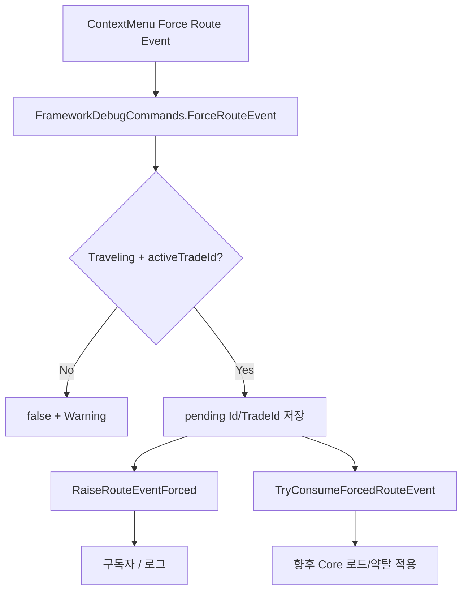
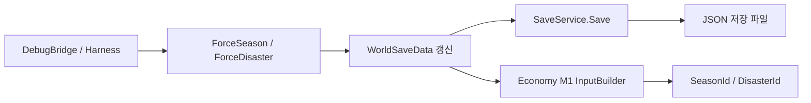

# World Force Debug API — 로직 정리

**작성일:** 2026-07-11  
**브랜치:** `feature/framework/world-force-debug-commands`  
**범위:** `Assets/_Project/11.CoreServices/`  
**목적:** M2 Framework P0 — `ForceSeason` / `ForceDisaster` / `ForceRouteEvent` debug API의 책임, 데이터 흐름, 실패 조건, 검증 방법을 정리한다.

---

## 1. 작업 개요

M2 통합에서 팀(식량 실패·계절 가격·로드 이벤트)이 Framework에 기대하는 **월드/이벤트 강제 주입** 진입점이 없었다.  
이번 작업은 프로덕션 월드 시뮬/Core 로드 적용이 아니라, **개발·통합 smoke용 Force\* API**를 제공한다.

| API | 영속화 | 핵심 효과 |
|-----|--------|-----------|
| `ForceSeason(seasonId)` | `WorldSaveData.currentSeasonId` + 즉시 Save | Economy 입력 `SeasonId`에 연결되는 저장값 변경 |
| `ForceDisaster(disasterId)` | `WorldSaveData.currentDisasterId` + 즉시 Save | Economy 입력 `DisasterId`에 연결되는 저장값 변경 |
| `ForceRouteEvent(eventId)` | **Save 없음** (런타임 pending) | Traveling trade 1회 주입 hook + `RouteEventForced` 이벤트 |

진입점:

- `FrameworkRoot.DebugCommands` (`FrameworkDebugCommands`)
- Inspector: `FrameworkDebugBridge`, `TradeStartDebugHarness` ContextMenu

---

## 2. 관련 파일

| 파일 | 역할 |
|------|------|
| `Scripts/Debug/FrameworkDebugCommands.cs` | Force\* 구현, pending route event 보관, Save 호출 |
| `Scripts/Events/FrameworkEvents.cs` | `RouteEventForced` / `RaiseRouteEventForced` |
| `Scripts/Debug/FrameworkDebugBridge.cs` | InGame ContextMenu + Inspector ID 필드 |
| `Scripts/Debug/TradeStartDebugHarness.cs` | 동일 Force\* ContextMenu + 무역 출발 준비 |
| `Scripts/Save/SaveData.cs` → `WorldSaveData` | `currentSeasonId`, `currentDisasterId` |
| `Scripts/TradeProgress/FrameworkEconomyM1InputBuilder.cs` | 정산 시 season/disaster를 Economy 입력으로 읽음 |

---

## 3. 데이터 모델

### 3-1. WorldSaveData (영속)

```text
SaveData.world
  ├── currentSeasonId     // 기본 "summer"
  └── currentDisasterId   // 기본 "" (재난 없음)
```

- ForceSeason / ForceDisaster는 이 필드를 직접 쓰고 `ISaveService.Save(CurrentSaveData)`를 호출한다.
- 다음 Economy settle 시 `FrameworkEconomyM1InputBuilder`가 동일 필드를 `PriceCalculationInput.SeasonId` / `DisasterId`로 넘긴다.

### 3-2. ForceRouteEvent pending (비영속)

`FrameworkDebugCommands` 인스턴스 필드:

```text
pendingForcedRouteEventId
pendingForcedRouteEventTradeId
```

- 세션/Play 모드 동안만 유지된다.
- Title Continue·도메인 재로드 후에도 **복구되지 않는 것이 정상**이다.
- Core 로드/약탈 적용 API가 붙기 전 **Framework stub hook**이다.

---

## 4. API별 로직

### 4-1. ForceSeason

```text
입력: seasonId (공백 불가)

1. seasonId null/whitespace → false, Warning
2. FrameworkRoot + CurrentSaveData + SaveService 준비 확인
3. world == null 이면 new WorldSaveData()
4. world.currentSeasonId = seasonId.Trim()
5. SaveService.Save(CurrentSaveData)
6. Info 로그: TradeId, SeasonId
7. true
```

**TradeId 로그:** active trade가 있으면 `tradeProgress.activeTradeId`, 없으면 `"(none)"`.  
Traveling 여부는 Season에 **요구하지 않는다**.

### 4-2. ForceDisaster

```text
입력: disasterId (null → "")

1. FrameworkRoot / Save 준비 확인 (Season과 동일)
2. world.currentDisasterId = disasterId?.Trim() ?? ""
3. SaveService.Save(CurrentSaveData)
4. Info 로그: TradeId, DisasterId
5. true
```

- **빈 문자열은 성공**이다 → “재난 없음”으로 클리어.
- Season과 달리 disasterId 공백을 실패로 보지 않는다.

### 4-3. ForceRouteEvent

```text
입력: eventId (공백 불가)

1. eventId null/whitespace → false
2. tradeProgress.state == Traveling 이고 activeTradeId 비어 있지 않으면
   - 아니면 false + Warning (Traveling required)
3. pendingForcedRouteEventId / TradeId 설정
4. FrameworkEvents.RaiseRouteEventForced(tradeId, eventId)
5. Info 로그: TradeId, RouteId, EventId
6. true
```

**하지 않는 것:**

- Core JourneyRunner에 로드/약탈 적용
- `WorldSaveData` / `TradeProgressSaveData` 필드 추가 저장
- `expectedTradeEndUtcTick` 갱신 (M2 후속 P0-3)

### 4-4. TryConsumeForcedRouteEvent

```text
입력: tradeId (선택), out eventId

- pending 없음 → false
- tradeId가 비어 있지 않고 pending trade와 불일치 → false
- 일치(또는 tradeId 생략) → eventId 반환, pending 비움, true
```

Core 또는 이후 coordinator가 **1회 소모**할 때 사용한다. ContextMenu는 없다.

---

## 5. 이벤트 계약

### `FrameworkEvents.RouteEventForced`

| 항목 | 내용 |
|------|------|
| 인자 | `(string tradeId, string eventId)` |
| 발행 조건 | `ForceRouteEvent`가 Traveling 검증 통과 후 |
| 중복 | 같은 trade에 재호출하면 pending이 **덮어쓰기**되고 이벤트가 다시 발생할 수 있음 |
| 구독자 책임 | 중복 적용 방지; 실제 Core 적용은 구독자/`TryConsumeForcedRouteEvent` 경로 |



---

## 6. Season / Disaster 흐름



정산 시점의 가격 반영은 **이미 연결된 읽기 경로**를 탄다.  
Force\* 직후 자동 settle은 하지 않으며, 다음 settle/claim 때 변경된 ID가 사용된다.

---

## 7. Inspector / ContextMenu

공통 ContextMenu 이름:

| 메뉴 | 호출 |
|------|------|
| `Framework/Force Season` | `ForceSeason(debugSeasonId)` |
| `Framework/Force Disaster` | `ForceDisaster(debugDisasterId)` |
| `Framework/Force Route Event` | `ForceRouteEvent(debugRouteEventId)` |

기본 Inspector 값:

- `debugSeasonId` = `winter`
- `debugDisasterId` = `drought`
- `debugRouteEventId` = `debug_route_event_001`

`TradeStartDebugHarness`만 무역 준비 API를 가진다:

1. `Framework/Fill Sample Caravan`
2. `Framework/Start Trade And Record Time` → Traveling
3. `Framework/Force Route Event`

저장 확인: `Framework/Print Save Data` (Harness) 또는 `Framework/Print Full Save Data` (`SaveDataDebugPrinter`).

---

## 8. 실패·경계 조건 요약

| 상황 | API | 결과 |
|------|-----|------|
| FrameworkRoot 미준비 | Season/Disaster/Route | false, Warning |
| seasonId 공백 | ForceSeason | false |
| disasterId 공백/null | ForceDisaster | true, disaster 클리어 |
| eventId 공백 | ForceRouteEvent | false |
| state ≠ Traveling | ForceRouteEvent | false |
| activeTradeId 공백 | ForceRouteEvent | false |
| pending 없음 / trade 불일치 | TryConsume… | false |

Content 테이블에 없는 season/disaster/event ID여도 Force\* 자체는 **문자열만 기록**한다.  
Economy·Core 해석 실패는 후속 시스템의 책임이다.

---

## 9. Play 검증 요약

권장 경로:

```text
Boot → Title → New Game → Loading → InGame
```

| 순서 | 동작 | 확인 |
|------|------|------|
| 1 | Force Season | 로그 + Print Save `currentSeasonId` |
| 2 | Force Disaster | 로그 + `currentDisasterId` |
| 3 | Force Route Event (무역 전) | Traveling required Warning |
| 4 | Fill Sample → Start Trade | Traveling |
| 5 | Force Route Event | `RouteEventForced` + inject hook 로그 |
| 6 | (선택) Title Continue | Season/Disaster 유지, Route pending 소멸 |

---

## 10. 범위 밖 (Do Not / 후속)

- M3: `PendingSettlementSaveData`, AtomicSave, AutoSave, Offline
- Core 로드/약탈 실제 적용, `expectedTradeEndUtcTick` 갱신 (M2 P0-3)
- `PurchaseGrowth` 활성화, Economy 다품목 확장
- Scene/Prefab YAML 직접 편집
- 월드 계절·재난의 **자동 시간 전환** (M2 P1)

---

## 11. 관련 문서

- `Docs/Personal_Documents/CSU/2026-07-11-framework-m2-planning-handoff.md`
- `Docs/Planning_Milestone/02_Framework_Integration_Milestone.md` (Force\* 체크리스트)
- `Docs/Personal_Documents/CSU/0711_caravan-ingame-food-sync.md` (선행 M2 P0-1)
