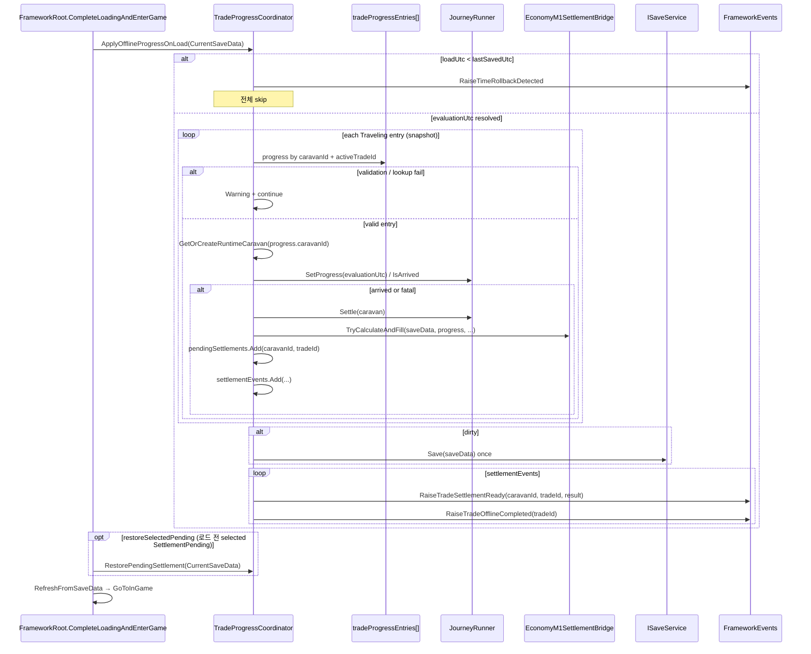

# Multi-active Entry-based Offline Restore 구현 로직

- 작성일: 2026-07-23
- 담당: Framework & Integration (CSU)
- 브랜치: `feature/framework/multi-active-offline-restore`
- 기준 브랜치: `dev2`
- 상태: 구현·Editor E2E·Runtime 검증 완료(조건부 PASS, 커밋 전)
- 선행 작업:
  - `Docs/Personal_Documents/CSU/0723_multi_active_online_tick_economy_trade_id.md` — entry 전체 Online Tick, Economy Trade ID 정렬
  - `Docs/Personal_Documents/CSU/0723_caravan_runtime_registry.md` — caravanId 기반 runtime registry
  - `Docs/Personal_Documents/CSU/0712_m3-offline-progress-pipeline.md` — 단일 Caravan Offline 복구 파이프라인
- 관련 문서:
  - `Docs/Personal_Documents/CSU/0721_multi_caravan_save_cutover.md`
  - `Docs/Personal_Documents/CSU/0712_m3-pending-settlement-persist.md`
  - `Docs/Personal_Documents/CSU/Research/0721_Framework_Runtime_Save_Contract_Research.md`

---

## 1. 목적

선행 Online Tick 작업으로 `CheckProgressAndCompletion`은 `tradeProgressEntries[]` 전체를 순회하지만,  
**Offline Restore**(`ApplyOfflineProgressOnLoad`)는 여전히 **selected 단일 `saveData.tradeProgress`** 만 처리했다.

| 조건 | 기존 동작 | 문제 |
|---|---|---|
| A Traveling, selected = B(Preparing) | selected progress만 offline 복구 | 비선택 A 진행·완료 누락 |
| A·B 동시 Traveling, 둘 다 offline 완료 | selected 1건만 settle | Pending·Event 1건만 생성 |
| A 완료 + B 진행 | 첫 완료 후 중단 가능 | 혼합 시나리오 미처리 |
| 오류 entry 존재 | 전체 중단 또는 selected fallback | entry 격리·Trade ID fallback 위험 |

이번 작업은 Offline Restore를 Online Tick과 **동일한 entry-based 계약**으로 확장한다.

1. **`tradeProgressEntries` snapshot 전체 순회** — Traveling entry마다 독립 진행·정산
2. **entry별 caravanId / activeTradeId 사용** — selected·legacy progress fallback 금지
3. **Restore 종료 후 Save·Event 일괄 처리** — Restore당 Save 최대 1회
4. **오류 entry 격리 Warning 계약** — Stage / caravanId / tradeId / Reason 포함

이번 범위에 **포함하지 않는 것**:

- Settlement Result Registry (`LastSettlementResult` 단일 cache 유지)
- Economy pending cache Registry (Bridge 내부 단일 `pendingTradeId` 유지)
- 비선택 Pending UI 자동 표시 / Overview badge
- `RestorePendingSettlement`의 selected wrapper Economy 재계산 정렬
- `SettleActiveTrade` legacy wrapper 제거 (단일 Caravan 호환용 잔존)

---

## 2. 변경 파일 요약

| 파일 | 역할 |
|---|---|
| `TradeProgressCoordinator.cs` | entry 전체 Offline Restore, `TryProcessTravelingEntry` 공유, Offline Warning Stage |
| `FrameworkRoot.cs` | `CompleteLoadingAndEnterGame` — Offline Restore → selected Pending cache 복구 순서 유지 |
| `FrameworkM1LoopE2EEditorTests.cs` | `RunMultiActiveOfflineRestoreChecks`, 단일 Offline UTC fixture 수정 |

Scene / Prefab / Meta / Package / SaveData schema 변경 없음.

---

## 3. Before → After

### 3.1 Offline Restore

```text
Before
  ApplyOfflineProgressOnLoad
    └─ CanUpdateTravelingTrade(saveData)           → selected tradeProgress 1건만
    └─ GetRuntimeForProgress(saveData)             → selected progress.caravanId
    └─ ResolveOfflineEvaluationUtc (전역 1회)
    └─ SyncElapsed + SetProgress
    └─ 도착 시 SettleActiveTrade                   → 즉시 Save + Event + TradeOfflineCompleted

After
  ApplyOfflineProgressOnLoad
    └─ ResolveOfflineEvaluationUtc (전역 1회, 역행 시 전체 skip)
    └─ entries = snapshot(tradeProgressEntries)
    └─ for each progress where state == Traveling
         └─ EntryValidation (caravanId, activeTradeId, UTC range)
         └─ TryProcessTravelingEntry(..., isOfflineRestore: true)
              ├─ SaveDataLookup.TryGetCaravan(progress.caravanId)
              ├─ GetOrCreateRuntimeCaravan(progress.caravanId)
              ├─ SyncElapsedInGameSeconds(progress, caravan, caravanSave, evaluationUtc)
              ├─ SetProgress / CopyToSave(caravan, caravanSave)
              └─ 도착 시 SettleTrade(..., progress, ...) → settlementEvents에 적재
    └─ if dirty → saveService.Save 1회
    └─ for each settlementEvents
         ├─ RaiseTradeSettlementReady
         ├─ RaiseTradeOfflineCompleted(tradeId)
         └─ (Failed && selected) 화면 전환
```

### 3.2 Online Tick과의 공유

Online Tick(`CheckProgressAndCompletion`)과 Offline Restore는 **`TryProcessTravelingEntry`** 를 공유한다.

| 구분 | Online Tick | Offline Restore |
|---|---|---|
| 시간 기준 | `gameTimeProvider.CurrentUtc` | `evaluationUtc` (상한 clamp) |
| `isOfflineRestore` | `false` | `true` |
| Pause | pause 중 전체 skip | 적용 없음 (Load 시점 1회) |
| Save 조건 | `dirty && (saveProgress \|\| settled)` | `dirty` |
| 완료 Event | `TradeSettlementReady` | `TradeSettlementReady` + `TradeOfflineCompleted` |
| Warning prefix | `Online trade ...` | `Offline trade restore skipped. Stage: ...` |

---

## 4. 진입점 · 호출 순서

### 4.1 FrameworkRoot.Load

```text
CompleteLoadingAndEnterGame()
  ├─ CurrentSaveData 보장
  ├─ EnsureSharedGameDataLoaded()
  ├─ restoreSelectedPending =
  │     CurrentSaveData.tradeProgress?.state == SettlementPending
  ├─ ApplyOfflineProgressOnLoad(CurrentSaveData)     ← entry 전체 Offline Restore
  ├─ if restoreSelectedPending
  │     RestorePendingSettlement(CurrentSaveData)    ← 로드 전부터 pending이던 selected만
  ├─ InGameScreenRouter.RefreshFromSaveData(...)
  ├─ RaiseLoadCompleted
  └─ SceneFlow.GoToInGame()
```

**중복 복구 방지:**

- 이번 Offline Restore에서 **새로 완료된 entry**는 Restore 내부에서 이미 `TradeSettlementReady`를 발행한다.
- `restoreSelectedPending`은 **로드 전부터** selected progress가 `SettlementPending`이었을 때만 `RestorePendingSettlement`를 호출한다.
- Traveling entry는 Offline Restore만 처리하고, `RestorePendingSettlement`는 SettlementPending 재진입 cache 복구 전용이다.

### 4.2 Offline evaluation 시간

```text
ResolveOfflineEvaluationUtc(saveData, loadUtc, out evaluationUtc)
  ├─ loadUtc < lastSavedUtcTicks → TimeRollbackDetected, 전체 skip
  └─ evaluationUtc = min(loadUtc, lastSavedUtc + maxOfflineRealSeconds)
```

- 역행 시 **entry loop 진입 전** return — 개별 entry 처리 없음
- 상한·역행 규칙은 기존 M3 Offline 파이프라인과 동일 (`0712_m3-offline-progress-pipeline.md`)

---

## 5. Entry 순회 규칙

| 항목 | 구현 |
|---|---|
| 순회 대상 | `new List<TradeProgressSaveData>(saveData.tradeProgressEntries)` snapshot |
| 상태 필터 | `progress.state == TradeProgressState.Traveling` 만 |
| 중복 방지 | `HashSet<TradeProgressSaveData> processed` |
| 조기 종료 | **없음** — 첫 완료 후에도 다음 entry 계속 처리 |
| ID 누락 | caravanId 또는 activeTradeId 비어 있으면 Warning 후 `continue` |
| UTC 무효 | `tradeStartUtcTick <= 0` 또는 `expectedTradeEndUtcTick <= tradeStartUtcTick` → skip |
| 예외 격리 | entry별 `try/catch` — 한 entry 실패가 전체 Restore 중단하지 않음 |

**사용하지 않는 것 (Restore 대상 결정):**

- `saveData.tradeProgress` (selected facade)
- `saveData.caravan` (legacy 단일 DTO)
- `ActiveCaravan` / `EnsureActiveCaravan()` 직접 참조
- `selectedCaravanId` 기반 대상 추론

---

## 6. TryProcessTravelingEntry (공유 코어)

```text
TryProcessTravelingEntry(saveData, progress, nowUtc, settlementEvents, isOfflineRestore, ...)
  ├─ SaveDataLookup.TryGetCaravan(saveData, progress.caravanId, out caravanSave)
  │    └─ 실패 → Offline: Stage SaveTargetLookup / Online: save target lookup failed
  ├─ caravan = GetOrCreateRuntimeCaravan(progress.caravanId)
  │    └─ null 또는 ID 불일치 → Offline: Stage RuntimeLookup / Online: runtime lookup failed
  ├─ SyncElapsedInGameSeconds(progress, caravan, caravanSave, nowUtc)
  ├─ JourneyRunner.SetProgress(caravan, CalculateProgress(progress, nowUtc))
  ├─ CaravanSaveDataMapper.CopyToSave(caravan, caravanSave)
  ├─ dirty = true
  ├─ 미도착 && fatal 없음 → return true (진행만 반영)
  └─ 도착 또는 fatal → SettleTrade → settlementEvents.Add
```

### 6.1 Runtime · Save lookup

- Runtime: `GetOrCreateRuntimeCaravan(progress.caravanId)` — registry per caravanId
- Save: `SaveDataLookup.TryGetCaravan(saveData, progress.caravanId, out caravanSave)`
- A progress가 B runtime에 적용되지 않도록 **entry의 caravanId만** 사용

### 6.2 SyncElapsed · Progress

- `SyncElapsedInGameSeconds`: tradeStart → evaluationUtc 절대값 overwrite (delta 누적 아님)
- `CalculateProgress`: entry의 UTC tick 기준 progress01
- `CaravanSaveDataMapper.CopyToSave`: progress01, elapsed, food, run 상태 등 owned save DTO 동기화

---

## 7. Settlement (`SettleTrade`)

Online Tick과 **동일한 entry-based Settle** 경로를 사용한다.

```text
SettleTrade(saveData, progress, caravan, caravanSave, settlementEvents)
  ├─ progress.state == Traveling 검증
  ├─ settlementTradeId = progress.activeTradeId
  ├─ 중복 Pending 차단: TryGetPendingSettlement(caravanId, tradeId)
  ├─ JourneyRunner.Settle(caravan)
  ├─ tradeProgressRecorder.MarkSettlementPending(progress)
  ├─ LastSettlementTradeId / LastSettlementResult 갱신 (단일 cache)
  ├─ economySettlementBridge.TryCalculateAndFill(saveData, progress, ...)
  ├─ pending = PendingSettlementSaveDataMapper.ToSave(...)
  │    └─ pending.caravanId = progress.caravanId
  ├─ saveData.pendingSettlements.Add(pending)
  ├─ CaravanSaveDataMapper.CopyToSave(caravan, caravanSave)
  └─ settlementEvents.Add(CaravanId, TradeId, Result)
```

- Economy Input / pendingTradeId = `progress.activeTradeId` (선행 Online Tick PR과 동일)
- selected 또는 legacy `tradeProgress.activeTradeId` fallback **없음**

---

## 8. Save · Event 정책

### 8.1 Save 호출

```csharp
if (dirty)
    saveService?.Save(saveData);
```

| 시나리오 | dirty | Disk Save |
|---|---|---|
| Traveling entry 없음 | false | 0회 |
| 처리 가능한 변경 없음 (전부 skip) | false | 0회 |
| 진행률 변경만 | true | 1회 |
| 완료 1건 | true | 1회 |
| 완료 2건 | true | 1회 |
| 완료 1건 + 진행 1건 | true | 1회 |
| 오류 entry + 정상 완료 | true | 1회 |
| 역행 (전체 skip) | false | 0회 |

**Caravan별 Save 반복 없음** — Restore 종료 후 최대 1회.

Online Tick과의 차이: Offline은 `saveProgress` 플래그 없이 **dirty이면 항상 Save** (Load 시점 반영 보장).

### 8.2 Event 일괄 발행

Save **이후** `settlementEvents` 순회:

```text
for each notification in settlementEvents:
  RaiseTradeSettlementReady(caravanId, tradeId, result)
  RaiseTradeOfflineCompleted(tradeId)
  if result.grade == Failed && caravanId == saveData.selectedCaravanId
      RequestScreen(Settlement)
```

| Event | 발행 조건 |
|---|---|
| `TradeSettlementReady` | offline settle 성공 entry마다 1회 |
| `TradeOfflineCompleted` | offline settle 성공 entry마다 1회 (tradeId) |
| `InGameScreenChanged → Settlement` | Failed && **selected caravan** 완료만 |
| `TimeRollbackDetected` | loadUtc < lastSavedUtc (Restore 전체 skip) |

- 비선택 caravan offline 완료 → **화면 강제 전환 없음**
- `selectedCaravanId`는 Restore 중 변경하지 않음

### 8.3 중복 방지

| 방식 | 동작 |
|---|---|
| 기존 Pending 존재 | `SettleTrade` 내부 `TryGetPendingSettlement` → duplicate blocked, Event 없음 |
| Restore 2회 호출 | 첫 번째 후 state = SettlementPending → Traveling loop 미진입, Event 추가 없음 |
| 진행만 반영 후 재호출 | elapsed 절대값 overwrite → 추가 변경 없으면 dirty false 가능 |

---

## 9. 오류 Entry 격리 · Warning 계약

Offline Restore 전용 Warning 형식:

```text
Offline trade restore skipped. Stage: {Stage}, CaravanId: {id}, TradeId: {id}, Reason: {reason}
```

| Stage | 발생 조건 |
|---|---|
| `EntryValidation` | caravanId 또는 activeTradeId 누락 |
| `SaveTargetLookup` | `TryGetCaravan(progress.caravanId)` 실패 |
| `RuntimeLookup` | `GetOrCreateRuntimeCaravan` 실패 또는 ID 불일치 |
| `Restore` | entry 처리 중 Exception |

UTC tick 무효:

```text
Offline trade progress skipped because UTC ticks are invalid. CaravanId: ..., TradeId: ...
```

- 오류 entry 1건이 다른 정상 entry 처리를 **중단하지 않음**
- Unhandled Exception 없이 Warning + skip

---

## 10. ID 정합성 계약

동일 처리 단위에서 다음 ID가 **같은 progress entry**에서 나와야 한다.

```text
TradeProgressSaveData.caravanId
TradeProgressSaveData.activeTradeId
Runtime CaravanData.caravanId
CaravanSaveData.caravanId
PendingSettlementSaveData.caravanId
PendingSettlementSaveData.tradeId
EconomyM1LoopInput.TradeId
FrameworkEvents.TradeSettlementReady (caravanId, tradeId)
FrameworkEvents.TradeOfflineCompleted (tradeId)
```

**금지:**

- `trade_selected`, `trade_legacy`, 다른 entry의 tradeId, 마지막 처리 entry tradeId로 fallback

---

## 11. Editor E2E

메뉴: `ND/Framework/Run M1 Loop + Economy E2E Checks`

| 메서드 | 검증 범위 |
|---|---|
| `RunMultiActiveOfflineRestoreChecks` | 완료+진행 혼합, 오류 entry 격리·Warning, 동시 완료 Pending 2·Event 2·Save 1, 반복 Restore 중복 방지 |
| `RunOfflineProgressE2E` | 단일 Caravan incomplete / complete / rollback 회귀 |
| `RunMultiActiveOnlineTickChecks` | Online Tick 회귀 |
| `RunExplicitEconomyTradeIdChecks` | Economy Trade ID fallback 차단 |
| `RunAtomicSettlementClaimE2E` | Claim 회귀 |

### 11.1 Offline Restore E2E fixture 핵심

**혼합 (A 완료 + B 진행):**

- A: `expectedTradeEndUtcTick` 과거 → SettlementPending
- B: `expectedTradeEndUtcTick` 미래 → Traveling, progress 증가
- selected = `caravan_C` (Preparing)
- 오류 entry: `missing_caravan`, 빈 `activeTradeId`

**동시 완료:**

- A/B 모두 `tradeStartUtcTick < expectedTradeEndUtcTick` (유효 UTC 범위 필수)
- `expectedTradeEndUtcTick`만 과거로 두면 `HasValidOfflineTimeRange` 실패

---

## 12. 검증 결과 요약 (2026-07-23)

Unity `6000.5.2f1`, Console Error `0`, Play Mode 재실행 포함.

| 항목 | 결과 |
|---|---|
| Offline Entry 전체 순회 | PASS |
| 비선택 Caravan 진행 | PASS |
| 복수 Offline 진행 (A≈0.3, B≈0.7) | PASS |
| 복수 Offline 동시 완료 (Pending 2, Event 2, Save 1) | PASS |
| 완료+진행 혼합 | PASS |
| 오류 entry 격리 · Warning 계약 | PASS |
| selected 유지 · 화면 강제 전환 없음 | PASS |
| Save Restore당 ≤1 | PASS |
| 중복 Pending · Event 방지 | PASS |
| Online Tick 회귀 | PASS |
| 단일 Caravan Offline 회귀 | PASS |
| Explicit Claim | 조건부 PASS (`TownApplyFailed`, rollback·Pending 보존 정상) |

**판정:** 조건부 PASS — 기능·E2E·Runtime 계약 충족, Claim 성공 경로는 test commit destination 부재로 미검증

---

## 13. 잔존 selected 의존 (이번 PR 범위 외)

Offline Restore **entry loop**에는 selected fallback이 없다.  
다음 legacy·wrapper 경로에는 **여전히 잔존**:

| 위치 | 용도 |
|---|---|
| `saveData.tradeProgress` (getter/facade) | `CompleteLoadingAndEnterGame`의 `restoreSelectedPending` 판정 |
| `RestorePendingSettlement` | selected facade 기반 cache 복구 |
| `SettleActiveTrade` | legacy 단일 settle + 즉시 Save·Event |
| `ClaimSettlementAndResetLegacy` | Obsolete selected claim |
| `LastSettlementResult` | 단일 runtime cache |

---

## 14. 알려진 한계 · 후속 작업

| 항목 | 설명 | 우선순위 |
|---|---|---|
| `LastSettlementResult` | Restore 내 마지막 완료 entry만 cache | P2 — Settlement Result Registry |
| Economy `pendingTradeId` | Bridge 단일 cache, 동시 완료 시 마지막 tradeId만 보존 | P2 |
| `restoreSelectedPending` | `tradeProgress` facade로 selected pending 판정 | P2 — entry 기반 pending 조회 |
| UI Overview / badge | 비선택 Pending Save에는 있으나 자동 표시 없음 | UI 팀 |
| Claim test fixture | `TownApplyFailed` — commit destination 부재 | 테스트 보강 |

---

## 15. 호출 흐름 다이어그램



---

## 16. Git 상태 (문서 작성 시점)

- 브랜치: `feature/framework/multi-active-offline-restore`
- 변경 파일:
  - `Assets/_Project/11.CoreServices/Scripts/TradeProgress/TradeProgressCoordinator.cs`
  - `Assets/_Project/11.CoreServices/Scripts/Bootstrap/FrameworkRoot.cs`
  - `Assets/_Project/11.CoreServices/Editor/FrameworkM1LoopE2EEditorTests.cs`
- Scene / Prefab / asset / meta: 없음
- `git diff --check`: CRLF 경고만, whitespace error 없음
