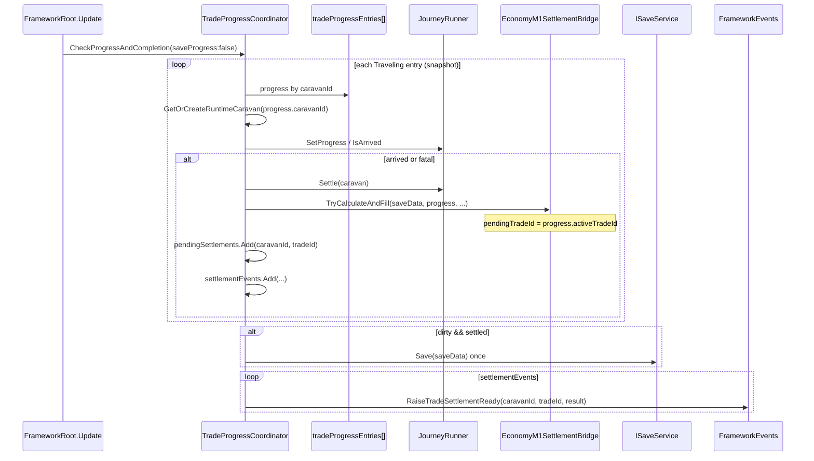

# Multi-active Online Tick · Economy Trade ID 정렬 구현 로직

- 작성일: 2026-07-23
- 담당: Framework & Integration (CSU)
- 브랜치: `feature/framework/multi-active-online-tick`
- 기준 브랜치: `dev2`
- 상태: 워킹 트리 구현·Editor E2E·독립 검증 완료(커밋 전)
- 선행 작업:
  - `Docs/Personal_Documents/CSU/0721_multi_caravan_save_cutover.md` — `tradeProgressEntries[]`, `pendingSettlements[]`
  - `Docs/Personal_Documents/CSU/0722_multi_caravan_trade_start_command.md` — caravan ID 기반 출발
  - `Docs/Personal_Documents/CSU/0723_caravan_runtime_registry.md` — caravanId 기반 runtime registry
- 관련 문서:
  - `Docs/Personal_Documents/CSU/Research/0721_Framework_Runtime_Save_Contract_Research.md`
  - `Docs/Personal_Documents/CSU/0712_m3-offline-progress-pipeline.md`
  - `Docs/Personal_Documents/CSU/0712_m3-pending-settlement-persist.md`

---

## 1. 목적

선행 작업으로 Save Cutover·출발 command·Runtime Registry가 도입되었지만, **Online Tick**(`CheckProgressAndCompletion`)은 여전히 **selected 단일 `saveData.tradeProgress`** 만 처리했다.

| 조건 | 기존 동작 | 문제 |
|---|---|---|
| A Traveling, selected = B(Preparing) | Tick이 selected progress만 검사 | 비선택 A 진행 정지 |
| A·B 동시 Traveling | 첫 완료 후 return/break | 두 번째 caravan 미처리 |
| A 완료 + B 진행 | caravan별 Save 반복 가능 | Tick당 Save 정책 위반 |
| Economy settle | `saveData.tradeProgress.activeTradeId` 사용 | 비선택/동시 완료 시 Trade ID 교차 |

이번 작업은 다음 두 축을 한 PR 범위에서 해결한다.

1. **Multi-active Entry-based Online Tick** — `tradeProgressEntries` 전체를 순회해 Traveling entry마다 독립 진행·정산
2. **Economy Trade ID 정렬** — Builder·Bridge·Coordinator가 **현재 처리 중인 `TradeProgressSaveData`** 의 Trade ID를 사용

이번 범위에 **포함하지 않는 것**:

- Entry-based Offline Restore (`ApplyOfflineProgressOnLoad`는 selected 단일 경로 유지)
- Settlement Result Registry (`LastSettlementResult` 단일 cache 유지)
- Economy pending cache Registry (Bridge 내부 단일 `pendingTradeId` 유지)
- 비선택 Pending UI 자동 표시 / Overview badge
- `RestorePendingSettlement`의 selected wrapper Economy 재계산 정렬

---

## 2. 변경 파일 요약

| 파일 | 역할 |
|---|---|
| `TradeProgressCoordinator.cs` | entry 전체 순회 Tick, entry별 `SettleTrade`, Tick 종료 후 Save·이벤트 일괄 처리 |
| `TradeProgressRecorder.cs` | `MarkSettlementPending(TradeProgressSaveData progress)` — entry 단위 상태 전환 |
| `EconomyM1SettlementBridge.cs` | 명시 progress overload, `pendingTradeId = progress.activeTradeId` |
| `FrameworkEconomyM1InputBuilder.cs` | 명시 progress overload, `TradeId`/`RouteId`를 progress에서 조립 |
| `FrameworkM1LoopE2EEditorTests.cs` | `RunMultiActiveOnlineTickChecks`, `RunExplicitEconomyTradeIdChecks` |

Scene / Prefab / Meta / Package / SaveData schema 변경 없음.

---

## 3. Before → After

### 3.1 Online Tick

```text
Before
  CheckProgressAndCompletion
    └─ CanUpdateTravelingTrade(saveData)     → selected tradeProgress 1건만
    └─ GetRuntimeForProgress(saveData)       → selected progress.caravanId
    └─ SetProgress / CopyRuntimeToOwnedSave
    └─ SettleActiveTrade                     → selected 1건 settle 후 즉시 Save·Event

After
  CheckProgressAndCompletion
    └─ entries = snapshot(tradeProgressEntries)
    └─ for each progress where state == Traveling
         └─ TryProcessTravelingEntry(progress)
              ├─ SaveDataLookup.TryGetCaravan(progress.caravanId)
              ├─ GetOrCreateRuntimeCaravan(progress.caravanId)
              ├─ SyncElapsedInGameSeconds(progress, caravan, caravanSave, now)
              ├─ SetProgress / CopyToSave(caravan, caravanSave)
              └─ 도착 시 SettleTrade(..., progress, ...) → settlementEvents에 적재
    └─ if dirty && (saveProgress || settled) → saveService.Save 1회
    └─ for each settlementEvents → RaiseTradeSettlementReady + (Failed && selected) 화면 전환
```

### 3.2 Economy Trade ID

```text
Before (명시 progress 경로 도입 직후 잔존)
  FrameworkEconomyM1InputBuilder.TryBuild(..., progress, ...)
    └─ RouteId = progress.activeRouteId
    └─ TradeId = saveData.tradeProgress.activeTradeId   ← selected 혼입

  EconomyM1SettlementBridge.TryCalculateAndFill(..., progress, ...)
    └─ pendingTradeId = saveData.tradeProgress.activeTradeId

After
  FrameworkEconomyM1InputBuilder.TryBuild(..., progress, ...)
    └─ RouteId = progress.activeRouteId
    └─ TradeId = progress.activeTradeId
    └─ string.IsNullOrWhiteSpace(progress.activeTradeId) → null (fallback 없음)

  EconomyM1SettlementBridge.TryCalculateAndFill(..., progress, ...)
    └─ ClearPending()
    └─ 빈 Trade ID → Warning + false
    └─ pendingTradeId = progress.activeTradeId

  TradeProgressCoordinator.SettleTrade / ClaimSettlement
    └─ economySettlementBridge.TryCalculateAndFill(saveData, progress, ...)
```

---

## 4. Online Tick 상세 로직

### 4.1 Entry 순회 규칙

| 항목 | 구현 |
|---|---|
| 순회 대상 | `new List<TradeProgressSaveData>(saveData.tradeProgressEntries)` snapshot |
| 상태 필터 | `progress.state == TradeProgressState.Traveling` 만 |
| 중복 방지 | `HashSet<TradeProgressSaveData> processed` |
| 조기 종료 | **없음** — 첫 완료 후에도 다음 entry 계속 처리 |
| ID 누락 | caravanId 또는 activeTradeId 비어 있으면 Warning 후 `continue` |
| 예외 격리 | entry별 `try/catch` — 한 entry 실패가 전체 Tick 중단하지 않음 |

### 4.2 Runtime · Save lookup (selected 비의존)

```text
TryProcessTravelingEntry(saveData, progress, ...)
  ├─ SaveDataLookup.TryGetCaravan(saveData, progress.caravanId, out caravanSave)
  │    └─ 실패 → Warning "Online trade save target lookup failed. CaravanId: ..."
  ├─ caravan = GetOrCreateRuntimeCaravan(progress.caravanId)
  │    └─ null 또는 caravan.caravanId != progress.caravanId → Warning 후 skip
  ├─ caravanSave.caravanId == progress.caravanId 검증
  ├─ SyncElapsedInGameSeconds(progress, caravan, caravanSave, nowUtc)
  ├─ JourneyRunner.SetProgress(caravan, CalculateProgress(progress, nowUtc))
  └─ CaravanSaveDataMapper.CopyToSave(caravan, caravanSave)   // owned save DTO
```

**사용하지 않는 것 (Tick 대상 결정):**

- `saveData.tradeProgress` (selected facade)
- `saveData.caravan` (legacy 단일 DTO)
- `ActiveCaravan` / `EnsureActiveCaravan()` 직접 참조

### 4.3 Settlement (`SettleTrade`)

```text
SettleTrade(saveData, progress, caravan, caravanSave, settlementEvents)
  ├─ progress.state == Traveling 검증
  ├─ settlementTradeId = progress.activeTradeId
  ├─ 중복 Pending 차단: TryGetPendingSettlement(caravanId, tradeId)
  ├─ JourneyRunner.Settle(caravan)
  ├─ tradeProgressRecorder.MarkSettlementPending(progress)   // entry 단위
  ├─ LastSettlementTradeId / LastSettlementResult 갱신 (단일 cache — 기존 한계)
  ├─ ApplyRouteMinimumFoodConsumption(progress, ...)
  ├─ economySettlementBridge.TryCalculateAndFill(saveData, progress, caravan, result, shared)
  ├─ pending = PendingSettlementSaveDataMapper.ToSave(...)
  │    └─ pending.caravanId = progress.caravanId
  ├─ saveData.pendingSettlements.Add(pending)
  ├─ CaravanSaveDataMapper.CopyToSave(caravan, caravanSave)
  └─ settlementEvents.Add(CaravanId, TradeId, Result)        // Tick 종료 후 Event
```

### 4.4 Save 호출 정책

```csharp
if (dirty && (saveProgress || settled))
    saveService?.Save(saveData);
```

| 시나리오 | `saveProgress` | `settled` | Disk Save |
|---|---|---|---|
| 일반 진행만 | false (FrameworkRoot 기본) | false | 0회 |
| 일반 진행만 | true | false | 1회 (legacy/debug) |
| 1건 이상 완료 | false | true | 1회 |
| 처리 대상 없음 | — | false | 0회 |

**Caravan별 Save 반복 없음** — Tick 종료 후 최대 1회.

### 4.5 Screen Router

```text
Tick 종료 후 settlementEvents 순회:
  RaiseTradeSettlementReady(notification.CaravanId, notification.TradeId, notification.Result)
  if result.grade == Failed && notification.CaravanId == saveData.selectedCaravanId
      inGameScreenRouter?.RequestScreen(Settlement)
```

- 비선택 caravan 완료 → **화면 강제 전환 없음**
- selected caravan Failed 완료 → 기존과 동일하게 Settlement
- `selectedCaravanId`는 Tick 중 변경하지 않음

---

## 5. Economy Trade ID 정렬 상세

### 5.1 FrameworkEconomyM1InputBuilder

**명시 경로:**

```csharp
public static EconomyM1LoopInput TryBuild(
    SaveData saveData,
    TradeProgressSaveData progress,
    CaravanData caravan,
    JourneyResultData journeyResult,
    ISharedGameDataProvider sharedGameData)
{
    if (progress == null || string.IsNullOrWhiteSpace(progress.activeTradeId) || saveData.player == null)
        return null;

    var routeId = progress.activeRouteId ?? string.Empty;
    // ...
    return new EconomyM1LoopInput
    {
        TradeId = progress.activeTradeId,
        // RouteId는 shared route lookup에 progress.activeRouteId 사용
    };
}
```

**단일 Caravan wrapper (thin):**

```csharp
public static EconomyM1LoopInput TryBuild(..., SaveData saveData, CaravanData caravan, ...)
    => TryBuild(saveData, saveData?.tradeProgress, caravan, ...);
```

selected facade를 **구해 명시 overload로 위임**만 한다. 명시 경로 내부에서 `saveData.tradeProgress`를 재읽지 않는다.

### 5.2 EconomyM1SettlementBridge

```csharp
public bool TryCalculateAndFill(..., TradeProgressSaveData progress, ...)
{
    ClearPending();
    if (progress == null || string.IsNullOrWhiteSpace(progress.activeTradeId))
    {
        FrameworkLog.Warning("Economy M1 settlement calculation skipped because the explicit trade ID is missing.");
        return false;
    }
    var input = FrameworkEconomyM1InputBuilder.TryBuild(saveData, progress, caravan, journeyResult, sharedGameData);
    // ...
    pendingTradeId = progress.activeTradeId;
    pendingEconomyResult = economyResult;
    return true;
}
```

- settle 직전 `ClearPending()` — 이전 entry의 pendingTradeId 재사용 방지
- claim 시 `TryApplyPendingEconomy(..., activeTradeId)` — 인자 tradeId와 pendingTradeId 일치 필요

### 5.3 Explicit Claim (`ClaimSettlement`)

```text
ClaimSettlement(caravanId, tradeId)
  ├─ SaveDataLookup.TryGetTradeProgress(saveData, caravanId, out progress)   // selected 재조회 아님
  ├─ pendingSettlements에서 (caravanId, tradeId) 단일 매칭
  ├─ progress.activeTradeId == tradeId 검증
  ├─ saveData.selectedCaravanId = caravanId   (claim staging, 완료 후 원복)
  ├─ JourneyRunner.ClaimSettlement(caravan)
  ├─ economySettlementBridge.TryCalculateAndFill(saveData, progress, caravan, settlementResult, shared)
  ├─ economySettlementBridge.TryApplyPendingEconomy(saveData, caravan, tradeId)
  └─ saveData.selectedCaravanId = selectedCaravanIdBeforeClaim
```

---

## 6. ID 정합성 계약

동일 처리 단위에서 다음 ID가 **같은 progress entry**에서 나와야 한다.

```text
TradeProgressSaveData.caravanId
TradeProgressSaveData.activeTradeId
TradeProgressSaveData.activeRouteId
Runtime CaravanData.caravanId          (GetOrCreateRuntimeCaravan)
CaravanSaveData.caravanId              (TryGetCaravan)
PendingSettlementSaveData.caravanId
PendingSettlementSaveData.tradeId
EconomyM1LoopInput.TradeId
EconomyM1SettlementBridge.pendingTradeId
FrameworkEvents.TradeSettlementReady   (caravanId, tradeId)
```

---

## 7. Editor E2E

메뉴: `ND/Framework/Run M1 Loop + Economy E2E Checks`

| 메서드 | 검증 범위 |
|---|---|
| `RunMultiActiveOnlineTickChecks` | 비선택 진행, 오류 entry 격리, 완료+진행 혼합, 동시 완료 Pending 2건·Event 2건·Save 1회, 중복 Pending 방지 |
| `RunExplicitEconomyTradeIdChecks` | Builder TradeId = explicit progress, Bridge pendingTradeId 정렬, 순차 settle 시 ID 독립, 빈 Trade ID fallback 차단 |
| 기존 M1 Loop / Economy / Offline / Claim | 단일 Caravan wrapper 회귀 |

---

## 8. 검증 결과 요약 (2026-07-23)

### 8.1 Multi-active Online Tick

| 항목 | 결과 |
|---|---|
| 비선택 Traveling 진행 | PASS |
| 복수 Traveling 독립 진행 | PASS |
| selected Preparing 시 A/B 진행 | PASS |
| 동시 완료 Pending 2 · Event 2 · Save 1 | PASS |
| 완료+진행 혼합 | PASS |
| 잘못된 entry 오류 격리 | PASS |
| 중복 Pending·Event 방지 | PASS |
| Save 0/1/1/0 | PASS |

**판정:** 조건부 PASS (단일 `LastSettlementResult` cache, Economy pending cache 단일 값은 허용 한계)

### 8.2 Economy Trade ID 정렬

| 항목 | 결과 |
|---|---|
| 비선택 Caravan Economy Trade ID | PASS |
| 순차 복수 Settlement Trade ID | PASS |
| 동시 완료 Trade ID 독립 | PASS (금액 cost 12 vs 52 등 독립) |
| 빈 Trade ID fallback 차단 | PASS |
| Explicit Claim 코드 경로 | PASS (실행 Claim은 commit staging 없으면 `TownApplyFailed` — 부분) |
| 단일 Caravan / M1 E2E 회귀 | PASS |

**판정:** 조건부 PASS — Online Tick PR 진행 가능

---

## 9. 잔존 selected 의존 (이번 PR 범위 외)

명시 Settle/Online Tick/Economy Builder·Bridge **명시 경로**에는 `saveData.tradeProgress.activeTradeId`를 읽지 않는다.  
다음 legacy·wrapper 경로에는 **여전히 잔존**:

| 위치 | 용도 |
|---|---|
| `FrameworkEconomyM1InputBuilder.TryBuild` (4-arg wrapper) | selected progress 위임 |
| `EconomyM1SettlementBridge.TryCalculateAndFill` (4-arg wrapper) | selected progress 위임 |
| `ApplyOfflineProgressOnLoad` | selected 단일 offline 복구 |
| `RestorePendingSettlement` | selected facade Economy 재계산 |
| `ClaimSettlementAndResetLegacy` | Obsolete selected claim |
| `CanCreateSettlement` / legacy helper | selected progress 검사 |

---

## 10. 알려진 한계 · 후속 작업

| 항목 | 설명 | 우선순위 |
|---|---|---|
| `LastSettlementResult` | Tick 내 마지막 완료만 cache | P2 — Settlement Result Registry |
| Economy `pendingTradeId` / `pendingEconomyResult` | Bridge 단일 cache, 동시 완료 시 마지막 B만 보존 | P2 — Economy cache Registry |
| Entry-based Offline Restore | `ApplyOfflineProgressOnLoad` selected 단일 | 후속 PR |
| Restore Economy wrapper | `RestorePendingSettlement` selected 재계산 | 후속 PR |
| UI Overview / badge | 비선택 Pending Save에는 있으나 자동 표시 없음 | UI 팀 |
| 빈 Trade ID Warning | Builder는 silent null, Bridge Warning에 caravanId 미포함 | P2 |

---

## 11. 호출 흐름 다이어그램



---

## 12. Git 상태 (검증 시점)

- 브랜치: `feature/framework/multi-active-online-tick`
- 변경 파일 5개 (Production 4 + Editor E2E 1)
- Scene / Prefab / asset / meta: 없음
- `git diff --check`: CRLF 경고만, whitespace error 없음
