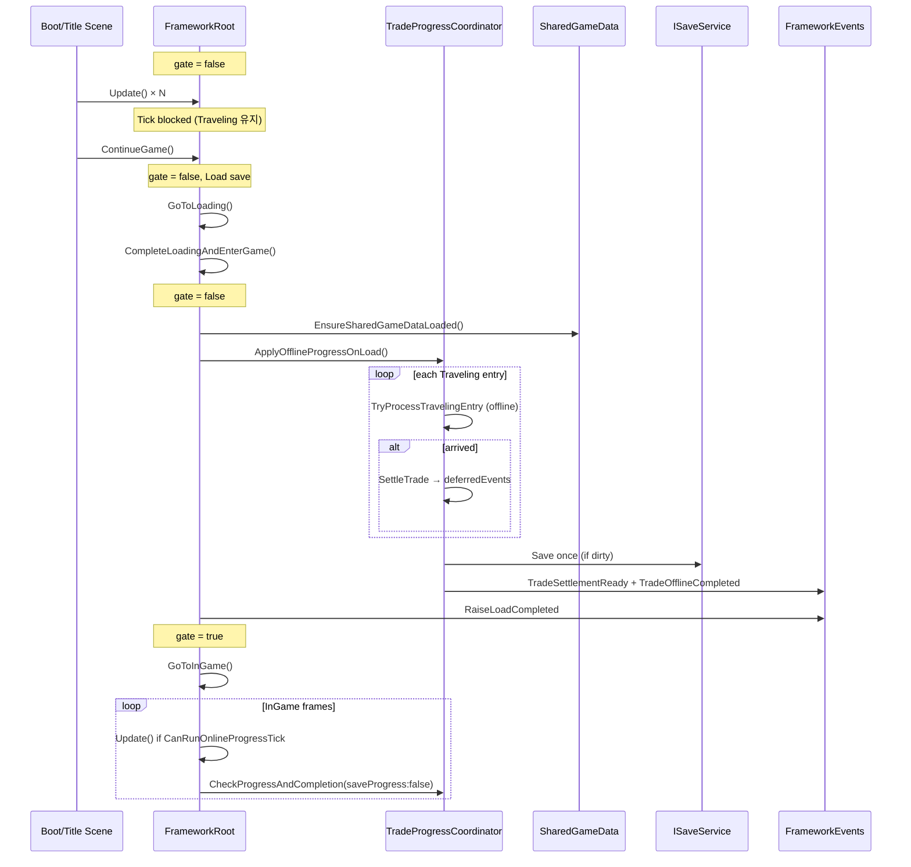
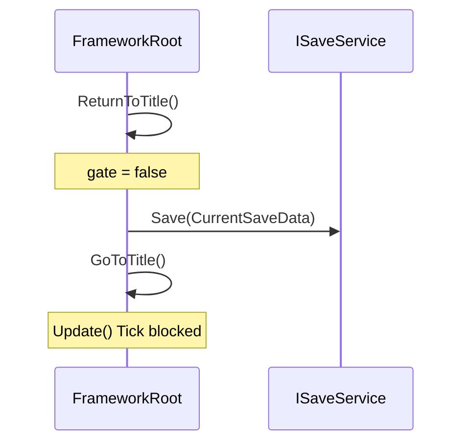

# Multi-active Progress 복원 · Online Tick Lifecycle Gate

- 작성일: 2026-07-24
- 담당: Framework & Integration (CSU)
- 브랜치: `fix/framework/restore-multi-active-progress`
- 기준 브랜치: `dev2`
- 기준 HEAD: `be4efe998194d74c7564057c00612341c57837b5`
- 상태: 구현·Editor E2E·Play Mode disk restart 재검증 완료 (조건부 PASS, 커밋 전)
- Unity: `6000.5.2f1`

---

## 1. 배경

### 1.1 회귀 원인

구버전 베이스 PR 병합 이후, 아래 multi-active 기능이 **단일 selected Caravan 경로**로 되돌아갔다.

| 기능 | 회귀 전 (의도) | 회귀 후 |
|---|---|---|
| Online Tick | `tradeProgressEntries[]` 전체 순회 | selected `saveData.tradeProgress` 1건만 |
| Offline Restore | entry 전체 batch 복구 | selected 단일 offline |
| Settlement 생성 | entry별 `SettleTrade(caravanId, tradeId)` | `SettleActiveTrade` legacy |
| Pending 저장 | canonical `pendingSettlements[]` | selected facade 위주 |
| Save / Event | batch당 Save 1회, 저장 성공 후 Event | entry마다 즉시 Save·Event 가능 |
| Caravan elapsed | CaravanSaveData별 독립 기록 | selected 위주 |

선행 문서에서 각 축을 분리 구현했으나, 병합 회귀로 **한 PR에서 통합 복원**이 필요했다.

- `Docs/Personal_Documents/CSU/0723_multi_active_online_tick_economy_trade_id.md`
- `Docs/Personal_Documents/CSU/0723_multi_active_offline_restore.md`

### 1.2 재검증에서 발견된 Blocker

복원 직후 Play Mode disk restart 검증에서 **Online Tick이 Offline Restore를 선점**하는 문제가 확인됐다.

```text
완료 시각이 지난 Traveling A/B 저장
→ Boot/Title에서 FrameworkRoot.Update 실행
→ CheckProgressAndCompletion이 SharedGameData 로드 전 Settlement 생성
→ Continue 시 ApplyOfflineProgressOnLoad가 처리할 Traveling entry 없음
```

증상:

- Title/Boot에서 A/B가 `SettlementPending`으로 변경
- Console: `Economy M1 settlement preview skipped because shared game data is not loaded`
- `TradeOfflineCompleted` 미발행 (Online Tick 경로 사용)
- Continue 시 Offline Restore batch 미사용

**해결:** `FrameworkRoot`에 **Online Tick lifecycle gate** (`isOnlineProgressTickEnabled`) 추가.

---

## 2. 이번 작업 범위

### 2.1 복원·정렬 대상

1. **Multi-active Online Tick** — entry 전체 순회, batch Save·Event
2. **Multi-active Offline Restore** — Online Tick과 동일한 `TryProcessTravelingEntry` 공유
3. **명시적 Settlement 생성** — `SettleTrade(caravanId, tradeId, progress entry)`
4. **Caravan별 elapsed 저장** — `SyncElapsedInGameSeconds`
5. **canonical `pendingSettlements` 저장** — entry ID 격리
6. **entry별 오류 격리** — null entry, missing caravan skip
7. **Save batch 병합** — Online/Offline 각 batch당 Save 최대 1회
8. **저장 성공 후 deferred Event** — Save 실패 시 Event 억제
9. **Online Tick lifecycle gate** — Boot/Title/Loading에서 Tick 차단
10. **Editor E2E** — lifecycle gate + multi-active 회귀

### 2.2 이번 범위에 포함하지 않는 것

- SaveData schema / version 변경
- `tradePreparationCommit` 다중 commit 구조
- Settlement UI 다중 cache
- Scene / Prefab 변경
- Economy 계산식 변경
- legacy wrapper 제거 (`SettleActiveTrade`, selected facade)

---

## 3. 변경 파일

| 파일 | 역할 |
|---|---|
| `TradeProgressCoordinator.cs` | multi-active Online/Offline batch, `TryProcessTravelingEntry`, deferred Event, explicit Claim |
| `FrameworkRoot.cs` | Online Tick gate, `CompleteLoadingAndEnterGame` 순서, `restorePending` 판정 개선 |
| `FrameworkM1LoopE2EEditorTests.cs` | lifecycle gate + multi-active E2E (신규) |

Scene / Prefab / Meta / Package / SaveData schema 변경 없음.

---

## 4. Online Tick Lifecycle Gate

### 4.1 목적

Online Tick(`FrameworkRoot.Update → CheckProgressAndCompletion`)이 **Loading 복구가 끝나기 전** 실행되지 않도록 한다.

특히 Title/Boot에서 `SharedGameData`가 아직 로드되지 않은 상태로 Settlement가 생성되는 것을 방지한다.

### 4.2 gate 조건

```csharp
private bool isOnlineProgressTickEnabled;  // default: false

private static bool CanRunOnlineProgressTick(
    bool isEnabled,
    SaveData saveData,
    ISharedGameDataProvider sharedGameData)
{
    return isEnabled
        && saveData != null
        && sharedGameData != null
        && sharedGameData.IsLoaded;
}
```

`Update()`는 위 조건을 **모두** 만족할 때만 `CheckProgressAndCompletion(saveProgress: false)`를 호출한다.

Tick 간격: `TradeProgressCheckIntervalSeconds = 0.2f` (unscaled).

### 4.3 gate ON / OFF 시점

| 시점 | `isOnlineProgressTickEnabled` |
|---|---|
| 초기값 / Awake 직후 | `false` |
| `StartNewGame()` | `false` |
| `ContinueGame()` | `false` |
| `CompleteLoadingAndEnterGame()` **시작** | `false` |
| `ReturnToTitle()` | `false` |
| `CompleteLoadingAndEnterGame()` — offline restore + pending restore + `LoadCompleted` **이후**, `GoToInGame()` 직전 | `true` |

### 4.4 기대 세션 흐름

```text
Boot / Title
  └─ gate = false
  └─ Update() → Tick 미실행 (Traveling 유지)

ContinueGame()
  └─ gate = false
  └─ SaveService.Load → Loading scene

CompleteLoadingAndEnterGame()
  ├─ gate = false (재진입·중복 호출 방어)
  ├─ EnsureSharedGameDataLoaded()
  ├─ restorePending 판정 (canonical pendingSettlements)
  ├─ ApplyOfflineProgressOnLoad()        ← Offline batch
  ├─ RestorePendingSettlement() (조건부)
  ├─ RefreshFromSaveData + RaiseLoadCompleted
  ├─ gate = true                         ← Online Tick 허용
  └─ GoToInGame()

InGame
  └─ Update() → CheckProgressAndCompletion (multi-active)

ReturnToTitle()
  └─ gate = false
  └─ Title에서 progress·Settlement 정지
```

---

## 5. CompleteLoadingAndEnterGame 순서

### 5.1 `restorePending` 판정 변경

**Before (회귀):**

```csharp
// selected caravan tradeProgress.state == SettlementPending
```

**After:**

```csharp
var restorePending = CurrentSaveData.pendingSettlements != null
    && CurrentSaveData.pendingSettlements.Exists(
        pending => pending != null && pending.hasResult && !pending.claimed);
```

- 비선택 Caravan의 기존 Pending도 cache 복구 대상에 포함
- 이번 Offline Restore에서 **새로 완료된 entry**는 Restore 내부에서 이미 Event를 발행하므로 `RestorePendingSettlement` 중복 호출 방지

### 5.2 호출 순서 (Production)

```text
CompleteLoadingAndEnterGame()
  1. isOnlineProgressTickEnabled = false
  2. CurrentSaveData 보장 (null이면 Load)
  3. EnsureSharedGameDataLoaded()          ← SharedGameData.IsLoaded == true
  4. restorePending = pendingSettlements에 hasResult && !claimed 존재
  5. ApplyOfflineProgressOnLoad()          ← Traveling entry batch
  6. if restorePending → RestorePendingSettlement()
  7. InGameScreenRouter.RefreshFromSaveData()
  8. FrameworkEvents.RaiseLoadCompleted()
  9. isOnlineProgressTickEnabled = true
 10. SceneFlow.GoToInGame()
```

---

## 6. TradeProgressCoordinator — Multi-active 로직

Online Tick과 Offline Restore는 **`TryProcessTravelingEntry`** 를 공유한다.

### 6.1 공통 Entry 순회 규칙

| 항목 | 구현 |
|---|---|
| 순회 대상 | `new List<TradeProgressSaveData>(saveData.tradeProgressEntries)` snapshot |
| 상태 필터 | `progress.state == TradeProgressState.Traveling` |
| 중복 방지 | `HashSet<TradeProgressSaveData> processed` |
| 조기 종료 | **없음** — 첫 완료 후에도 다음 entry 계속 |
| ID 누락 | caravanId / activeTradeId 비어 있으면 Warning + skip |
| null entry | Warning + skip |
| 예외 격리 | entry별 try/catch |

**사용하지 않는 것 (대상 결정):**

- `saveData.tradeProgress` (selected facade) — Tick/Restore loop에서
- `ActiveCaravan` / selected 추론

### 6.2 TryProcessTravelingEntry

```text
TryProcessTravelingEntry(saveData, progress, evaluationUtc, isOfflineRestore, deferredEvents, ...)
  ├─ SaveDataLookup.TryGetCaravan(saveData, progress.caravanId, out caravanSave)
  ├─ GetOrCreateRuntimeCaravan(progress.caravanId)
  ├─ SyncElapsedInGameSeconds(progress, caravanSave, runtime, evaluationUtc)
  ├─ JourneyRunner.SetProgress(runtime, CalculateProgress(progress, evaluationUtc))
  ├─ CaravanSaveDataMapper.CopyToSave(runtime, caravanSave)
  ├─ 미도착 && fatal 없음 → return (진행만 반영)
  └─ 도착 또는 fatal → SettleTrade(..., progress.caravanId, progress.activeTradeId, deferredEvents)
```

| 구분 | Online Tick | Offline Restore |
|---|---|---|
| 시간 기준 | `gameTimeProvider.CurrentUtc` | `evaluationUtc` (lastSaved 상한 clamp) |
| `isOfflineRestore` | `false` | `true` |
| Pause | `IsGameTimePaused`이면 전체 skip | Load 시점 1회, pause 무관 |
| Save | `dirty && (saveProgress \|\| settled)` | `dirty`이면 항상 Save |
| 완료 Event | `TradeSettlementReady` | `TradeSettlementReady` + `TradeOfflineCompleted` |

### 6.3 SettleTrade (명시적 Settlement)

```text
SettleTrade(saveData, progress, caravanSave, runtime, caravanId, tradeId, deferredEvents)
  ├─ progress.state == Traveling 검증
  ├─ 중복 Pending 차단: TryGetPendingSettlement(caravanId, tradeId)
  ├─ JourneyRunner.Settle(runtime)
  ├─ tradeProgressRecorder.MarkSettlementPending(progress)
  ├─ economySettlementBridge.TryCalculateAndFill(saveData, progress, ...)  ← progress.activeTradeId
  ├─ pendingSettlements.Add(canonical pending)
  ├─ CaravanSaveDataMapper.CopyToSave
  └─ deferredEvents.Add (즉시 Event 발행하지 않음)
```

### 6.4 Save · Event batch

**Online Tick:**

```csharp
if (dirty && (saveProgress || settled))
    saveService.Save(saveData);
if (saveSucceeded)
    PublishSettlementNotifications(..., isOfflineRestore: false);
```

**Offline Restore:**

```csharp
if (dirty)
    saveService.Save(saveData);
if (saveSucceeded)
    PublishSettlementNotifications(..., isOfflineRestore: true);
```

Save 실패 시:

```text
FrameworkLog.Warning("Trade progress events were suppressed because the batch save failed.");
```

→ runtime state는 변경됐을 수 있으나 **Event는 억제** (저장 일관성).

**PublishSettlementNotifications:**

```text
for each notification:
  RaiseTradeSettlementReady(caravanId, tradeId, result)
  if isOfflineRestore → RaiseTradeOfflineCompleted(tradeId)
  if Failed && caravanId == selectedCaravanId → RequestScreen(Settlement)
```

---

## 7. ID 정합성 계약

동일 처리 단위에서 아래 ID는 **같은 progress entry**에서 나와야 한다.

```text
TradeProgressSaveData.caravanId
TradeProgressSaveData.activeTradeId
Runtime CaravanData.caravanId
CaravanSaveData.caravanId
PendingSettlementSaveData.caravanId / tradeId
EconomyM1LoopInput.TradeId
FrameworkEvents.TradeSettlementReady (caravanId, tradeId)
FrameworkEvents.TradeOfflineCompleted (tradeId)
```

selected Caravan ID / legacy `tradeProgress.activeTradeId`로 fallback **하지 않음**.

---

## 8. Editor E2E

메뉴: `ND/Framework/Run Multi-active Progress E2E Checks`

| 메서드 | 검증 범위 |
|---|---|
| `RunOnlineTickLifecycleGateChecks` | gate OFF 시 Tick 미소비, Offline Restore 선행, gate ON 후 중복 Settlement 없음 |
| `RunRuntimeRegistryChecks` | caravanId별 runtime registry 격리 |
| `RunMultiActiveOnlineTickChecks` | 비선택 진행, 오류 entry 격리, 동시 완료 Save 1회 |
| `RunMultiActiveOfflineRestoreChecks` | 혼합 상태, 오류 entry, batch Save·Event |
| `RunExplicitEconomyTradeIdChecks` | Economy Trade ID = explicit progress |
| `RunClaimRegressionChecks` | explicit Claim, save failure rollback, duplicate 차단 |

**lifecycle gate 테스트:** `CanRunOnlineProgressTick`은 reflection으로 `private static` 호출 (Editor assembly).

성공 로그:

```text
[Framework Multi-active E2E] All checks passed.
```

---

## 9. Play Mode 재검증 결과 (2026-07-24)

### 9.1 시나리오 A — Boot/Title Tick 차단

| 항목 | 결과 |
|---|---|
| Title gate | `false` |
| A/B state (Continue 전) | Traveling / Traveling |
| pendingSettlements | 0 |
| Save 호출 (Continue 전) | 없음 |
| Settlement / OfflineCompleted Event | 0 |
| Economy preview skipped Warning | 0 |

**판정: PASS**

### 9.2 시나리오 B — Continue Offline Restore 선행

| 항목 | 결과 |
|---|---|
| A/B state (Continue 후) | SettlementPending / SettlementPending |
| pendingSettlements.Count | 2 |
| Save | 1회 |
| TradeSettlementReady | 2회 (A, B tradeId 각각) |
| TradeOfflineCompleted | 2회 |
| selectedCaravanId | `disk-restart-a` 유지 |
| SharedGameData | Restore 이전 로드 확인 |
| Economy preview skipped | 0 |

실행 순서:

```text
ContinueGame → Loading → CompleteLoadingAndEnterGame
→ SharedGameData loaded → Save 1회
→ Ready(A) → Offline(A) → Ready(B) → Offline(B)
→ LoadCompleted → gate=true → InGame
```

**판정: PASS**

### 9.3 시나리오 C — Offline 후 중복 방지

| 항목 | 결과 |
|---|---|
| InGame 후 pendingCount | 2 → 2 |
| 추가 Ready / Offline / Save | 없음 |

**판정: PASS**

### 9.4 InGame Online Tick

| 항목 | 결과 |
|---|---|
| gate | `true` |
| A/B progress 증가 | PASS (비선택 B도 동일) |
| elapsed 격리 | CaravanSaveData별 기록 |
| selected 유지 | PASS |

**판정: PASS**

### 9.5 Title 복귀 후 Tick 차단

| 항목 | 결과 |
|---|---|
| ReturnToTitle 후 gate | `false` |
| progress / elapsed 정지 | PASS |
| Title Settlement 생성 | 없음 |

**판정: PASS**

### 9.6 혼합 상태 (A Pending + B Traveling 완료 + C Preparing)

| 항목 | 결과 |
|---|---|
| Title: A Pending / B Traveling / C Preparing | PASS |
| Continue 후 B만 새 Pending | PASS |
| A 중복 Settlement | 없음 |
| selected | `mix-c` 유지 |
| Save | 1회 |

**판정: PASS**

### 9.7 Claim 최소 회귀

| 항목 | 결과 |
|---|---|
| A Claim (commit 재stage 후) | PASS, town=`RiverTown` |
| B Pending 유지 | PASS |
| A 중복 Claim 차단 | PASS |

**주의:** 저장된 `tradePreparationCommit`이 B일 때 A Claim은 `TryStage` 실패 → `TownApplyFailed`.  
단일 commit 구조상 A Claim 전 `Clear` + A commit 재stage 필요. **Tick gate PR Blocker 아님.**

### 9.8 최종 판정

**조건부 PASS** — Tick gate + multi-active 복원 경로 확인.  
복수 Claim preparation commit은 **별도 후속 작업**.

---

## 10. Before → After (회귀 대비)

### 10.1 FrameworkRoot.Update

```text
Before (회귀)
  Update()
    └─ TradeProgressCoordinator.CheckProgressAndCompletion()
         └─ Title/Boot에서도 Traveling 완료 처리 가능
         └─ SharedGameData 미로드 시 Economy Warning

After
  Update()
    └─ CanRunOnlineProgressTick(enabled, saveData, sharedGameData)?
         ├─ false → return (Tick 없음)
         └─ true  → CheckProgressAndCompletion(saveProgress: false)
```

### 10.2 Offline vs Online 선점

```text
Before (Blocker)
  Boot/Title Update → Online Settle → Continue → Offline Restore할 Traveling 없음

After
  Boot/Title Update → gate false → Traveling 유지
  Continue → Offline Restore batch → Event → gate true → InGame Online Tick
```

---

## 11. 잔존 legacy · 알려진 한계

### 11.1 legacy 경로 (공존)

| 위치 | 용도 |
|---|---|
| `SettleActiveTrade` | 단일 Caravan legacy settle |
| `RestorePendingSettlement` | selected wrapper cache 복구 |
| `ClaimSettlementAndResetLegacy` | Obsolete selected claim |
| `saveData.tradeProgress` facade | 호환 accessor |
| `LastSettlementResult` | 단일 UI cache |

### 11.2 후속 작업

| 항목 | 설명 | 우선순위 |
|---|---|---|
| `tradePreparationCommit` 단일 slot | A Claim 후 B Claim 시 commit 재stage 필요 | P1 (schema 승인 시) |
| Settlement UI 다중 cache | canonical pending은 Save에 있으나 UI 단일 cache | P2 |
| legacy wrapper 제거 | `SettleActiveTrade` 등 | P3 |
| `restorePending` + RestorePendingSettlement | entry 기반 pending cache 정책 정리 | P2 |

---

## 12. 호출 흐름 다이어그램

### 12.1 Boot → Continue → InGame (gate 포함)



### 12.2 Return to Title



---

## 13. 검증 명령 · 경로

```bash
git status --short
git branch --show-current
git rev-parse HEAD
```

Unity:

```text
Menu: ND/Framework/Run Multi-active Progress E2E Checks
Play: Boot → Title → ContinueGame → Loading → CompleteLoadingAndEnterGame → InGame
Save: C:/Users/<user>/AppData/LocalLow/DefaultCompany/ND/save_data.json
```

disk restart harness 예시 (만료 Traveling A/B):

```text
Caravan A/B: Traveling, expected end < now, pending=0, selected=A
Play 종료 → Boot 재진입 → Title 대기 → Continue
```

---

## 14. Git 상태 (문서 작성 시점)

- 브랜치: `fix/framework/restore-multi-active-progress`
- HEAD: `be4efe998194d74c7564057c00612341c57837b5` (= origin/dev2, 커밋 없음)
- 변경 파일:
  - `Assets/_Project/11.CoreServices/Scripts/Bootstrap/FrameworkRoot.cs`
  - `Assets/_Project/11.CoreServices/Scripts/TradeProgress/TradeProgressCoordinator.cs`
  - `Assets/_Project/11.CoreServices/Editor/FrameworkM1LoopE2EEditorTests.cs`
  - `Assets/_Project/11.CoreServices/Editor/FrameworkM1LoopE2EEditorTests.cs.meta`
- Scene / Prefab / asset / meta: 없음

---

## 15. 관련 문서

| 문서 | 내용 |
|---|---|
| `0723_multi_active_online_tick_economy_trade_id.md` | Online Tick entry 순회, Economy Trade ID |
| `0723_multi_active_offline_restore.md` | Offline Restore entry batch |
| `0721_multi_caravan_save_cutover.md` | SaveData v6, `tradeProgressEntries[]` |
| `0712_m3-offline-progress-pipeline.md` | 단일 Caravan Offline 파이프라인 (선행) |
| `0712_m3-pending-settlement-persist.md` | canonical `pendingSettlements[]` |
| `0721_atomic_claim_town_routing.md` | explicit Claim, town routing |

---

## 16. 한 줄 요약

**multi-active coordinator/E2E를 통합 복원하고, `isOnlineProgressTickEnabled` gate로 Boot/Title Online Tick 선점을 차단해 Offline Restore가 Continue 시 먼저 실행되도록 했다.**  
Editor E2E·Play Mode disk restart 재검증 **조건부 PASS**. 복수 Claim preparation commit은 별도 후속.
