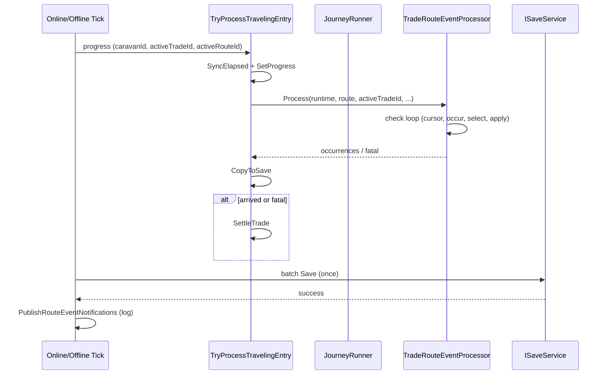
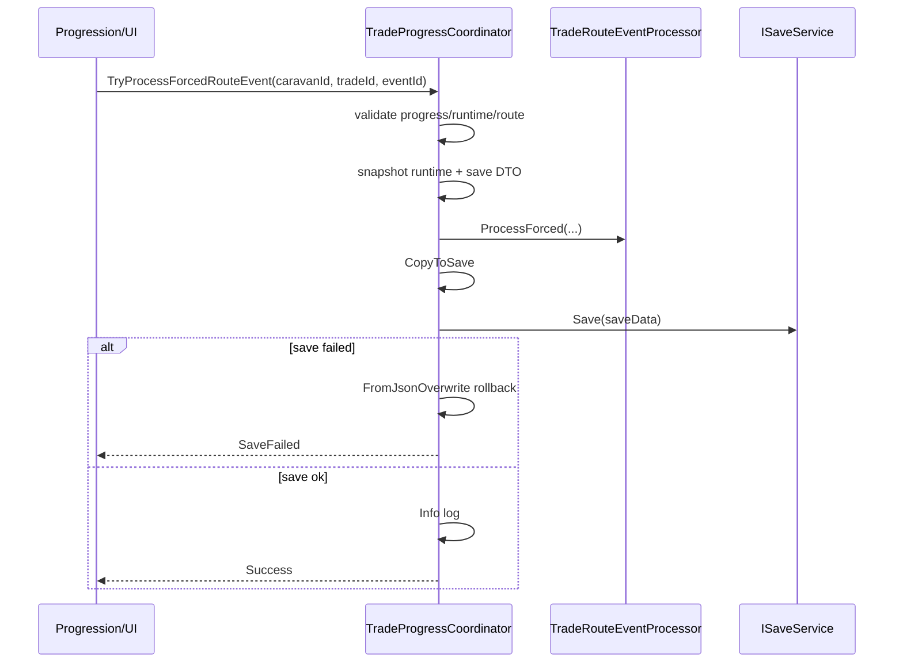

# Multi-active Route Event Processor · Forced Route Event API 구현 로직

- 작성일: 2026-07-24
- 담당: Framework & Integration (CSU)
- 브랜치: `Feature/framework/multi-active-route-events`
- 커밋: `d90d5db` — `feat(framework): add deterministic multi-active route events`
- 기준 브랜치: `dev2`
- 상태: 구현·EditMode·Editor Runtime Verification·Multi-active E2E 회귀 완료 (조건부 PASS)
- 선행 작업:
  - `Docs/Personal_Documents/CSU/0723_multi_active_online_tick_economy_trade_id.md` — entry 전체 Online Tick
  - `Docs/Personal_Documents/CSU/0723_multi_active_offline_restore.md` — entry 전체 Offline Restore
  - `Docs/Personal_Documents/CSU/0723_caravan_runtime_registry.md` — caravanId 기반 runtime registry
- 관련 문서:
  - `Docs/Personal_Documents/JJH/0723_Progression_Trade_Event_Integration_Work_Log.md`
  - `Docs/Guide/Framework_Shared_Game_Data_Guide.md`

---

## 1. 목적

선행 Multi-active 작업으로 Online Tick·Offline Restore는 `tradeProgressEntries[]` 전체를 entry 단위로 처리하지만, **거리 기반 Route Event**는 아직 없었다.

| 조건 | 기존 동작 | 문제 |
|---|---|---|
| Traveling 중 거리 구간 통과 | Route Event 없음 | 무역 진행 중 이벤트·전투·실패 시나리오 미반영 |
| Online / Offline | 동일 파이프라인 없음 | 재접속·오프라인 복구 시 이벤트 누락 가능 |
| 다중 Caravan | selected만 가정하는 API | 비선택 Caravan 이벤트 처리 불가 |
| 외부(Progression/UI) 강제 이벤트 | API 없음 | `(caravanId, tradeId, eventId)` 명시 호출 불가 |
| 저장 실패 | Forced 경로 rollback 없음 | runtime·SaveData 불일치 위험 |

이번 작업은 다음을 한 PR 범위에서 해결한다.

1. **거리 기반 자동 Route Event 처리** — Online Tick·Offline Restore 공통
2. **결정성** — 동일 trade/check 입력 → 동일 발생·선택·적용
3. **cursor 영속화** — `runEventChecksProcessed` / `runEventsOccurred` 저장·복원
4. **Multi-active 격리** — entry canonical ID 기준, selected facade 미사용
5. **Forced Route Event API** — `TryProcessForcedRouteEvent(caravanId, tradeId, eventId)`
6. **Forced Save 실패 rollback** — 대상 Caravan runtime·SaveData 복구
7. **Shared Route Events 복사** — `RouteData.RouteEvents` → `SharedRouteDefinition.Events`

이번 범위에 **포함하지 않는 것**:

- Lucky/Weather 전용 runtime 효과 API (발생 횟수만 기록)
- Framework Event(`TradeRouteEventOccurred` 등) 정식 추가 — Save 성공 후 **로그**만
- Production Route asset 이벤트 콘텐츠 대량 작성 (대부분 `routeEvents: []`, `MaxEventCount: 0`)
- Play Mode InGame 풀씬 수동 검증 (Editor production-service fixture로 대체)

---

## 2. 변경 파일 요약

| 파일 | 역할 |
|---|---|
| `TradeRouteEventProcessor.cs` | 거리 check·FNV 결정성·이벤트 적용·Forced 처리 (신규) |
| `TradeProgressCoordinator.cs` | Online/Offline entry 경로에 Route Event 삽입, Forced API·rollback |
| `SharedGameDataService.cs` | `RouteEvents` → `SharedRouteDefinition.Events` 복사 |
| `TradeRouteEventProcessorTests.cs` | EditMode 3건 (결정성·cursor·Forced cursor 격리) |
| `TradeRouteEventRuntimeVerification.cs` | Editor Menu E2E — Multi-active·Forced·Offline parity·cursor 복원 |

Scene / Prefab / SaveData schema version 변경 없음.  
`CaravanSaveData`의 `runEventChecksProcessed`, `runEventsOccurred` 필드는 기존 스키마 사용.

---

## 3. Before → After

### 3.1 Traveling entry 처리 순서

```text
Before (TryProcessTravelingEntry)
  SyncElapsedInGameSeconds
  JourneyRunner.SetProgress
  CaravanSaveDataMapper.CopyToSave
  → 도착/fatal 시 SettleTrade

After
  SyncElapsedInGameSeconds
  JourneyRunner.SetProgress
  ProcessRouteEvents              ← 신규: fatal·도착·Settlement 이전
  CaravanSaveDataMapper.CopyToSave
  → 도착/fatal 시 SettleTrade
```

Route Event는 **항상 SetProgress 직후**, **SettleTrade 직전**에 실행된다.

### 3.2 Online Tick / Offline Restore

```text
CheckProgressAndCompletion / ApplyOfflineProgressOnLoad
  └─ for each Traveling entry (기존 Multi-active 순회)
       └─ TryProcessTravelingEntry
            ├─ SetProgress
            ├─ ProcessRouteEvents → deferredRouteEvents 적재
            ├─ CopyToSave
            └─ SettleTrade (필요 시)
  └─ batch Save (최대 1회)
  └─ Save 성공 시
       ├─ PublishSettlementNotifications
       └─ PublishRouteEventNotifications   ← Save 이후 로그
```

---

## 4. 핵심 컴포넌트: `TradeRouteEventProcessor`

순수 static processor. **저장·registry·이벤트 발행은 Coordinator 책임**.

### 4.1 자동 처리 `Process(...)`

**입력**

| 파라미터 | 의미 |
|---|---|
| `caravan` | 대상 runtime Caravan (cursor·상태 mutate) |
| `route` | Shared route (`Distance`, `MaxEventCount`, `BaseRiskLevel`, `Events`) |
| `tradeId` | `progress.activeTradeId` — seed 입력 |
| `eventIntervalKm` | `route.Distance / route.MaxEventCount` |
| `eventChancePerCheck` | `route.BaseRiskLevel` (0~1 clamp) |

**check index 계산**

```text
traveledDistanceKm = progress01 × currentDistanceKm
completedCheckCount = floor(traveledDistanceKm / eventIntervalKm)
```

**루프** (`checkIndex = runEventChecksProcessed` … `completedCheckCount - 1`)

1. `runEventChecksProcessed = checkIndex + 1` — **발생 여부와 무관하게 cursor 소비**
2. `StableHash(tradeId, checkIndex, "occur")` → unit float ≥ chance 이면 **continue** (미발생)
3. `StableHash(tradeId, checkIndex, "select") % Events.Length` → 이벤트 선택
4. `StableHash(tradeId, checkIndex, "apply")` → Combat seed
5. `TryApply` — Combat / Lucky / Weather
6. `runEventsOccurred++`, occurrence 기록
7. fatal이면 **break** (이후 check 미처리)

**스킵 조건** (`ProcessRouteEvents`에서 processor 호출 전)

- Shared data 미로드
- `activeRouteId` 없음
- `Events` 비어 있음
- `MaxEventCount <= 0` 또는 `Distance <= 0`

→ processor 미호출, Warning 없이 `false` 반환 (기존 Route asset 대부분 해당).

### 4.2 Forced 처리 `ProcessForced(...)`

- `eventId`로 Route Events 배열에서 **명시 선택**
- `runEventChecksProcessed` **변경 없음**
- `runEventsOccurred++`
- seed: `StableHash(tradeId, -1, eventId)`
- occurrence `CheckIndex = -1`

### 4.3 FNV-1a stable hash

```text
hash = FNV-1a(tradeId + "|" + checkIndex + "|" + purpose)
purpose ∈ { "occur", "select", "apply" }
```

- 호출 횟수·RNG 전역 상태에 **비의존**
- **분할 Tick vs 일괄 Tick** 동일 최종 cursor·이벤트 (EditMode 검증)
- `Events` 배열 **순서 변경** 시 동일 trade/check 선택 결과도 변경될 수 있음 (문서화됨)

### 4.4 이벤트 타입별 적용

| 타입 | 동작 |
|---|---|
| **Combat** | `JourneyRunner.ResolveBanditRaid(caravan, power, cargoRate, fodderRate, seed)` — cargo/food/mercenary/fatal 가능 |
| **Lucky** | 발생만 기록, runtime 효과 없음 |
| **Weather** | 발생만 기록, runtime 효과 없음 |

Combat 실패(`processed == false`) 또는 invalid event → `RouteEventProcessResult.Failure`.

---

## 5. Coordinator 통합

### 5.1 Canonical 대상 (필수)

Route Event 경로에서 사용하는 ID:

```text
TradeProgressSaveData.caravanId
TradeProgressSaveData.activeTradeId
TradeProgressSaveData.activeRouteId
```

**사용하지 않음** (selected facade):

```text
selectedCaravanId
ActiveCaravan
EnsureActiveCaravan()
saveData.tradeProgress
saveData.caravan
```

### 5.2 `ProcessRouteEvents`

- `sharedGameData.TryGetRoute(progress.activeRouteId, out route)`
- `TradeRouteEventProcessor.Process(runtime, route, progress.activeTradeId, intervalKm, route.BaseRiskLevel)`
- 성공 시 `RouteEventNotification`을 `deferredRouteEvents`에 적재
- `routeEventStateChanged` → Online Tick의 `shouldSave` 조건에 포함

### 5.3 `TryProcessForcedRouteEvent(caravanId, tradeId, eventId)`

**검증 순서**

1. ID trim / empty
2. `SaveDataLookup.TryGetTradeProgress(caravanId)`
3. `state == Traveling`
4. `progress.activeTradeId == tradeId`
5. `SaveDataLookup.TryGetCaravan` + `TryGetRuntimeCaravan` (caravanId 일치)
6. Shared route 조회 + `RouteContainsEvent`
7. `runFatalReason == None`

**트랜잭션**

```text
runtimeSnapshot = JsonUtility.ToJson(runtimeCaravan)
saveSnapshot    = JsonUtility.ToJson(caravanSave)
ProcessForced(...)
CopyToSave(runtime → caravanSave)
saveResult = saveService.Save(saveData)
  ├─ 성공 → Info 로그 + ForcedRouteEventResult.Success
  └─ 실패 → FromJsonOverwrite rollback (동일 객체) + SaveFailed
              rollback 예외 → RollbackFailed
```

Forced는 **entry당 즉시 Save** (Online batch Save와 별도).

### 5.4 실패 reason enum

`ForcedRouteEventFailureReason`: InvalidCaravanId, InvalidTradeId, InvalidEventId, ProgressNotFound, NotTraveling, TradeMismatch, CaravanNotFound, RuntimeCaravanNotFound, RouteNotFound, EventNotFound, AlreadyFatal, EventApplicationFailed, SaveFailed, RollbackFailed.

### 5.5 알림 / 로그

- 자동: `PublishRouteEventNotifications` — Save 성공 후 `FrameworkLog.Info`
- Forced: Save 성공 직후 Coordinator에서 동일 형식 Info
- 형식: `CaravanId, TradeId, RouteId, EventId, CheckIndex, Forced, Offline, Fatal`
- **정식 Framework Event는 미추가** (Progression 연동은 후속)

---

## 6. SharedGameDataService 변경

`AddRoutes` 시 `RouteData` → `SharedRouteDefinition` 매핑에 추가:

```csharp
Events = CopyRouteEvents(item.RouteEvents)
```

`CopyRouteEvents(RouteEventData[])`:

- null / empty → `SharedRouteEventDefinition[0]`
- 필드: `routeEventId→Id`, `eventType→EventType`, Combat 파라미터, Reward 등
- **순서 유지**

Production 현황 (2026-07-24 검증):

- 8 routes load, 대부분 `Events=[]`, `MaxEventCount=0`, `BaseRiskLevel=0` → 자동 event 없음
- `dummyroute`: Events 1건, **Id 빈 문자열** — Content 정리 필요 (비차단)

---

## 7. 저장 데이터 · cursor

| 필드 | 위치 | 의미 |
|---|---|---|
| `runEventChecksProcessed` | `CaravanData` / `CaravanSaveData` | 처리 완료한 check index 수 (0-based cursor) |
| `runEventsOccurred` | 동일 | 실제 발생한 event 횟수 (Forced 포함) |
| `runFatalReason` | 동일 | Combat 등으로 fatal 시 이후 check 중단 |

- `JourneyRunner.TryDepart` 시 cursor·occurred **0으로 초기화**
- `CaravanSaveDataMapper.CopyToSave` / `ToRuntime` 양방향 동기화
- 재로드 후 `RebuildRuntimeCaravans` → 같은 거리 재 Tick 시 **중복 처리 없음**

---

## 8. Multi-active · entry 격리 계약

Online / Offline 모두 **동일 `TryProcessTravelingEntry`** 사용.

| 항목 | 계약 |
|---|---|
| 순회 | `tradeProgressEntries` snapshot, Traveling만, `HashSet` 중복 방지 |
| 대상 Caravan | `progress.caravanId`로 Save + Runtime lookup |
| 비선택 Caravan | 동일하게 Route Event 처리 |
| Preparing / null entry | skip |
| invalid entry (missing caravan) | Warning, **나머지 entry 계속** |
| Save | Tick/Restore 전체 **최대 1회** batch |
| selectedCaravanId | Route Event 경로에서 **불변** |
| fatal 후 | 해당 entry check 중단 → SettleTrade (실패 settlement) |
| 도착 Tick | 마지막 event → SettleTrade 순서 |

---

## 9. Online vs Offline 동일성

동일 초기 snapshot + 동일 `tradeId` + 동일 최종 progress:

- `runEventChecksProcessed` / `runEventsOccurred` / fatal 일치 (Editor parity 검증 PASS)
- Offline은 `ApplyOfflineProgressOnLoad` 한 번에 여러 check 처리
- Online은 `CheckProgressAndCompletion` 반복과 동일 최종 상태

---

## 10. 검증

### 10.1 EditMode (`TradeRouteEventProcessorTests`)

| 테스트 | 검증 |
|---|---|
| `Process_SplitAndSingleDistanceProduceSameCursorAndEvents` | 분할/일괄 tick 동일성 |
| `Process_DoesNotRepeatCompletedChecks` | cursor 재처리 방지 |
| `ProcessForced_DoesNotConsumeAutomaticCursor` | Forced cursor 격리 |

**3/3 PASS**

### 10.2 Editor Menu

- `ND/Framework/Run Multi-active Progress E2E Checks` — 기존 회귀 PASS
- `ND/Framework/Run Route Event Runtime Verification` — Route Event 전용 PASS

### 10.3 검증 fixture

Production asset 영구 수정 없이 `BaseToRiver` SharedRouteDefinition에 **런타임만** 주입:

```text
BaseRiskLevel = 1
MaxEventCount = 10
Events = [ weather-auto, combat-auto ]
```

검증 종료 후 원복.

### 10.4 최종 판정

**조건부 PASS** — 핵심 계약 통과. Lucky/Weather 효과 API·RollbackFailed 강제·Production route 콘텐츠 부재·Play Mode 풀씬은 후속/제한.

---

## 11. 호출 흐름 다이어그램





---

## 12. 후속 / 리스크

| 항목 | 내용 | 담당 |
|---|---|---|
| Lucky/Weather runtime API | 발생만 기록, 효과 없음 | Core / Progression |
| Framework Event | 로그 → `TradeRouteEventOccurred` 등 정식 이벤트 | Framework |
| Route 콘텐츠 | Production route `MaxEventCount`·Events 채우기 | Content |
| `dummyroute` 빈 event Id | Shared copy 시 invalid event | Content |
| Play Mode InGame | Boot→InGame 실제 Tick 수동 확인 | QA |
| RollbackFailed | rollback 예외 경로 Editor 강제 미재현 | Framework test |

---

## 13. Public API 요약

```csharp
// 자동 (Coordinator 내부)
TradeRouteEventProcessor.Process(caravan, route, tradeId, intervalKm, chancePerCheck)

// Forced (외부 호출)
ForcedRouteEventResult TryProcessForcedRouteEvent(string caravanId, string tradeId, string eventId)
```

Progression/UI는 **Traveling** 상태에서 `(caravanId, tradeId, eventId)` 3-tuple로 Forced 호출.  
자동 cursor와 독립; Save 실패 시 대상 Caravan만 rollback.
