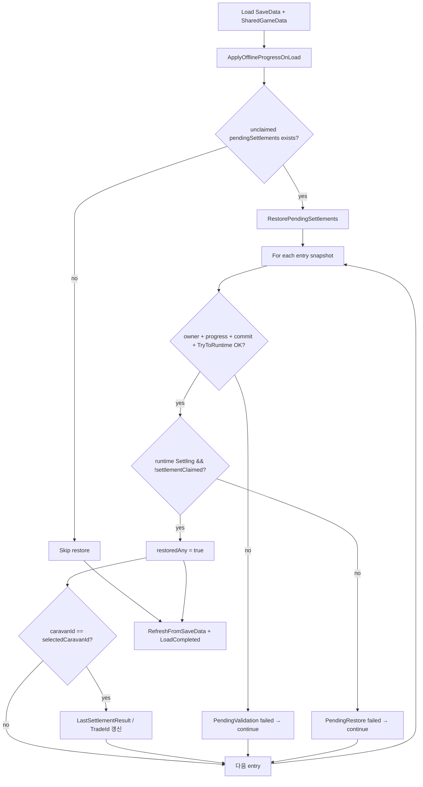

# Multi-Pending Restore and Targeted Claim Backend (Work C)

- 작성일: 2026-07-25
- 담당: Framework & Integration (CSU)
- 브랜치: `feature/framework/multi-pending-restore-claim`
- 기준 브랜치: `dev2`
- 커밋: `b176a4b` — `feat(framework): restore and query multiple pending settlements`
- 선행 커밋: `7f5faab` (Work A merge — `feature/framework/multi-trade-commit-identity`)
- Unity: `6000.5.2f1`
- SaveData version: **6** (변경 없음)

---

## 1. 배경

### 1.1 기존 문제

Work A 이전까지 multi-active progress는 다음 축은 이미 분리되어 있었다.

| 축 | 저장 구조 |
|---|---|
| Progress | `tradeProgressEntries[]` (Caravan별) |
| Pending settlement | `pendingSettlements[]` (Caravan + tradeId) |
| Preparation commit | `tradePreparationCommits[]` (Work A) |

그러나 **로드 후 pending 복구**와 **조회 API**는 여전히 selected / singular 경로에 기대고 있었다.

| 항목 | 기존 (Work C 이전) | 문제 |
|---|---|---|
| Load 복구 | `RestorePendingSettlement()` (단수) | `saveData.tradeProgress` + legacy `pendingSettlement` + selected runtime caravan 기준 |
| FrameworkRoot | `RestorePendingSettlement(CurrentSaveData)` | collection에 A·B pending이 있어도 selected 1건만 복구 시도 |
| 외부 조회 | `SaveDataLookup.TryGetPendingSettlement` (내부) | coordinator 공개 API 없음, defensive copy 없음 |
| Claim | `ClaimSettlement(caravanId, tradeId)` | Work A에서 exact identity는 이미 구현됨 |

그 결과 restart / Continue 시:

- Caravan A와 B가 동시에 `SettlementPending`이어도 **비선택 Caravan pending**은 runtime cache·result projection이 복구되지 않을 수 있다.
- UI·후속 시스템이 durable pending을 **읽기 전용으로 안전하게 조회**할 API가 없다.
- malformed A가 있으면 **전체 복구가 중단**될 위험이 있다 (단수 restore 경로).

### 1.2 선행 작업과의 관계

| 문서 / 작업 | 역할 |
|---|---|
| `0724_multi_active_progress_restore_and_online_tick_gate.md` | multi-active progress 생성·offline restore |
| `0725_multi_trade_commit_claim_identity.md` (Work A) | exact commit stage/get/complete, exact Claim destination |
| **Work C (본 문서)** | **multi-pending durable restore**, **exact query API**, **FrameworkRoot load 연동** |

Work C는 Claim payout 로직 자체를 새로 만든 것이 아니라, **이미 있는 exact Claim**과 **이미 durable한 `pendingSettlements[]`** 사이의 restore·query gap을 메운다.

---

## 2. 목표 (Work C)

1. `SaveData.pendingSettlements`를 **유일한 durable pending 권위**로 유지한다.
2. 로드 시 **모든 valid pending entry**를 독립 검증·복구한다 (`selectedCaravanId` 무관).
3. exact `(caravanId, tradeId)` lookup API를 coordinator에 공개한다.
4. 조회 결과는 **defensive copy**로 반환해 권위 SaveData를 오염시키지 않는다.
5. restore는 **Save / Claim / economy apply / TradeSettlementReady** 를 호출하지 않는다.
6. malformed entry는 **entry 단위로 격리**하고 valid entry 복구는 계속한다.
7. Claim A가 B의 pending·progress·runtime·commit·economy에 영향을 주지 않음을 유지한다 (Work A Claim 재사용).

---

## 3. 권위 데이터와 Identity

### 3.1 Durable pending

```csharp
// SaveData.cs — version 6
public List<PendingSettlementSaveData> pendingSettlements = new List<PendingSettlementSaveData>();
```

각 entry는 최소 다음을 carry한다.

- `caravanId`
- `tradeId`
- `hasResult`, `resultVersion`, `claimed`
- settlement result payload (grade, revenue, loss lists 등)

### 3.2 Exact lookup key

```
(caravanId, tradeId)
```

- `selectedCaravanId`는 lookup·restore·claim **권한**에 사용하지 않는다.
- `SaveDataLookup.TryGetPendingSettlement`에서 `caravanId`가 blank이면 즉시 false (Work C 보강).
- 동일 `(caravanId, tradeId)` duplicate가 collection에 2건 이상이면 lookup **fail safe** (null, error log).

### 3.3 Compatibility cursor (비권위)

| 필드 | 역할 |
|---|---|
| `LastSettlementResult` | selected Caravan pending에 대한 **UI 호환 cache** |
| `LastSettlementTradeId` | 위 cache와 연결된 tradeId |
| `SettlementUiBridge` pending cache | presentation / legacy bridge용 |

exact Claim·exact lookup은 위 cache **없이** durable `pendingSettlements[]`만으로 동작한다.

---

## 4. 신규·변경 Public API

### 4.1 `TradeProgressCoordinator`

| API | 반환 | 역할 |
|---|---|---|
| `GetPendingSettlements()` | `IReadOnlyList<PendingSettlementSaveData>` | collection 전체의 **복사본** 목록 |
| `TryGetPendingSettlement(caravanId, tradeId, out pending)` | `bool` | exact match **복사본** 1건 |
| `TryGetPendingSettlementResult(caravanId, tradeId, out result)` | `bool` | durable DTO → `JourneyResultData` (Core 상태 변경 없음) |
| `RestorePendingSettlements(saveData)` | `bool` | multi-entry restore (본 Work C 핵심) |

기존 `ClaimSettlement(caravanId, tradeId)` — Work A 구현 그대로 사용.

### 4.2 `PendingSettlementSaveDataMapper`

| API | 역할 |
|---|---|
| `Copy(PendingSettlementSaveData source)` | DTO + `lostMercenaryInstanceIds` List deep copy |
| `TryToRuntime(...)` | 저장값 → runtime result (economy **재계산 없음**, 새 `JourneyResultData` 생성) |

### 4.3 `SaveDataLookup` (미세 보강)

```csharp
if (string.IsNullOrWhiteSpace(caravanId) || !HasCaravan(...) || pendingSettlements == null)
    return false;
```

blank caravanId로의 우연한 broad match를 차단한다. **selected fallback은 추가하지 않음.**

---

## 5. Load 흐름 (`FrameworkRoot`)

`CompleteLoadingAndEnterGame()` 순서:

```text
EnsureSharedGameDataLoaded()
→ (restorePending 플래그 계산)
→ ApplyOfflineProgressOnLoad(CurrentSaveData)
→ RestorePendingSettlements(CurrentSaveData)   // Work C: 단수 RestorePendingSettlement 대체
→ InGameScreenRouter.RefreshFromSaveData(...)
→ FrameworkEvents.RaiseLoadCompleted(...)
→ isOnlineProgressTickEnabled = true
→ SceneFlow.GoToInGame()
```

### 5.1 `restorePending` 게이트

```csharp
var restorePending = CurrentSaveData.pendingSettlements != null
    && CurrentSaveData.pendingSettlements.Exists(
        pending => pending != null && pending.hasResult && !pending.claimed);
```

- **로드 전부터** canonical unclaimed pending이 있을 때만 multi-restore 실행.
- 이번 offline restore에서 **새로 완료된** entry는 settle 경로에서 이미 `TradeSettlementReady`를 발행했으므로, 여기서 중복 복구하지 않는다.

---

## 6. `RestorePendingSettlements` 상세

### 6.1 입력 전제

- `SharedGameData`는 FrameworkRoot에서 이미 로드된 뒤 호출된다.
- `saveData.pendingSettlements`가 null이면 false.

### 6.2 순회 방식

```csharp
var entries = new List<PendingSettlementSaveData>(saveData.pendingSettlements);
for (var i = 0; i < entries.Count; i++) { ... }
```

collection snapshot으로 순회해 restore 중 collection mutation과의 충돌을 피한다.

### 6.3 entry별 검증 (모두 통과해야 restore)

| 검증 | 실패 시 |
|---|---|
| `caravanId`, `tradeId` non-blank | `PendingValidation failed` → **continue** |
| `SaveDataLookup.TryGetCaravan` | continue |
| `TryGetTradeProgress` + `state == SettlementPending` | continue |
| `progress.activeTradeId == tradeId` | continue |
| `exactTradePrepareCommitStore.TryGet(caravanId, tradeId)` | continue |
| commit owner id match | continue |
| `PendingSettlementSaveDataMapper.TryToRuntime(pending, out result)` | continue |

실패 로그 예:

```text
PendingValidation failed. CaravanId: {id}, TradeId: {id}, Reason: durable owner, progress, commit, or result mismatch.
```

> `stage` 필드는 로그에 포함되지 않는다 (CaravanId / TradeId / Reason만).

### 6.4 runtime Caravan 검증

```csharp
var caravan = GetOrCreateRuntimeCaravan(caravanId);
if (caravan == null
    || caravan.state != JourneyState.Settling
    || caravan.settlementClaimed)
{
    PendingRestore failed ... continue;
}
```

- `GetOrCreateRuntimeCaravan`은 **저장 snapshot**에서 runtime을 만든다.
- Caravan save의 `state`가 `Settling`이어야 restore 성공 (JSON round-trip / restart 전제).

성공 로그:

```text
PendingRestore succeeded. CaravanId: {id}, TradeId: {id}
```

### 6.5 restore가 **하지 않는** 것

| 동작 | restore 시 |
|---|---|
| `saveService.Save` | 호출 안 함 |
| `JourneyRunner.Settle` | 호출 안 함 |
| economy apply (`TryApplyPendingEconomy`) | 호출 안 함 |
| `ClaimSettlement` | 호출 안 함 |
| `TradeSettlementReady` | 발행 안 함 |
| `pendingSettlements` add/remove | 변경 안 함 |
| `selectedCaravanId` | 변경 안 함 |

### 6.6 compatibility cache 갱신

valid entry 중 **`saveData.selectedCaravanId`와 일치하는 caravan** 1건의 result만:

```csharp
LastSettlementTradeId = selectedTradeId;
LastSettlementResult = selectedResult;
```

- non-selected pending도 runtime Caravan은 `Settling`으로 claimable 상태여야 하나, singular cache에는 올리지 않는다.
- 반환값 `restoredAny`: 1건이라도 runtime 검증 통과하면 true.

### 6.7 singular `RestorePendingSettlement` 와의 차이

| | `RestorePendingSettlement` (legacy) | `RestorePendingSettlements` (Work C) |
|---|---|---|
| 대상 | selected + singular `tradeProgress` / `pendingSettlement` | `pendingSettlements[]` 전체 |
| Economy rebuild | `TryCalculateAndFill` 시도 | **없음** |
| `TradeSettlementReady` | 성공 시 **발행** | **발행 안 함** |
| Save | 없음 (단, economy side effect 가능) | 없음 |
| FrameworkRoot | **더 이상 호출하지 않음** | **load 시 호출** |

legacy 메서드는 코드베이스에 남아 있으나 FrameworkRoot load path에서는 사용하지 않는다.

---

## 7. Defensive Copy

### 7.1 `PendingSettlementSaveDataMapper.Copy`

- scalar 필드 값 복사
- `lostMercenaryInstanceIds` → **새 `List<string>`**
- 권위 DTO reference 공유 없음

### 7.2 소비 규칙

```csharp
var list = coordinator.GetPendingSettlements(); // read-only list, element는 copy
coordinator.TryGetPendingSettlement(idA, tradeA, out var copy); // copy 1건
```

외부에서 copy의 `tradeId`, `revenue`, nested list를 mutate해도 `SaveData.pendingSettlements`는 변하지 않는다.

---

## 8. Targeted Claim (Work A 재사용, Work C 검증 대상)

Work C에서 Claim 로직은 **신규 구현 없음**. Work A의 exact Claim이 multi-pending 환경에서 기대 동작을 유지하는지가 검증 포인트다.

### 8.1 `ClaimSettlement(caravanId, tradeId)` 요약

1. exact pending 1건 match (`matches == 1`)
2. progress `SettlementPending` + `activeTradeId` match
3. `TryToRuntime` → settlement result
4. `TryResolveClaimDestination(caravanId, tradeId, ...)` — exact commit
5. snapshot (`SaveData` JSON + runtime caravan JSON)
6. Core `ClaimSettlement` → economy apply (`tradeId` explicit) → progress state 전환 → `ResetToPrepare`
7. `exactTradePrepareCommitStore.TryComplete(caravanId, tradeId)`
8. `pendingSettlements.Remove(pending)` — **해당 entry만**
9. `Save` 성공 시에만 success; 실패 시 **full snapshot rollback**

### 8.2 Claim A → B isolation invariant

Claim A 성공 후 B에 대해 유지되어야 하는 것:

| B 상태 | Claim A 후 |
|---|---|
| `pendingSettlements` entry | unchanged |
| `tradeProgressEntries` (`SettlementPending`) | unchanged |
| runtime `JourneyState.Settling` | unchanged |
| `tradePreparationCommits` (B) | unchanged |
| player economy | A 1회만 반영 |
| `selectedCaravanId` | Claim API가 명시적으로 바꾸지 않음 (Claim 중 temporary set 후 복원) |

### 8.3 Duplicate Claim

두 번째 `ClaimSettlement(A, tradeA)` → `PendingSettlementNotFound` (또는 invalid state) — economy 재적용 없음.

---

## 9. End-to-End 시나리오 (기대 동작)

```text
Pending A + Pending B durable save
→ restart / JSON reload / Continue
→ pendingSettlements[] 에 A·B 유지
→ TryGetPendingSettlement(A), TryGetPendingSettlement(B) 성공
→ runtime A·B = JourneyState.Settling
→ ClaimSettlement(A, tradeA) 1회 성공
→ A pending 제거, A progress reset, A runtime = JourneyState.Prepare
→ B pending·progress·runtime unchanged
→ ClaimSettlement(A, tradeA) 재시도 → safe failure
→ ClaimSettlement(B, tradeB) 1회 성공
```

---

## 10. 변경 파일 요약

| 파일 | 변경 요약 |
|---|---|
| `TradeProgressCoordinator.cs` | `GetPendingSettlements`, `TryGetPendingSettlement`, `TryGetPendingSettlementResult`, `RestorePendingSettlements` (+105 lines) |
| `PendingSettlementSaveDataMapper.cs` | `Copy()` defensive deep copy (+34 lines) |
| `SaveDataLookup.cs` | blank `caravanId` guard (+1 조건) |
| `FrameworkRoot.cs` | load path: `RestorePendingSettlement` → `RestorePendingSettlements` |

**미변경:** Core, Economy, UI Scene/Prefab, Content, Package, SaveData schema version.

---

## 11. 검증 요약 (2026-07-25)

### 11.1 Regression

메뉴: `ND/Framework/Run Multi-active Progress E2E Checks` → **PASS**

### 11.2 Work C dedicated scenarios (Editor fixture)

| 시나리오 | 결과 |
|---|---|
| Exact lookup A/B + selection independence | PASS |
| Cross-identity rejection (A+TradeB) | PASS |
| Defensive copy (scalar + nested list) | PASS |
| JSON round-trip + `RestorePendingSettlements` | PASS |
| Non-selected B discovery after reload | PASS |
| No restore-time Save / no `TradeSettlementReady` | PASS |
| Malformed A (progress tradeId mismatch) / valid B restore | PASS |
| Claim A isolation (B preserved) | PASS |
| Selection independence (selected=B, Claim A) | PASS |
| Duplicate Claim A | PASS (`PendingSettlementNotFound`) |
| Claim B after A | PASS |
| Cache independence (`ClearSettlementCache` 후 Claim) | PASS |
| Claim Save-failure rollback + retry | PASS |

Runtime enum 확인:

- settlement-waiting: `JourneyState.Settling`
- after claim reset: `JourneyState.Prepare`
- progress pending: `TradeProgressState.SettlementPending`

### 11.3 Static build

| 대상 | 결과 |
|---|---|
| Unity Console (Work C compile) | Error 0 |
| `git diff --check` | PASS |
| `Assembly-CSharp.csproj` | PASS |
| `ND.sln` | FAIL — 기존 Editor NUnit 환경 이슈 (Work C 무관) |

---

## 12. 알려진 한계 / 후속 작업

| 항목 | 상태 |
|---|---|
| Settlement UI multi-pending presentation | **미구현** — `SettlementUiBridge`는 singular cache + selected 경로 |
| `PresentSettlement(caravanId, tradeId)` UI wiring | durable lookup는 가능, 화면 라우팅은 후속 |
| `RestorePendingSettlement` legacy dead path 정리 | 미착수 |
| malformed 로그에 `stage` 필드 | 미포함 (Reason 문자열만) |
| `RestorePendingSettlement` XML 주석 | `TradeSettlementReady` 재발행 설명이 legacy 동작 — 신규 path와 불일치 |
| Play Mode exit → full Editor restart E2E | JSON round-trip으로 대체 검증 |

---

## 13. 관련 문서

- `Docs/Personal_Documents/CSU/0725_multi_trade_commit_claim_identity.md` (Work A)
- `Docs/Personal_Documents/CSU/0724_multi_active_progress_restore_and_online_tick_gate.md`
- `Docs/Personal_Documents/CSU/0723_multi_active_online_tick_economy_trade_id.md`
- `Docs/Personal_Documents/CSU/0721_multi_caravan_atomic_claim.md`
- `Docs/Personal_Documents/CSU/0715_settlement_claim_framework_connection.md`

---

## 14. 흐름도

### Load → Multi Restore



### Exact Query vs Claim

```mermaid
flowchart LR
    subgraph Query["Read-only (Work C)"]
        Q1[GetPendingSettlements]
        Q2[TryGetPendingSettlement]
        Q3[TryGetPendingSettlementResult]
        Q1 --> Copy[Mapper.Copy]
        Q2 --> Copy
        Q3 --> Runtime[Mapper.TryToRuntime]
    end

    subgraph Claim["Mutation (Work A)"]
        C1[ClaimSettlement caravanId+tradeId]
        C1 --> Snap[JSON snapshot]
        Snap --> Core[Core + Economy apply]
        Core --> Rem[pendingSettlements.Remove one]
        Rem --> Save[Save or rollback]
    end

    DUR[(pendingSettlements[])] --> Query
    DUR --> Claim
```
