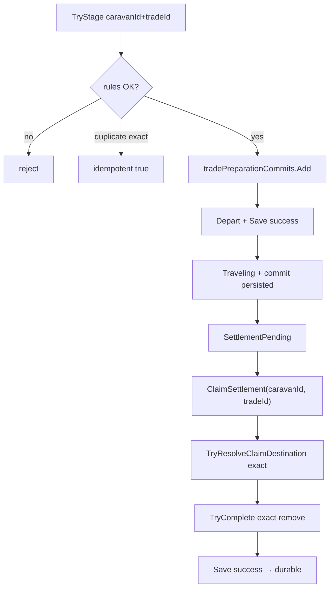
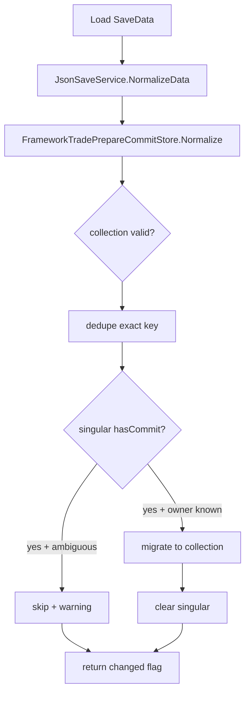

# Multi-Trade Commit · Claim Exact Identity (Work A)

- 작성일: 2026-07-25
- 담당: Framework & Integration (CSU)
- 브랜치: `feature/framework/multi-trade-commit-identity`
- 기준 브랜치: `dev2`
- 커밋: `ba6c30f` — `feat(framework): support multi-trade preparation commits`
- Unity: `6000.5.2f1`
- SaveData version: **6** (변경 없음)

---

## 1. 배경

### 1.1 기존 문제

Multi-active progress (`tradeProgressEntries[]`, `pendingSettlements[]`)는 Caravan별로 분리되어 있었지만, **출발 준비 commit**은 여전히 단일 필드 `SaveData.tradePreparationCommit` 하나만 사용했다.

| 축 | Multi-active (이미 분리) | Commit (기존) |
|---|---|---|
| Progress | `tradeProgressEntries[]` | — |
| Pending | `pendingSettlements[]` | — |
| Preparation commit | — | `tradePreparationCommit` (단일) |

그 결과:

- Caravan A/B가 동시에 Traveling이어도 commit은 **마지막 1건만** 남는다.
- Claim destination lookup이 `tradeId`만으로 commit을 찾으면, **다른 Caravan의 trade**와 충돌할 수 있다.
- 출발 실패 rollback도 `tradeId`만 받아 **정확한 소유자**를 지울 수 없다.

### 1.2 선행 작업과의 관계

- `0724_multi_active_progress_restore_and_online_tick_gate.md` — progress/pending/settlement 생성은 multi-active로 복원 완료.
- 이번 Work A — **commit 저장·조회·완료·rollback**을 `caravanId + tradeId` exact identity로 정렬.
- Work C (미구현) — Settlement UI의 multi-pending restore, selected와 무관한 화면 라우팅 등.

---

## 2. 목표 (Work A)

1. `SaveData.tradePreparationCommits[]`를 **런타임·저장 권위**로 사용한다.
2. lifecycle lookup은 **`caravanId + tradeId`** exact match만 허용한다.
3. 동일 Caravan의 **다른 active trade** stage는 거부한다.
4. 동일 **tradeId**가 **다른 Caravan**에 이미 있으면 거부한다.
5. exact duplicate stage는 **idempotent** (중복 항목 없음, 기존 payload 유지).
6. Claim destination·commit complete는 explicit `(caravanId, tradeId)`로만 수행한다.
7. Claim Save 실패 시 **전체 SaveData snapshot** rollback (기존 정책 유지).
8. 레거시 singular `tradePreparationCommit`은 **Normalize 마이그레이션**으로만 흡수한다.

---

## 3. 데이터 모델

### 3.1 SaveData 추가 필드

```csharp
// SaveData.cs — version 6 유지
public List<TradePreparationCommitSaveData> tradePreparationCommits =
    new List<TradePreparationCommitSaveData>();
```

### 3.2 TradePreparationCommitSaveData 추가 필드

```csharp
public string caravanId = string.Empty;
```

각 commit entry는 **자신이 속한 Caravan**을 명시한다.

### 3.3 권위 구조

| 필드 | 역할 |
|---|---|
| `tradePreparationCommits[]` | **정상 런타임 권위**. stage/get/complete/remove 대상 |
| `tradePreparationCommit` (singular) | **레거시 입력·마이그레이션 소스**. Normalize 후 `hasCommit=false`로 비움 |

Normalize가 성공하면 singular는 비어 있고, collection만 active commit을 보관한다.

### 3.4 Identity key

내부 key: `caravanId + "\n" + tradeId` (`CreateKey`)

---

## 4. 핵심 컴포넌트

### 4.1 FrameworkTradePrepareCommitStore

`ITradePrepareCommitSink` / `Source` / `Completion` + **`IExactTradePrepareCommitStore`**

| API | 동작 |
|---|---|
| `TryStage(commitData)` | collection에 추가. 규칙 검사 후 `Add` |
| `TryGet(caravanId, tradeId, out)` | exact lookup |
| `TryComplete(caravanId, tradeId, out)` | exact get → exact remove |
| `Rollback(caravanId, tradeId)` | exact remove (출발 실패 rollback) |
| `TryRemove(caravanId, tradeId)` | exact remove |
| `Normalize(saveData)` | collection 정리 + legacy migration. `bool changed` 반환 |
| `HasActiveCommit(saveData, caravanId, tradeId?)` | selected Caravan 게이트용 |
| `Clear(saveData)` | collection + singular 모두 초기화 |

### 4.2 IExactTradePrepareCommitStore (Sandbox integration)

`TradePrepareCommitData.cs`에 추가. Framework와 LJH adapter가 **exact rollback**을 공유하기 위한 계약.

```csharp
public interface IExactTradePrepareCommitStore
{
    void Rollback(string caravanId, string tradeId);
    bool TryGet(string caravanId, string tradeId, out TradePrepareCommitData commitData);
    bool TryComplete(string caravanId, string tradeId, out TradePrepareCommitData commitData);
    bool TryRemove(string caravanId, string tradeId);
}
```

### 4.3 TradeProgressCoordinator

- 생성자에서 `exactTradePrepareCommitStore` = source 또는 completion의 `IExactTradePrepareCommitStore` 캐스트.
- `ClaimSettlement(caravanId, tradeId)`:
  - `TryResolveClaimDestination(saveData, caravanId, tradeId, progress, out dest)` — **exact commit** 필수.
  - commit complete: `exactTradePrepareCommitStore.TryComplete(caravanId, tradeId, out _)`.
  - Save 실패: `RestoreClaimSnapshot` — **전체 SaveData JSON snapshot** 복원 (기존과 동일).

### 4.4 TradePrepareStartAdapter

출발 실패·gateway 실패 시 rollback:

```csharp
if (commitSink is IExactTradePrepareCommitStore exactStore)
    exactStore.Rollback(commitData.caravanId, commitData.tradeId);
else
    commitSink?.Rollback(commitData.tradeId); // legacy
```

### 4.5 JsonSaveService

```csharp
assetDataChanged |= FrameworkTradePrepareCommitStore.Normalize(data);
```

Normalize가 실제 변경을 만들었을 때만 normalization Save 트리거.

---

## 5. Stage 규칙 (`TryStage`)

입력: `TradePrepareCommitData` snapshot (`caravanId`, `tradeId` 필수)

```text
1. caravanId / tradeId 비어 있음 → reject
2. Normalize(saveData)
3. FindExact(caravanId, tradeId) 존재 → idempotent return true (payload 변경 없음)
4. collection에 동일 tradeId가 다른 caravanId 소유 → reject
5. collection에 동일 caravanId가 이미 다른 active trade 보유 → reject
6. 새 TradePreparationCommitSaveData 생성 → collection.Add
```

### 5.1 Idempotent duplicate

동일 `(caravanId, tradeId)`로 다시 stage하면 **새 entry를 만들지 않고** `true` 반환. destination 등 기존 값 유지.

### 5.2 거부 케이스

| 케이스 | 결과 |
|---|---|
| Caravan A에 trade-1 stage 후, A에 trade-2 stage | reject (same-Caravan conflict) |
| Caravan A에 trade-X stage 후, Caravan B에 trade-X stage | reject (cross-Caravan duplicate tradeId) |

---

## 6. Normalize · Legacy Migration

`FrameworkTradePrepareCommitStore.Normalize(SaveData)` 흐름:

```text
A. tradePreparationCommits == null → 빈 List 생성
B. collection sweep:
   - null / !hasCommit / caravanId·tradeId empty → remove
   - NormalizeCommit (trim strings, null lists)
   - duplicate exact key → remove (warning)
   - duplicate caravanId (서로 다른 trade) → Error log, preserve for inspection
C. singular tradePreparationCommit NormalizeCommit
D. singular.hasCommit && ownership resolvable:
   - legacy.caravanId empty → ResolveLegacyCaravanId(tradeProgressEntries, tradeId)
     · progress entry가 tradeId에 대해 unique owner 1명 → caravanId 채움
     · ambiguous / none → migration skip (warning)
   - exact key가 collection에 없음 → Clone → Add, singular clear
   - exact key 이미 존재 + payload conflict → legacy ignore (warning), singular clear
   - migration success → singular = new empty (hasCommit=false)
E. return changed
```

### 6.1 Idempotence

이미 collection-only 상태에서 두 번째 `Normalize` → **`changed=false`**.  
`JsonSaveService.NormalizeData`도 연속 호출 시 불필요 Save 없음.

### 6.2 ResolveLegacyCaravanId

`tradeProgressEntries`에서 `activeTradeId == tradeId`인 entry의 `caravanId`를 수집.

- owner 0명 → empty (migration 불가)
- owner 2명 이상 (서로 다른 caravanId) → empty (ambiguous, guess 금지)
- owner 1명 → 해당 caravanId

---

## 7. Claim Destination Resolution

`TryResolveClaimDestination(saveData, caravanId, tradeId, progress, out destinationTownId)`

검증 순서:

```text
1. progress.caravanId == caravanId
2. progress.activeTradeId == tradeId
3. exactTradePrepareCommitStore.TryGet(caravanId, tradeId, out commit)
4. commit.caravanId / commit.tradeId 재검증
5. destinationTownId = commit.selectedDestinationTownId
6. sharedGameData route lookup: progress.activeRouteId
7. route.ToTownId == destinationTownId (일치 필수)
```

**selectedCaravanId는 lookup에 사용하지 않는다.**  
Claim 호출자가 넘긴 `(caravanId, tradeId)`만 authority.

Claim 성공 시:

- `exactTradePrepareCommitStore.TryComplete(caravanId, tradeId)` — **해당 commit만** remove
- 다른 Caravan commit·pending·progress 불변
- `selectedCaravanId`는 claim 직전 값으로 복원 (`selectedCaravanIdBeforeClaim`)

---

## 8. Rollback 경로

### 8.1 출발 Save 실패 (`TradeStartService`)

`TradeStartService`는 **Save 성공 후** `setActiveCaravan` callback에서 commit stage.

Save 실패 시 progress/caravan snapshot restore → **B commit은 생성되지 않음**. A commit 유지.

### 8.2 Adapter 출발 실패 (`TradePrepareStartAdapter`)

Stage 후 Core/gateway 실패 → `RollbackCommit(commitData)` → exact `(caravanId, tradeId)` remove.

### 8.3 Claim Save 실패

`JsonUtility.ToJson(saveData)` snapshot → 실패 시 `RestoreClaimSnapshot` 전체 복원.

---

## 9. Selected Caravan 연동 (게이트만)

commit **ownership lookup**에는 selected를 쓰지 않지만, **selected Caravan 기준 게이트**는 유지:

| 호출처 | 용도 |
|---|---|
| `TradePreparationEntryCommand.TryExecute` | selected Caravan에 active commit 있으면 준비 진입 차단 |
| `InGameScreenStateRouter.MapFromSaveData` | selected progress Completed/Failed 시, selected의 exact commit cleared 여부 |

```csharp
FrameworkTradePrepareCommitStore.HasActiveCommit(
    saveData,
    saveData.selectedCaravanId,
    saveData.tradeProgress.activeTradeId); // router only
```

Work C에서 multi-pending UI restore가 필요하면 router/entry 게이트를 별도 확장해야 한다.

---

## 10. Legacy Compatibility Overload

`TryGet(tradeId)`, `TryComplete(tradeId)`, `Rollback(tradeId)` — `[Obsolete]`

내부: `TryResolveUniqueTradeOwner(tradeId)`

- collection에서 `tradeId` 일치 active entry가 **정확히 1건** → 해당 caravanId 사용
- 0건 또는 2건 이상 → **fail safe** (rollback no-op / TryGet false)

player-facing Claim path는 `ClaimSettlement(caravanId, tradeId)` / `FrameworkRoot`의 `pendingCaravanId + pendingTradeId` 사용.

---

## 11. 변경 파일 요약

| 파일 | 변경 요약 |
|---|---|
| `SaveData.cs` | `tradePreparationCommits` List 추가 |
| `TradePreparationCommitSaveData.cs` | `caravanId` 필드 추가 |
| `FrameworkTradePrepareCommitStore.cs` | collection 권위, exact API, Normalize/migration |
| `JsonSaveService.cs` | Normalize changed-flag 전파 |
| `TradeProgressCoordinator.cs` | exact destination + exact TryComplete |
| `TradePreparationEntryCommand.cs` | `HasActiveCommit(selected)` |
| `InGameScreenStateRouter.cs` | `HasActiveCommit(selected, tradeId)` |
| `TradePrepareCommitData.cs` | `IExactTradePrepareCommitStore` |
| `TradePrepareStartAdapter.cs` | exact rollback |
| `FrameworkM1LoopE2EEditorTests.cs` | Work A + 기존 multi-active regression |

**미변경:** UI Scene, Prefab, Core, Economy, Content, Package, ProjectSettings.

---

## 12. 검증 요약 (Editor)

메뉴: `ND/Framework/Run Multi-active Progress E2E Checks`

| 시나리오 | 결과 |
|---|---|
| Multi-commit coexistence (A+B) | PASS |
| Exact duplicate stage idempotent | PASS |
| Same-Caravan conflicting trade reject | PASS |
| Same tradeId cross-Caravan reject | PASS |
| Complete A leaves B | PASS |
| Legacy singular → collection migration | PASS |
| Normalize idempotence (2nd pass) | PASS |
| Concurrent departure + dual commit JSON | PASS |
| Claim A with selected=B, B preserved | PASS |
| Claim Save failure full snapshot restore | PASS |
| Departure Save failure A preserved | PASS |
| Duplicate Claim prevention | PASS |
| 기존 multi-active regression (tick/offline/claim) | PASS |

---

## 13. Work C 경계 (이번 PR 범위 밖)

- Settlement UI multi-pending restore
- selected와 무관한 InGame screen routing (다른 Caravan pending/commit 반영)
- `ClaimSettlementAndResetLegacy` / `TryResolveClaimDestination(saveData, out)` dead code 정리
- UI `SettlementUiDataAdapter` → explicit `(caravanId, tradeId)` 직접 호출 (현재 bridge 경유)

---

## 14. 관련 문서

- `Docs/Personal_Documents/CSU/0724_multi_active_progress_restore_and_online_tick_gate.md`
- `Docs/Personal_Documents/CSU/0723_multi_active_online_tick_economy_trade_id.md`
- `Docs/Personal_Documents/CSU/0721_multi_caravan_atomic_claim.md`
- `Docs/Contract/Settlement_Recovery_and_Trade_ID_Contract.md`
- `Docs/Contract/SaveData_V2_Field_Contract.md`

---

## 15. 흐름도 (요약)

### Stage → Depart → Claim



### Normalize on Load


